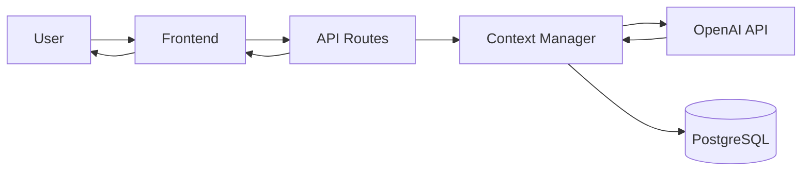

# HireXp AI Architecture - Direct API Approach

## Overview

HireXp uses a **direct AI API integration approach** for all conversation-based features. This document outlines the architectural decisions, implementation patterns, and rationale for choosing direct API calls over more complex solutions like RAG (Retrieval-Augmented Generation).

## Architecture Decision

### Why Direct API Calls?

**Decision**: Use OpenAI API directly with session-based context management, WITHOUT RAG or vector embeddings.

**Key Benefits**:
1. **Simplicity** - Fewer moving parts, easier to debug
2. **Cost Efficiency** - No vector database costs ($150-350/month savings)
3. **Faster Development** - 2-3 weeks faster implementation
4. **Better Performance** - Lower latency (saves 100-300ms per request)
5. **Easier Maintenance** - Less infrastructure to manage

## System Architecture

### High-Level Flow



### Component Breakdown

```typescript
// Core architecture components

1. Frontend Layer
   ├── React UI Components
   ├── Audio Recording (Web Audio API)
   └── WebSocket Client (real-time)

2. API Layer
   ├── Next.js API Routes
   ├── Request Validation (Zod)
   ├── Rate Limiting
   └── Error Handling

3. Context Management
   ├── Session Store (Redis)
   ├── Message History Buffer
   ├── User Profile Context
   └── Conversation State

4. AI Integration
   ├── OpenAI GPT-4 API (direct)
   ├── Whisper API (speech-to-text)
   ├── ElevenLabs API (text-to-speech)
   └── Streaming Responses

5. Data Layer
   ├── PostgreSQL (conversations, messages)
   ├── Cloudinary (audio storage)
   └── Redis (session cache)
```

## Context Management Strategy

### Session-Based Context

Instead of using embeddings and vector retrieval, we maintain conversation context using a simple session-based approach:

```typescript
// lib/ai/context-manager.ts

interface ConversationContext {
  sessionId: string;
  userId: string;
  conversationType: 'chat' | 'interview' | 'mock-call';

  // User profile for personalization
  userProfile: {
    level: 'beginner' | 'intermediate' | 'advanced';
    strengths: string[];
    improvements: string[];
    nativeLanguage?: string;
  };

  // Conversation history (sliding window)
  messageHistory: Array<{
    role: 'user' | 'assistant' | 'system';
    content: string;
    timestamp: Date;
  }>;

  // Session metadata
  metadata: {
    startedAt: Date;
    lastActivityAt: Date;
    messageCount: number;
    tokensUsed: number;
  };
}

export class ContextManager {
  private redis: Redis;
  private maxMessages = 20; // Keep last 20 messages
  private maxTokens = 2000; // ~2000 tokens context window

  async getContext(sessionId: string): Promise<ConversationContext> {
    // Retrieve from Redis cache
    const cached = await this.redis.get(`session:${sessionId}`);
    if (cached) return JSON.parse(cached);

    // Fallback to database
    return await this.loadFromDatabase(sessionId);
  }

  async updateContext(
    sessionId: string,
    newMessage: Message
  ): Promise<void> {
    const context = await this.getContext(sessionId);

    // Add new message
    context.messageHistory.push(newMessage);

    // Trim history if too long
    if (context.messageHistory.length > this.maxMessages) {
      context.messageHistory = context.messageHistory.slice(-this.maxMessages);
    }

    // Update metadata
    context.metadata.lastActivityAt = new Date();
    context.metadata.messageCount++;

    // Save to cache
    await this.redis.setex(
      `session:${sessionId}`,
      1800, // 30 minutes TTL
      JSON.stringify(context)
    );
  }

  async buildPromptContext(context: ConversationContext): Promise<string> {
    // Build context string from history
    const history = context.messageHistory
      .slice(-10) // Last 10 messages
      .map(m => `${m.role}: ${m.content}`)
      .join('\n');

    return `
User Profile:
- Level: ${context.userProfile.level}
- Strengths: ${context.userProfile.strengths.join(', ')}
- Focus Areas: ${context.userProfile.improvements.join(', ')}

Recent Conversation:
${history}
    `.trim();
  }
}
```

## Direct API Integration

### OpenAI Integration Pattern

```typescript
// lib/ai/openai-service.ts
import OpenAI from "openai";

export class OpenAIService {
  private client: OpenAI;

  constructor() {
    this.client = new OpenAI({
      apiKey: process.env.OPENAI_API_KEY,
    });
  }

  async sendMessage(
    context: ConversationContext,
    userMessage: string,
    systemPrompt: string
  ): Promise<string> {
    // Build messages array from context
    const messages = [
      {
        role: "system" as const,
        content: systemPrompt
      },
      // Include conversation history
      ...context.messageHistory.map(m => ({
        role: m.role as "user" | "assistant",
        content: m.content
      })),
      // Add new user message
      {
        role: "user" as const,
        content: userMessage
      }
    ];

    // Direct API call - no retrieval step
    const response = await this.client.chat.completions.create({
      model: "gpt-4-turbo-preview",
      messages,
      temperature: 0.7,
      max_tokens: 500,
      stream: false
    });

    return response.choices[0].message.content || "";
  }

  async sendMessageStreaming(
    context: ConversationContext,
    userMessage: string,
    systemPrompt: string
  ) {
    const messages = this.buildMessages(context, userMessage, systemPrompt);

    // Streaming response for better UX
    const stream = await this.client.chat.completions.create({
      model: "gpt-4-turbo-preview",
      messages,
      temperature: 0.7,
      max_tokens: 500,
      stream: true
    });

    return stream;
  }

  private buildMessages(
    context: ConversationContext,
    userMessage: string,
    systemPrompt: string
  ) {
    return [
      { role: "system" as const, content: systemPrompt },
      ...context.messageHistory.map(m => ({
        role: m.role as "user" | "assistant",
        content: m.content
      })),
      { role: "user" as const, content: userMessage }
    ];
  }
}
```

## System Prompts

### Dynamic Prompt Generation

```typescript
// lib/ai/prompts.ts

export class PromptBuilder {
  static buildChitChatPrompt(userLevel: string): string {
    const basePrompt = `
You are a friendly English conversation partner helping users improve their communication skills.

Guidelines:
- Be encouraging and supportive
- Provide gentle corrections when needed
- Ask follow-up questions to continue the conversation
- Focus on practical, real-world language use
    `;

    const levelSpecific = {
      beginner: `
- Use simple vocabulary and short sentences
- Explain unfamiliar words
- Speak slowly and clearly
- Encourage attempts at communication
      `,
      intermediate: `
- Use natural expressions and idioms
- Introduce new vocabulary gradually
- Challenge with open-ended questions
- Provide cultural context
      `,
      advanced: `
- Use sophisticated vocabulary
- Discuss complex topics
- Focus on nuance and style
- Provide subtle corrections
      `
    };

    return basePrompt + (levelSpecific[userLevel] || levelSpecific.beginner);
  }

  static buildInterviewPrompt(): string {
    return `
You are a professional job interviewer conducting an interview for a call center position.

Your role:
- Ask relevant questions about customer service experience
- Evaluate communication skills
- Assess problem-solving abilities
- Maintain a professional yet friendly tone
- Provide constructive feedback

Focus areas:
- Clarity of communication
- Problem-solving approach
- Customer service mindset
- Professionalism
    `;
  }

  static buildMockCallPrompt(scenario: CallScenario): string {
    return `
You are a customer calling about: ${scenario.issue}

Customer Profile:
- Name: ${scenario.customerName}
- Account: ${scenario.accountNumber}
- Issue: ${scenario.issue}

Your behavior:
- Start slightly frustrated but willing to work with the agent
- Provide information when asked
- React realistically to solutions
- End call satisfied if issue is resolved properly

Stay in character throughout the call.
    `;
  }
}
```

## Performance Optimization

### Token Management

```typescript
// lib/ai/token-optimizer.ts

export class TokenOptimizer {
  private maxContextTokens = 2000;

  async optimizeContext(
    messages: Message[]
  ): Promise<Message[]> {
    // Estimate tokens (rough: 1 token ≈ 4 chars)
    const estimateTokens = (text: string) => Math.ceil(text.length / 4);

    let totalTokens = 0;
    const optimizedMessages: Message[] = [];

    // Iterate from newest to oldest
    for (let i = messages.length - 1; i >= 0; i--) {
      const messageTokens = estimateTokens(messages[i].content);

      if (totalTokens + messageTokens > this.maxContextTokens) {
        break;
      }

      optimizedMessages.unshift(messages[i]);
      totalTokens += messageTokens;
    }

    return optimizedMessages;
  }

  async summarizeOlderContext(messages: Message[]): Promise<string> {
    // For very long conversations, summarize older messages
    if (messages.length > 30) {
      const oldMessages = messages.slice(0, -20);
      const summary = await this.generateSummary(oldMessages);
      return summary;
    }
    return "";
  }
}
```

### Caching Strategy

```typescript
// lib/ai/cache-manager.ts

export class CacheManager {
  private redis: Redis;

  async cacheResponse(
    key: string,
    response: string,
    ttl: number = 1800
  ): Promise<void> {
    await this.redis.setex(key, ttl, response);
  }

  async getCachedResponse(key: string): Promise<string | null> {
    return await this.redis.get(key);
  }

  // Cache common greetings and responses
  async getCachedGreeting(userLevel: string): Promise<string | null> {
    return await this.redis.get(`greeting:${userLevel}`);
  }

  // Cache session context
  async cacheSessionContext(
    sessionId: string,
    context: ConversationContext
  ): Promise<void> {
    await this.redis.setex(
      `session:${sessionId}`,
      1800, // 30 minutes
      JSON.stringify(context)
    );
  }
}
```

## API Route Implementation

### Example: Chat Message Endpoint

```typescript
// app/api/ai/chat/message/route.ts
import { NextRequest, NextResponse } from "next/server";
import { OpenAIService } from "@/lib/ai/openai-service";
import { ContextManager } from "@/lib/ai/context-manager";
import { PromptBuilder } from "@/lib/ai/prompts";

export async function POST(request: NextRequest) {
  try {
    const { sessionId, message } = await request.json();

    // Get conversation context
    const contextManager = new ContextManager();
    const context = await contextManager.getContext(sessionId);

    // Build system prompt
    const systemPrompt = PromptBuilder.buildChitChatPrompt(
      context.userProfile.level
    );

    // Send to OpenAI (direct API call)
    const aiService = new OpenAIService();
    const response = await aiService.sendMessage(
      context,
      message,
      systemPrompt
    );

    // Update context with new messages
    await contextManager.updateContext(sessionId, {
      role: "user",
      content: message,
      timestamp: new Date()
    });

    await contextManager.updateContext(sessionId, {
      role: "assistant",
      content: response,
      timestamp: new Date()
    });

    // Return response
    return NextResponse.json({
      success: true,
      response,
      metadata: {
        tokensUsed: context.metadata.tokensUsed,
        messageCount: context.metadata.messageCount + 2
      }
    });

  } catch (error) {
    console.error("Chat API error:", error);
    return NextResponse.json(
      { success: false, error: "Failed to process message" },
      { status: 500 }
    );
  }
}
```

## Cost Analysis

### Monthly Cost Breakdown (at 5K conversations/month)

**Direct API Approach**:
```
OpenAI GPT-4 API: $0.08/conversation × 5000 = $400
Whisper API: $0.006/min × 10min avg × 5000 = $300
ElevenLabs TTS: $0.036/response × 5000 = $180
Storage (PostgreSQL): $25
Cloudinary: $50
Infrastructure (Vercel): $50

Total: ~$1005/month
```

**RAG Approach Would Add**:
```
Vector Database (Pinecone): $70-200/month
Embedding Generation: $0.01/conversation × 5000 = $50
Additional Infrastructure: $30

Additional Cost: $150-280/month
Total: ~$1155-1285/month

Savings: $150-280/month (13-22% reduction)
```

## When to Consider RAG

### Future Scenarios That Would Justify RAG

1. **Company-Specific Training**
   - Each company needs custom scripts and policies
   - Hundreds of documents per company
   - Frequent content updates

2. **Large Knowledge Base**
   - Product catalogs with thousands of items
   - Extensive FAQ databases
   - Technical documentation

3. **Multi-Tenant Customization**
   - Different training materials per client
   - Industry-specific vocabulary
   - Regional variations

4. **Dynamic Content**
   - Frequently updated policies
   - Real-time product information
   - Time-sensitive data

### Migration Path

If RAG becomes necessary:

**Phase 1** (Evaluation - Month 6-8):
- Analyze user feedback for knowledge gaps
- Identify most requested custom content
- Calculate ROI of RAG implementation

**Phase 2** (Initial Implementation - Month 9-10):
- Set up vector database (Pinecone/Weaviate)
- Implement embedding generation pipeline
- Create retrieval system

**Phase 3** (Integration - Month 11-12):
- Integrate retrieval with existing chat system
- A/B test RAG vs. direct approach
- Optimize retrieval quality

**Phase 4** (Scaling - Month 13+):
- Full RAG deployment
- Company-specific knowledge bases
- Advanced personalization

## Monitoring & Analytics

### Key Metrics to Track

```typescript
interface AIMetrics {
  // Performance
  avgResponseTime: number;
  p95ResponseTime: number;
  errorRate: number;

  // Usage
  conversationsPerDay: number;
  messagesPerConversation: number;
  avgConversationLength: number;

  // Cost
  tokensUsedPerDay: number;
  costPerConversation: number;
  monthlySpend: number;

  // Quality
  userSatisfactionScore: number;
  completionRate: number;
  errorRecoveryRate: number;
}
```

### Logging Strategy

```typescript
// Log all AI interactions for analysis
const logAIInteraction = {
  sessionId: string,
  userId: string,
  requestType: 'chat' | 'interview' | 'mock-call',
  promptTokens: number,
  completionTokens: number,
  responseTime: number,
  success: boolean,
  error?: string
};
```

## Security Considerations

### Input Validation

```typescript
import { z } from "zod";

const messageSchema = z.object({
  sessionId: z.string().uuid(),
  message: z.string().min(1).max(1000),
  messageType: z.enum(["text", "voice"])
});

// Sanitize user input to prevent prompt injection
const sanitizeInput = (input: string): string => {
  return input
    .replace(/```/g, '') // Remove code blocks
    .replace(/system:/gi, '') // Remove system role attempts
    .trim()
    .slice(0, 1000); // Max length
};
```

### Rate Limiting

```typescript
const rateLimits = {
  messagesPerMinute: 30,
  conversationsPerHour: 5,
  tokensPerDay: 50000
};
```

## Conclusion

The direct API approach provides:
- ✅ **Simplicity** - Easy to implement and maintain
- ✅ **Cost Efficiency** - Lower monthly costs
- ✅ **Performance** - Faster response times
- ✅ **Flexibility** - Easy to modify and extend
- ✅ **Reliability** - Fewer points of failure

This architecture is optimal for HireXp's MVP phase, with a clear path to RAG implementation if future needs require it.

---

*Document Version: 1.0*
*Last Updated: October 2025*
*Next Review: April 2026*
