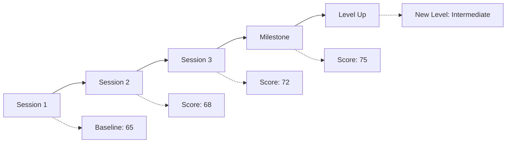

# AI Chit Chat - Evaluation Metrics

## Overview

The evaluation system for AI Chit Chat provides comprehensive assessment of user's English communication skills across multiple dimensions. Each conversation is evaluated in real-time with detailed post-session analysis.

## Scoring Framework

### Overall Score Calculation

The overall score is a weighted average of five core metrics:

```typescript
overallScore = (
  grammarScore * 0.25 +
  fluencyScore * 0.20 +
  vocabularyScore * 0.20 +
  comprehensionScore * 0.20 +
  pronunciationScore * 0.15
)
```

### Score Ranges

| Score Range | Level | Description |
|-------------|-------|-------------|
| 90-100 | Expert | Native-like proficiency |
| 80-89 | Advanced | Highly proficient with minor errors |
| 70-79 | Upper-Intermediate | Good command with occasional mistakes |
| 60-69 | Intermediate | Functional with regular errors |
| 50-59 | Lower-Intermediate | Basic communication ability |
| 40-49 | Beginner | Limited vocabulary and structure |
| 0-39 | Starter | Very basic understanding |

## Core Metrics

### 1. Grammar Score (25% weight)

Evaluates grammatical accuracy and sentence structure.

#### Sub-metrics:
- **Syntax Accuracy** (40%)
  - Subject-verb agreement
  - Tense consistency
  - Word order
  - Sentence completeness

- **Tense Usage** (30%)
  - Present tenses
  - Past tenses
  - Future tenses
  - Perfect tenses
  - Conditional structures

- **Article Usage** (15%)
  - Definite articles (the)
  - Indefinite articles (a/an)
  - Zero articles
  - Context appropriateness

- **Preposition Accuracy** (15%)
  - Time prepositions
  - Place prepositions
  - Movement prepositions
  - Abstract prepositions

#### Calculation Algorithm:

```typescript
function calculateGrammarScore(messages: Message[]): number {
  let totalScore = 0;
  let errorCount = 0;

  for (const message of messages) {
    const errors = detectGrammarErrors(message);

    // Error severity weights
    const severity = {
      critical: 5,  // Makes meaning unclear
      major: 3,     // Noticeable but understandable
      minor: 1      // Small mistakes
    };

    errorCount += errors.reduce((sum, error) => {
      return sum + severity[error.severity];
    }, 0);
  }

  // Calculate score based on error density
  const errorDensity = errorCount / (messages.length * averageWordsPerMessage);
  totalScore = Math.max(0, 100 - (errorDensity * 10));

  return totalScore;
}
```

### 2. Fluency Score (20% weight)

Measures the flow and naturalness of communication.

#### Sub-metrics:
- **Response Speed** (30%)
  - Time to start response
  - Typing/speaking speed
  - Hesitation frequency

- **Coherence** (35%)
  - Logical flow
  - Idea connection
  - Topic maintenance
  - Transition usage

- **Filler Usage** (20%)
  - Appropriate fillers
  - Overuse detection
  - Natural pausing

- **Sentence Variety** (15%)
  - Simple sentences
  - Compound sentences
  - Complex sentences
  - Question formation

#### Evaluation Criteria:

```typescript
interface FluencyMetrics {
  averageResponseTime: number; // seconds
  hesitationCount: number;
  fillerWords: string[];
  sentenceVariety: {
    simple: number;
    compound: number;
    complex: number;
  };

  calculate(): number {
    let score = 100;

    // Deduct for slow responses
    if (this.averageResponseTime > 5) score -= 10;
    if (this.averageResponseTime > 10) score -= 20;

    // Deduct for excessive hesitation
    score -= Math.min(this.hesitationCount * 2, 30);

    // Deduct for filler overuse
    const fillerRatio = this.fillerWords.length / totalWords;
    if (fillerRatio > 0.05) score -= 15;

    // Bonus for sentence variety
    if (this.sentenceVariety.complex > 0.2) score += 5;

    return Math.max(0, Math.min(100, score));
  }
}
```

### 3. Vocabulary Score (20% weight)

Assesses vocabulary range and appropriate usage.

#### Sub-metrics:
- **Vocabulary Range** (40%)
  - Unique word count
  - Word frequency distribution
  - Advanced vocabulary usage

- **Word Choice** (30%)
  - Context appropriateness
  - Register awareness
  - Collocation accuracy

- **Idiom Usage** (15%)
  - Common expressions
  - Phrasal verbs
  - Cultural references

- **Spelling Accuracy** (15%)
  - Correct spelling
  - Common misspellings
  - Typo detection

#### Vocabulary Levels:

```typescript
const vocabularyLevels = {
  A1: ["hello", "goodbye", "please", "thank you"], // 500 words
  A2: ["because", "maybe", "sometimes", "usually"], // 1000 words
  B1: ["although", "suggest", "opinion", "experience"], // 2000 words
  B2: ["nevertheless", "significant", "consequence"], // 4000 words
  C1: ["albeit", "quintessential", "pragmatic"], // 8000 words
  C2: ["ubiquitous", "perspicacious", "zeitgeist"] // 16000+ words
};

function assessVocabularyLevel(words: string[]): string {
  // Analyze word complexity and return CEFR level
}
```

### 4. Comprehension Score (20% weight)

Evaluates understanding of conversation context and questions.

#### Sub-metrics:
- **Response Relevance** (40%)
  - On-topic responses
  - Question answering
  - Follow-up understanding

- **Context Understanding** (30%)
  - Reference resolution
  - Implied meaning
  - Humor/sarcasm detection

- **Instruction Following** (20%)
  - Task completion
  - Clarification requests
  - Multi-step instructions

- **Cultural Awareness** (10%)
  - Idiom comprehension
  - Social cues
  - Register appropriateness

### 5. Pronunciation Score (15% weight)
*Only for voice interactions*

#### Sub-metrics:
- **Clarity** (40%)
  - Word articulation
  - Consonant clusters
  - Vowel sounds

- **Intonation** (30%)
  - Sentence stress
  - Question intonation
  - Emphasis patterns

- **Rhythm** (20%)
  - Natural pacing
  - Stress timing
  - Connected speech

- **Accent Intelligibility** (10%)
  - Comprehensibility
  - Consistency
  - Native-like features

## Real-time Feedback System

### Immediate Corrections

```typescript
interface ImmediateFeedback {
  type: 'grammar' | 'vocabulary' | 'pronunciation';
  severity: 'critical' | 'major' | 'minor';
  original: string;
  suggestion: string;
  explanation?: string;

  shouldInterrupt(): boolean {
    // Critical errors interrupt flow
    return this.severity === 'critical';
  }
}
```

### Progressive Feedback Levels

| User Level | Feedback Style | Correction Frequency |
|------------|---------------|---------------------|
| Beginner | Gentle, encouraging | Major errors only |
| Intermediate | Balanced | Most errors |
| Advanced | Detailed, nuanced | All errors |

## Post-Session Analysis

### Detailed Report Generation

```typescript
interface SessionReport {
  conversationId: string;
  duration: number;

  scores: {
    overall: number;
    grammar: DetailedScore;
    fluency: DetailedScore;
    vocabulary: DetailedScore;
    comprehension: DetailedScore;
    pronunciation?: DetailedScore;
  };

  improvements: {
    fromLastSession: ComparisonData;
    trend: 'improving' | 'stable' | 'declining';
    projectedProgress: ProgressionChart;
  };

  insights: {
    strengths: string[];
    weaknesses: string[];
    patterns: ErrorPattern[];
    recommendations: LearningPath;
  };
}
```

### Error Pattern Detection

```typescript
class ErrorPatternAnalyzer {
  patterns = {
    THIRD_PERSON_S: /he|she|it\s+\w+(?<!s)$/,
    PAST_IRREGULAR: /go|went|gone/,
    ARTICLE_MISSING: /\b(is|are|was|were)\s+[^aeiou]/,

    analyze(errors: Error[]): Pattern[] {
      // Group errors by type
      // Identify recurring mistakes
      // Generate focused practice recommendations
    }
  };
}
```

## Benchmarking

### Performance Comparison

```typescript
interface Benchmark {
  userScore: number;
  averageScore: {
    global: number;
    sameLevel: number;
    sameRegion: number;
    sameAge: number;
  };

  percentile: number;
  improvement: {
    weekly: number;
    monthly: number;
    total: number;
  };
}
```

### Progress Tracking



## Adaptive Difficulty

### Dynamic Adjustment Algorithm

```typescript
function adjustDifficulty(currentLevel: number, performance: Performance): number {
  const threshold = {
    increase: 0.85, // 85% success rate
    decrease: 0.60, // 60% success rate
  };

  if (performance.successRate > threshold.increase) {
    return Math.min(currentLevel + 0.1, 1.0);
  } else if (performance.successRate < threshold.decrease) {
    return Math.max(currentLevel - 0.1, 0.0);
  }

  return currentLevel;
}
```

## Quality Assurance

### Evaluation Accuracy

- **Human Validation**: Regular calibration with human evaluators
- **Inter-rater Reliability**: > 0.85 Cohen's kappa
- **A/B Testing**: Continuous algorithm improvement
- **User Feedback**: Incorporation of user ratings

### Bias Mitigation

```typescript
const biasChecks = {
  accent: "Normalize for non-native accents",
  cultural: "Account for cultural communication styles",
  gender: "Equal scoring regardless of gender",
  age: "Age-appropriate expectations"
};
```

## Gamification Elements

### Achievement System

| Achievement | Requirement | Points |
|-------------|------------|---------|
| First Conversation | Complete 1 session | 10 |
| Grammar Guru | 90+ grammar score | 50 |
| Vocabulary Victor | Learn 100 new words | 75 |
| Fluency Master | 85+ fluency for 5 sessions | 100 |
| Pronunciation Pro | 90+ pronunciation score | 80 |

### Progress Milestones

```typescript
const milestones = [
  { sessions: 5, badge: "Committed Learner" },
  { sessions: 25, badge: "Dedicated Student" },
  { sessions: 50, badge: "English Enthusiast" },
  { sessions: 100, badge: "Conversation Expert" },
  { score: 80, badge: "High Achiever" },
  { streak: 7, badge: "Week Warrior" },
  { streak: 30, badge: "Monthly Master" }
];
```

## Reporting API

### Analytics Dashboard Data

```typescript
interface AnalyticsData {
  timeRange: DateRange;

  aggregate: {
    totalSessions: number;
    averageScore: number;
    totalPracticeTime: number;
    improvementRate: number;
  };

  breakdown: {
    byMetric: MetricBreakdown[];
    byTopic: TopicBreakdown[];
    byTimeOfDay: TimeBreakdown[];
  };

  recommendations: {
    focusAreas: string[];
    suggestedTopics: string[];
    optimalPracticeTime: string;
  };
}
```

---

*Document Version: 1.0*
*Last Updated: October 2025*
*Next Review: November 2025*