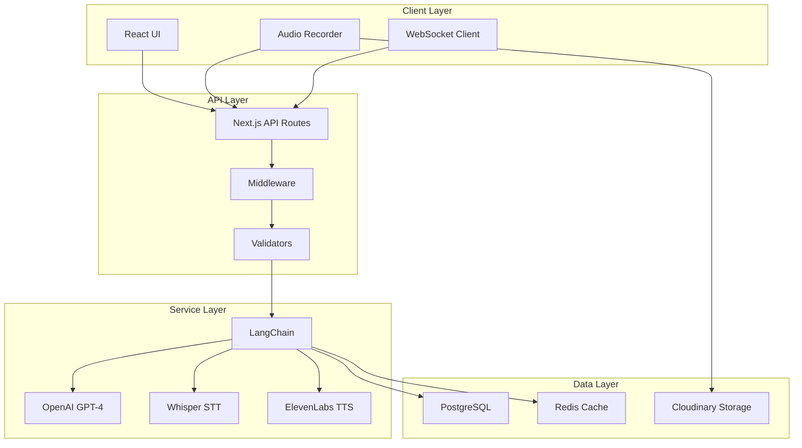

# AI Chit Chat - Technical Specifications

## Architecture Overview

### System Components



## Technology Stack

### Core Technologies

| Component | Technology | Version | Purpose |
|-----------|------------|---------|---------|
| Framework | Next.js | 15.x | Full-stack React framework |
| Language | TypeScript | 5.x | Type safety |
| AI Model | OpenAI GPT-4 | Latest | Conversation engine |
| Orchestration | LangChain | 0.3.x | AI workflow management |
| Database | PostgreSQL | 15.x | Data persistence |
| ORM | Prisma | 5.x | Database abstraction |
| Cache | Redis | 7.x | Session management |
| Speech-to-Text | Whisper | API v1 | Voice input processing |
| Text-to-Speech | ElevenLabs | v1 | Voice output generation |

### Frontend Libraries

```json
{
  "dependencies": {
    "react": "^19.0.0",
    "framer-motion": "^12.0.0",
    "socket.io-client": "^4.8.0",
    "react-hook-form": "^7.63.0",
    "zod": "^3.24.0",
    "@radix-ui/react-*": "latest"
  }
}
```

## API Design

### Conversation Management

#### Start Conversation
```typescript
POST /api/ai/chit-chat/start

Request:
{
  "userId": string,
  "topic?": string,
  "difficulty?": "beginner" | "intermediate" | "advanced",
  "sessionDuration?": number // minutes
}

Response:
{
  "conversationId": string,
  "sessionToken": string,
  "welcomeMessage": string,
  "settings": {
    "voiceEnabled": boolean,
    "autoCorrect": boolean,
    "feedbackLevel": string
  }
}
```

#### Send Message
```typescript
POST /api/ai/chit-chat/message

Request:
{
  "conversationId": string,
  "message": string,
  "audioUrl?": string,
  "messageType": "text" | "voice"
}

Response:
{
  "messageId": string,
  "response": string,
  "audioUrl?": string,
  "feedback": {
    "corrections": Array<Correction>,
    "suggestions": Array<Suggestion>,
    "score": number
  },
  "metadata": {
    "processingTime": number,
    "tokensUsed": number
  }
}
```

### Voice Processing

#### Speech-to-Text
```typescript
POST /api/ai/chit-chat/voice/transcribe

Request:
{
  "audioBlob": Blob,
  "format": "webm" | "mp3" | "wav",
  "language": "en-US"
}

Response:
{
  "transcription": string,
  "confidence": number,
  "alternatives": string[]
}
```

## LangChain Integration (Simplified - No RAG)

### Conversation Chain Architecture

**Note**: This implementation uses LangChain for basic conversation management WITHOUT RAG or vector embeddings. Context is managed through session-based message history.

```typescript
// lib/ai/langchain/chains.ts
import { ConversationChain } from "@langchain/core";
import { ChatOpenAI } from "@langchain/openai";
import { BufferMemory } from "langchain/memory";

export class ChitChatChain {
  private chain: ConversationChain;
  private memory: BufferMemory;
  private model: ChatOpenAI;

  constructor(config: ChainConfig) {
    this.model = new ChatOpenAI({
      modelName: "gpt-4-turbo-preview",
      temperature: 0.7,
      maxTokens: 500,
      streaming: true
    });

    // Simple buffer memory - no embeddings or retrieval
    this.memory = new BufferMemory({
      memoryKey: "history",
      returnMessages: true,
      maxTokenLimit: 2000 // Keep last ~2000 tokens in context
    });

    this.chain = new ConversationChain({
      llm: this.model,
      memory: this.memory,
      verbose: process.env.NODE_ENV === "development"
    });
  }

  async processMessage(input: string, context: Context): Promise<Response> {
    // Direct API call with conversation history
    // No retrieval or embedding generation
    const response = await this.chain.call({
      input,
      ...context
    });

    return response;
  }
}
```

### Direct API Approach (Alternative)

For even simpler implementation without LangChain:

```typescript
// lib/ai/direct/chat.ts
import OpenAI from "openai";

export class DirectChatAPI {
  private openai: OpenAI;

  constructor() {
    this.openai = new OpenAI({
      apiKey: process.env.OPENAI_API_KEY
    });
  }

  async sendMessage(
    messages: Array<{role: string, content: string}>,
    systemPrompt: string
  ) {
    const response = await this.openai.chat.completions.create({
      model: "gpt-4-turbo-preview",
      messages: [
        { role: "system", content: systemPrompt },
        ...messages
      ],
      temperature: 0.7,
      max_tokens: 500,
      stream: true
    });

    return response;
  }
}
```

### System Prompts

```typescript
const SYSTEM_PROMPTS = {
  beginner: `
    You are a friendly English conversation partner for beginners.
    - Use simple vocabulary and short sentences
    - Provide gentle corrections
    - Encourage attempts at communication
    - Speak slowly and clearly
    - Offer translations when helpful
  `,

  intermediate: `
    You are an engaging English conversation partner for intermediate learners.
    - Use varied vocabulary and natural expressions
    - Correct major errors while maintaining flow
    - Introduce idioms and phrasal verbs gradually
    - Challenge with follow-up questions
    - Provide cultural context when relevant
  `,

  advanced: `
    You are a sophisticated English conversation partner for advanced learners.
    - Use complex vocabulary and nuanced expressions
    - Focus on style and register appropriateness
    - Discuss abstract and professional topics
    - Provide subtle corrections for minor errors
    - Challenge with debate and critical thinking
  `
};
```

## Data Models

### Database Schema

```prisma
model Conversation {
  id            String   @id @default(cuid())
  userId        String
  type          String   @default("CHIT_CHAT")
  topic         String?
  difficulty    String
  status        String   @default("ACTIVE")
  startedAt     DateTime @default(now())
  endedAt       DateTime?
  messages      Message[]
  evaluation    Evaluation?
  metadata      Json?

  user          User     @relation(fields: [userId], references: [id])

  @@index([userId, status])
}

model Message {
  id              String   @id @default(cuid())
  conversationId  String
  role            String   // "user" | "assistant"
  content         String   @db.Text
  audioUrl        String?
  corrections     Json?    // Array of corrections
  feedback        Json?    // Immediate feedback
  timestamp       DateTime @default(now())

  conversation    Conversation @relation(fields: [conversationId], references: [id])

  @@index([conversationId])
}

model ChitChatEvaluation {
  id                  String   @id @default(cuid())
  conversationId      String   @unique
  grammarScore        Float
  fluencyScore        Float
  vocabularyScore     Float
  comprehensionScore  Float
  overallScore        Float
  strengths           String[]
  improvements        String[]
  recommendations     String[]
  evaluatedAt         DateTime @default(now())

  conversation        Conversation @relation(fields: [conversationId], references: [id])
}
```

## Real-time Features

### WebSocket Implementation

```typescript
// lib/websocket/chat-socket.ts
import { Server } from "socket.io";

export class ChatSocketServer {
  private io: Server;

  initialize(server: any) {
    this.io = new Server(server, {
      cors: {
        origin: process.env.NEXT_PUBLIC_APP_URL,
        credentials: true
      }
    });

    this.io.on("connection", (socket) => {
      socket.on("join-conversation", (conversationId) => {
        socket.join(`conversation:${conversationId}`);
      });

      socket.on("typing", (data) => {
        socket.to(`conversation:${data.conversationId}`)
          .emit("user-typing", data);
      });

      socket.on("message", async (data) => {
        // Process message and emit response
      });
    });
  }
}
```

## Audio Processing

### Recording Configuration

```typescript
// lib/audio/recorder.ts
export class AudioRecorder {
  private mediaRecorder: MediaRecorder;
  private audioChunks: Blob[] = [];

  async initialize() {
    const stream = await navigator.mediaDevices.getUserMedia({
      audio: {
        echoCancellation: true,
        noiseSuppression: true,
        sampleRate: 16000,
        channelCount: 1
      }
    });

    this.mediaRecorder = new MediaRecorder(stream, {
      mimeType: 'audio/webm;codecs=opus',
      audioBitsPerSecond: 128000
    });
  }

  startRecording() {
    this.audioChunks = [];
    this.mediaRecorder.start(100); // Collect data every 100ms
  }

  async stopRecording(): Promise<Blob> {
    return new Promise((resolve) => {
      this.mediaRecorder.ondataavailable = (event) => {
        this.audioChunks.push(event.data);
      };

      this.mediaRecorder.onstop = () => {
        const audioBlob = new Blob(this.audioChunks, {
          type: 'audio/webm'
        });
        resolve(audioBlob);
      };

      this.mediaRecorder.stop();
    });
  }
}
```

## Performance Optimization

### Caching Strategy

```typescript
// Redis caching for sessions and context (not embeddings)
const cacheConfig = {
  conversation: {
    ttl: 3600, // 1 hour
    maxSize: 100 // active conversations
  },
  sessionContext: {
    ttl: 1800, // 30 minutes
    maxSize: 500 // user sessions
  },
  audio: {
    ttl: 1800, // 30 minutes
    maxSize: 50 // audio files
  }
};

// Note: No embedding cache needed - using direct API approach
```

### Token Optimization

```typescript
const tokenManagement = {
  maxContextTokens: 2000,
  maxResponseTokens: 500,
  compressionStrategy: "sliding-window",
  pruningThreshold: 0.8,

  async optimizeContext(messages: Message[]) {
    // Implement sliding window compression
    // Remove redundant information
    // Summarize older messages
  }
};
```

## Error Handling

### Error Recovery

```typescript
enum ErrorCode {
  AI_SERVICE_ERROR = "AI_001",
  AUDIO_PROCESSING_ERROR = "AUDIO_001",
  RATE_LIMIT_ERROR = "RATE_001",
  VALIDATION_ERROR = "VAL_001"
}

const errorHandlers = {
  [ErrorCode.AI_SERVICE_ERROR]: async (error) => {
    // Fallback to simpler model
    // Return cached response
    // Notify user of degraded service
  },

  [ErrorCode.AUDIO_PROCESSING_ERROR]: async (error) => {
    // Switch to text-only mode
    // Attempt re-processing
    // Provide manual transcript option
  }
};
```

## Security Considerations

### Input Validation

```typescript
import { z } from "zod";

const messageSchema = z.object({
  conversationId: z.string().cuid(),
  message: z.string().min(1).max(1000),
  audioUrl: z.string().url().optional(),
  messageType: z.enum(["text", "voice"])
});

const sanitizeInput = (input: string): string => {
  // Remove potential prompt injections
  // Filter inappropriate content
  // Validate against known patterns
};
```

### Rate Limiting

```typescript
const rateLimits = {
  messages: {
    windowMs: 60000, // 1 minute
    max: 30 // messages
  },
  audio: {
    windowMs: 60000,
    max: 10 // audio messages
  },
  conversations: {
    windowMs: 3600000, // 1 hour
    max: 5 // new conversations
  }
};
```

## Monitoring & Analytics

### Metrics to Track

```typescript
interface ConversationMetrics {
  // Performance
  responseTime: number;
  audioProcessingTime: number;
  tokenUsage: number;

  // Quality
  errorRate: number;
  feedbackScore: number;
  completionRate: number;

  // Engagement
  messageCount: number;
  sessionDuration: number;
  returnRate: number;
}
```

### Logging Strategy

```typescript
const logLevels = {
  ERROR: ["API failures", "Processing errors"],
  WARN: ["High latency", "Rate limits"],
  INFO: ["Session starts", "Completions"],
  DEBUG: ["Message flow", "Token usage"]
};
```

## Testing Strategy

### Unit Tests
- LangChain chain configuration
- Message processing logic
- Evaluation algorithms
- Audio processing utilities

### Integration Tests
- API endpoint responses
- Database operations
- External service calls
- WebSocket connections

### E2E Tests
- Complete conversation flow
- Voice input/output
- Error recovery
- Performance benchmarks

---

*Document Version: 1.0*
*Last Updated: October 2025*
*Next Review: November 2025*