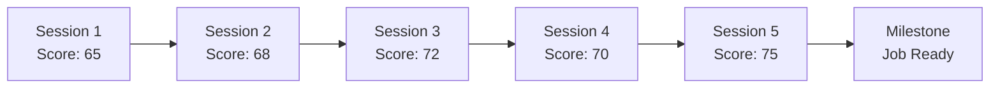

# AI Mock Call - Evaluation Metrics

## Overview

The AI Mock Call evaluation system assesses performance across multiple dimensions critical to call center success. The system provides real-time feedback during calls and comprehensive post-call analysis to accelerate skill development.

## Scoring Framework

### Overall Score Calculation

```typescript
overallScore = (
  greetingScore * 0.10 +
  listeningScore * 0.20 +
  solutionScore * 0.25 +
  communicationScore * 0.20 +
  empathyScore * 0.15 +
  closingScore * 0.10
)
```

### Performance Levels

| Score | Level | Description | Call Center Readiness |
|-------|-------|-------------|----------------------|
| 90-100 | Expert | Exceptional performance | Ready for senior roles |
| 80-89 | Proficient | Strong performance | Ready for employment |
| 70-79 | Competent | Good performance | Ready with minor training |
| 60-69 | Developing | Adequate performance | Needs additional practice |
| 50-59 | Beginner | Basic performance | Requires significant training |
| 0-49 | Novice | Needs improvement | Not yet ready |

## Core Evaluation Categories

### 1. Opening & Greeting (10% weight)

Evaluates the professional start of the call.

#### Evaluation Criteria:

```typescript
interface GreetingMetrics {
  components: {
    timeliness: number;        // Answered within 3 seconds
    companyName: boolean;      // Mentioned company name
    agentName: boolean;        // Provided agent name
    offerToHelp: boolean;      // Asked how to help
    tone: number;              // Friendly and professional
    enthusiasm: number;        // Energy level appropriate
  };

  calculate(): number {
    let score = 100;

    // Deductions
    if (this.components.timeliness > 3) score -= 20;
    if (!this.components.companyName) score -= 25;
    if (!this.components.agentName) score -= 15;
    if (!this.components.offerToHelp) score -= 20;

    // Tone adjustment
    score *= (this.components.tone / 100);
    score *= (this.components.enthusiasm / 100);

    return Math.max(0, score);
  }
}
```

**Examples:**
- ✅ Excellent (95+): "Good morning! Thank you for calling TechSupport Inc. My name is Sarah. How may I assist you today?"
- ⚠️ Needs Improvement (60): "Hello... TechSupport... What's your problem?"

### 2. Active Listening (20% weight)

Measures ability to understand and acknowledge customer needs.

#### Sub-metrics:

- **Issue Identification** (40%)
  - Correctly identifies primary issue
  - Recognizes secondary concerns
  - Asks clarifying questions

- **Acknowledgment** (30%)
  - Verbal confirmations ("I understand...")
  - Paraphrasing customer's concerns
  - Note-taking accuracy

- **Information Gathering** (30%)
  - Asks relevant questions
  - Collects necessary details
  - Verifies information

#### Scoring Algorithm:

```typescript
class ListeningEvaluator {
  evaluate(transcript: CallTranscript): ListeningScore {
    const metrics = {
      questionCount: this.countQuestions(transcript),
      clarifications: this.findClarifications(transcript),
      acknowledgments: this.findAcknowledgments(transcript),
      interruptions: this.countInterruptions(transcript),
      missedCues: this.findMissedCues(transcript)
    };

    let score = 100;

    // Positive indicators
    score += metrics.questionCount * 2;
    score += metrics.clarifications * 5;
    score += metrics.acknowledgments * 3;

    // Negative indicators
    score -= metrics.interruptions * 10;
    score -= metrics.missedCues * 15;

    return Math.min(100, Math.max(0, score));
  }

  private findAcknowledgments(transcript: CallTranscript): number {
    const patterns = [
      /I understand/i,
      /I see/i,
      /That must be frustrating/i,
      /Let me make sure I have this right/i,
      /So what you're saying is/i
    ];

    return patterns.reduce((count, pattern) => {
      return count + (transcript.agentText.match(pattern) || []).length;
    }, 0);
  }
}
```

### 3. Solution & Problem Solving (25% weight)

Evaluates ability to resolve customer issues effectively.

#### Evaluation Components:

- **Accuracy** (40%)
  - Correct solution provided
  - Follows company policy
  - Technical accuracy

- **Efficiency** (30%)
  - Time to resolution
  - Minimal back-and-forth
  - Clear explanation

- **Completeness** (30%)
  - All issues addressed
  - Preventive advice given
  - Follow-up arranged

#### Scenario-Based Scoring:

```typescript
interface SolutionScoring {
  scenarioId: string;
  acceptableSolutions: Solution[];
  providedSolution: string;

  evaluate(): SolutionScore {
    const score = {
      accuracy: 0,
      efficiency: 0,
      completeness: 0
    };

    // Check if solution matches acceptable ones
    const matchedSolution = this.findBestMatch(
      this.providedSolution,
      this.acceptableSolutions
    );

    if (matchedSolution) {
      score.accuracy = matchedSolution.accuracyScore;
      score.efficiency = this.calculateEfficiency();
      score.completeness = this.assessCompleteness();
    }

    return score;
  }

  private calculateEfficiency(): number {
    const optimalTime = 300; // 5 minutes
    const actualTime = this.callDuration;

    if (actualTime <= optimalTime) return 100;
    if (actualTime <= optimalTime * 1.5) return 80;
    if (actualTime <= optimalTime * 2) return 60;
    return 40;
  }
}
```

### 4. Communication Skills (20% weight)

Assesses clarity, professionalism, and effectiveness of communication.

#### Metrics:

- **Clarity** (35%)
  - Clear articulation
  - Appropriate pace
  - Avoids jargon

- **Professionalism** (35%)
  - Appropriate language
  - Maintains composure
  - Respectful tone

- **Effectiveness** (30%)
  - Concise explanations
  - Logical flow
  - Persuasiveness

#### Language Analysis:

```typescript
class CommunicationAnalyzer {
  private inappropriateTerms = [
    'dude', 'yeah whatever', 'I guess', 'I dunno',
    'that\'s not my problem', 'calm down'
  ];

  private professionalPhrases = [
    'I\'d be happy to',
    'Let me assist you',
    'I appreciate your patience',
    'Thank you for bringing this to our attention'
  ];

  analyze(transcript: string): CommunicationScore {
    const metrics = {
      clarity: this.assessClarity(transcript),
      professionalism: this.assessProfessionalism(transcript),
      effectiveness: this.assessEffectiveness(transcript),
      fillerWords: this.countFillers(transcript),
      speakingPace: this.calculatePace(transcript)
    };

    return this.calculateScore(metrics);
  }

  private assessProfessionalism(text: string): number {
    let score = 100;

    // Deduct for inappropriate language
    this.inappropriateTerms.forEach(term => {
      if (text.toLowerCase().includes(term)) {
        score -= 10;
      }
    });

    // Add for professional phrases
    this.professionalPhrases.forEach(phrase => {
      if (text.toLowerCase().includes(phrase.toLowerCase())) {
        score += 5;
      }
    });

    return Math.min(100, Math.max(0, score));
  }
}
```

### 5. Empathy & Emotional Intelligence (15% weight)

Measures ability to connect with customers emotionally.

#### Assessment Areas:

- **Empathy Statements** (40%)
  - Acknowledges feelings
  - Shows understanding
  - Validates concerns

- **Tone Matching** (30%)
  - Adjusts to customer mood
  - Appropriate energy level
  - Emotional regulation

- **Personalization** (30%)
  - Uses customer name
  - References their situation
  - Shows genuine care

#### Empathy Detection:

```typescript
const empathyIndicators = {
  strong: [
    'I completely understand',
    'That must be frustrating',
    'I can see why you\'re upset',
    'I would feel the same way',
    'Thank you for your patience'
  ],
  moderate: [
    'I understand',
    'I see',
    'I hear you',
    'That\'s concerning'
  ],
  weak: [
    'OK',
    'I got it',
    'Alright',
    'Understood'
  ]
};

function calculateEmpathyScore(transcript: CallTranscript): number {
  const customerEmotionLevel = detectEmotionLevel(transcript.customer);
  const agentEmpathyLevel = detectEmpathyLevel(transcript.agent);

  // Higher customer emotion requires more empathy
  if (customerEmotionLevel > 70 && agentEmpathyLevel < 50) {
    return 40; // Missed opportunity
  }

  return Math.min(100, agentEmpathyLevel * 1.2);
}
```

### 6. Call Closure (10% weight)

Evaluates professional call ending and follow-up.

#### Closure Components:

- **Issue Confirmation** (35%)
  - Verifies resolution
  - Confirms understanding
  - Checks satisfaction

- **Next Steps** (35%)
  - Clear action items
  - Timeline provided
  - Follow-up scheduled

- **Professional Farewell** (30%)
  - Thanks customer
  - Offers further help
  - Branded closing

## Industry-Specific Metrics

### Call Center KPIs

```typescript
interface CallCenterMetrics {
  // Efficiency Metrics
  averageHandleTime: number;      // Target: < 6 minutes
  firstCallResolution: boolean;   // Target: > 70%
  holdTime: number;               // Target: < 30 seconds
  transferRate: number;           // Target: < 10%

  // Quality Metrics
  customerSatisfaction: number;   // Target: > 85%
  qualityScore: number;          // Target: > 80%
  complianceScore: number;       // Target: 100%

  // Productivity Metrics
  callsPerHour: number;          // Benchmark: 10-12
  wrapUpTime: number;            // Target: < 30 seconds
  availability: number;           // Target: > 85%
}
```

### Compliance Scoring

```typescript
interface ComplianceCheck {
  required: {
    identityVerification: boolean;
    disclosureStatements: boolean;
    dataProtection: boolean;
    recordingConsent: boolean;
  };

  calculate(): number {
    const checks = Object.values(this.required);
    const passed = checks.filter(c => c === true).length;
    return (passed / checks.length) * 100;
  }
}
```

## Real-time Feedback System

### During Call Indicators

```typescript
interface RealtimeFeedback {
  type: 'positive' | 'warning' | 'critical';
  category: 'empathy' | 'pace' | 'solution' | 'compliance';
  message: string;
  timestamp: number;

  examples: [
    {
      type: 'warning',
      category: 'pace',
      message: 'Speaking too fast - slow down'
    },
    {
      type: 'positive',
      category: 'empathy',
      message: 'Great empathy statement!'
    },
    {
      type: 'critical',
      category: 'compliance',
      message: 'Must verify identity before proceeding'
    }
  ]
}
```

### Visual Indicators

```scss
.performance-indicator {
  &.excellent { background: #00C853; } // Green
  &.good { background: #66BB6A; }      // Light Green
  &.fair { background: #FFB300; }      // Amber
  &.poor { background: #FF6B35; }      // Orange
  &.critical { background: #FF3B30; }  // Red
}
```

## Post-Call Analysis

### Detailed Report Structure

```typescript
interface CallReport {
  summary: {
    overallScore: number;
    outcome: 'resolved' | 'escalated' | 'failed';
    duration: number;
    customerSatisfaction: number;
  };

  timeline: {
    events: TimelineEvent[];
    keyMoments: {
      timestamp: number;
      description: string;
      impact: 'positive' | 'negative';
    }[];
  };

  strengths: {
    category: string;
    example: string;
    impact: string;
  }[];

  improvements: {
    category: string;
    issue: string;
    suggestion: string;
    priority: 'high' | 'medium' | 'low';
  }[];

  comparison: {
    vsPersonalBest: number;
    vsAverage: number;
    vsTarget: number;
  };

  learningPath: {
    nextScenario: string;
    focusAreas: string[];
    recommendedTraining: string[];
  };
}
```

### AI-Generated Feedback

```typescript
class FeedbackGenerator {
  generateFeedback(evaluation: Evaluation): Feedback {
    const prompt = `
    Analyze this call center performance:
    - Scores: ${JSON.stringify(evaluation.scores)}
    - Customer mood change: ${evaluation.moodChange}
    - Resolution: ${evaluation.resolved}

    Provide:
    1. Three specific strengths with examples
    2. Three areas for improvement with actionable advice
    3. One key takeaway for next call
    `;

    return this.aiService.generate(prompt);
  }
}
```

## Progress Tracking

### Skill Development Curves

```typescript
interface SkillProgression {
  skill: string;
  currentLevel: number;
  targetLevel: number;
  sessionsToTarget: number;
  improvementRate: number;

  milestones: {
    level: number;
    sessionsRequired: number;
    achieved: boolean;
  }[];
}
```

### Performance Trends



## Gamification & Achievements

### Achievement Categories

| Achievement | Requirement | XP |
|-------------|------------|-----|
| Speed Resolver | Resolve in < 5 min | 50 |
| Empathy Expert | 95% empathy score | 75 |
| Perfect Call | 100% overall score | 200 |
| De-escalation Master | Calm 5 angry customers | 100 |
| Compliance Champion | 100% compliance 10 calls | 150 |

### Certification Levels

```typescript
const certificationLevels = {
  bronze: {
    requirement: 'Complete 10 calls with 70+ score',
    benefits: 'Basic Call Center Ready'
  },
  silver: {
    requirement: 'Complete 25 calls with 80+ score',
    benefits: 'Professional Agent Certified'
  },
  gold: {
    requirement: 'Complete 50 calls with 85+ score',
    benefits: 'Expert Agent Certified'
  },
  platinum: {
    requirement: 'Complete 100 calls with 90+ score',
    benefits: 'Master Agent Certified'
  }
};
```

---

*Document Version: 1.0*
*Last Updated: October 2025*
*Next Review: November 2025*