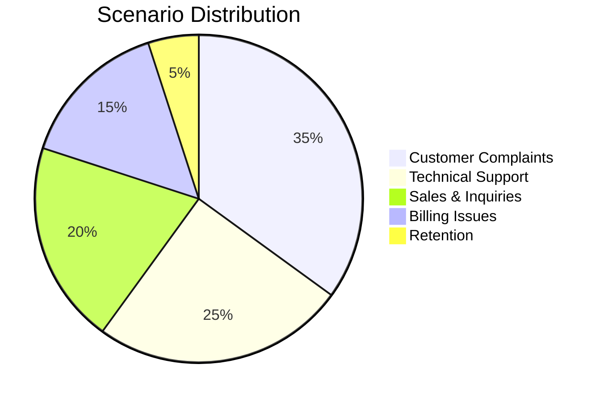
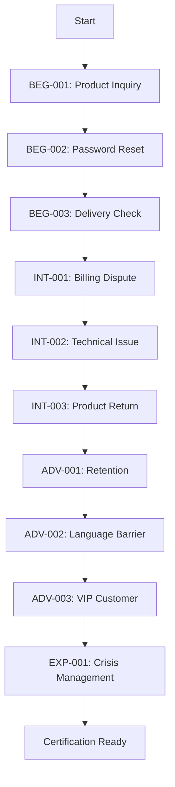

# AI Mock Call - Scenarios Library

## Overview

This document contains the comprehensive library of call center scenarios designed to prepare users for real-world customer service situations. Each scenario is crafted based on actual call center data and industry best practices.

## Scenario Categories

### Distribution by Type



## Beginner Scenarios

### BEG-001: Simple Product Inquiry

**Category:** Sales & Inquiries
**Duration:** 3-5 minutes
**Difficulty:** ⭐☆☆☆☆

**Customer Profile:**
```json
{
  "name": "Maria Santos",
  "age": 32,
  "personality": "Friendly, curious",
  "mood": "Neutral",
  "speaking_style": "Clear, moderate pace",
  "background": "First-time caller, interested in services"
}
```

**Scenario Context:**
- Customer wants information about internet plans
- Has basic questions about speed and pricing
- No technical knowledge required
- Straightforward inquiry with no complications

**Success Criteria:**
- Provide accurate plan information
- Explain differences between packages
- Offer appropriate recommendation
- Capture customer information for follow-up

**Sample Dialogue:**
```
Customer: "Hi, I'm calling to ask about your internet plans."
Agent: [Greeting and offer to help]
Customer: "What speeds do you offer?"
Agent: [Explain available speeds]
Customer: "And how much does it cost?"
```

---

### BEG-002: Password Reset Request

**Category:** Technical Support
**Duration:** 4-6 minutes
**Difficulty:** ⭐☆☆☆☆

**Customer Profile:**
```json
{
  "name": "elderly_1",
  "age": 68,
  "personality": "Patient but confused",
  "mood": "Slightly worried",
  "speaking_style": "Slow, needs repetition",
  "background": "Not tech-savvy, needs gentle guidance"
}
```

**Scenario Context:**
- Customer forgot their account password
- Needs step-by-step guidance
- Requires identity verification
- Simple technical issue with clear resolution

**Success Criteria:**
- Verify customer identity properly
- Guide through password reset process
- Ensure customer can access account
- Provide clear instructions for future reference

---

### BEG-003: Delivery Status Check

**Category:** Sales & Inquiries
**Duration:** 3-4 minutes
**Difficulty:** ⭐☆☆☆☆

**Customer Profile:**
```json
{
  "name": "James Miller",
  "age": 28,
  "personality": "Busy professional",
  "mood": "Neutral, slightly impatient",
  "speaking_style": "Quick, to-the-point",
  "background": "Regular customer, values efficiency"
}
```

**Scenario Context:**
- Customer ordered product 3 days ago
- Wants to know delivery status
- Order is on schedule
- No complications or issues

## Intermediate Scenarios

### INT-001: Billing Dispute - Overcharge

**Category:** Billing Issues
**Duration:** 8-12 minutes
**Difficulty:** ⭐⭐⭐☆☆

**Customer Profile:**
```json
{
  "name": "Robert Johnson",
  "age": 45,
  "personality": "Assertive, detail-oriented",
  "mood": "Frustrated",
  "frustration_level": 65,
  "speaking_style": "Firm, wants explanations",
  "background": "Long-term customer, good payment history"
}
```

**Scenario Context:**
- Customer's bill is $75 higher than usual
- Legitimate error in billing system
- Customer has documentation
- Requires investigation and resolution

**Emotional Triggers:**
- Frustration increases if agent doesn't acknowledge the issue quickly
- Calms down with empathy and clear action plan
- May ask for supervisor if not satisfied

**Acceptable Solutions:**
1. **Best:** Immediate credit + future bill discount
2. **Good:** Full credit on next bill
3. **Acceptable:** Investigation with callback

**Key Challenges:**
- Customer interrupts if explanations are too long
- Demands immediate resolution
- Questions company competence
- May threaten to cancel service

**Sample Escalation Path:**
```
Initial Frustration: 65/100
If no empathy shown: +20
If put on hold > 60 seconds: +15
If solution not offered within 5 minutes: +25
If appropriate empathy and solution: -30
```

---

### INT-002: Technical Issue - Internet Outage

**Category:** Technical Support
**Duration:** 10-15 minutes
**Difficulty:** ⭐⭐⭐☆☆

**Customer Profile:**
```json
{
  "name": "Sarah Chen",
  "age": 38,
  "personality": "Working from home, stressed",
  "mood": "Anxious",
  "urgency": "High - needs internet for work",
  "technical_level": "Moderate",
  "background": "Has important video call in 1 hour"
}
```

**Scenario Context:**
- Internet stopped working 30 minutes ago
- Customer already tried basic troubleshooting
- Issue is area-wide outage (not initially known)
- Customer needs immediate solution

**Technical Details:**
- Modem lights: Power ON, Internet OFF
- Already restarted modem twice
- Other devices also cannot connect
- No recent changes to setup

**Resolution Path:**
1. Verify customer information
2. Check area outage system (finds outage)
3. Provide estimated resolution time (2 hours)
4. Offer mobile hotspot as temporary solution
5. Provide compensation options

**Emotional Management:**
- High anxiety due to work meeting
- Needs reassurance and alternatives
- Appreciates proactive solutions

---

### INT-003: Product Return - Defective Item

**Category:** Customer Complaints
**Duration:** 8-10 minutes
**Difficulty:** ⭐⭐⭐☆☆

**Customer Profile:**
```json
{
  "name": "Michelle Brown",
  "age": 29,
  "personality": "Disappointed, reasonable",
  "mood": "Unhappy but calm",
  "expectation": "Full refund or replacement",
  "background": "First issue with company"
}
```

**Scenario Context:**
- Purchased product 2 weeks ago
- Product stopped working after 10 days
- Has receipt and within warranty
- Wants quick resolution

**Company Policies:**
- 30-day return window
- Replacement or refund available
- Requires return of defective item
- Can offer expedited shipping

## Advanced Scenarios

### ADV-001: Irate Customer - Service Cancellation Threat

**Category:** Retention
**Duration:** 15-20 minutes
**Difficulty:** ⭐⭐⭐⭐☆

**Customer Profile:**
```json
{
  "name": "David Thompson",
  "age": 52,
  "personality": "Aggressive, demanding",
  "mood": "Very angry",
  "frustration_level": 85,
  "loyalty": "10-year customer",
  "value": "High-value account",
  "trigger": "Third time calling about same issue"
}
```

**Scenario Context:**
- Recurring billing error for 3 months
- Previous agents didn't resolve issue
- Customer wants to cancel all services
- Threatens social media complaint

**Complex Factors:**
- Customer interrupts frequently
- Rejects initial solutions
- Demands compensation for inconvenience
- Questions agent's competence
- May use profanity (bleeps out)

**De-escalation Strategy:**
```typescript
const deescalationPath = {
  acknowledge: "Recognize frustration and apologize",
  empathize: "Validate their experience",
  investigate: "Show genuine interest in solving",
  escalate: "Involve supervisor if needed",
  resolve: "Offer substantial compensation",
  followUp: "Personal callback from manager"
};
```

**Win-back Offers:**
- 3 months free service
- Account credit of $200
- Service upgrade at no cost
- Direct manager contact line

---

### ADV-002: Complex Technical Issue with Language Barrier

**Category:** Technical Support
**Duration:** 20-25 minutes
**Difficulty:** ⭐⭐⭐⭐⭐

**Customer Profile:**
```json
{
  "name": "Raj Patel",
  "age": 60,
  "personality": "Confused, struggling with English",
  "mood": "Frustrated and embarrassed",
  "language_proficiency": "Limited English",
  "accent": "Heavy",
  "technical_knowledge": "Very basic"
}
```

**Scenario Context:**
- Multiple device connectivity issues
- Customer struggles to explain problem
- Misunderstands technical terms
- Needs patient, clear communication

**Communication Challenges:**
- Often says "yes" without understanding
- Confuses similar-sounding words
- Needs visual alternatives (email screenshots)
- May need multiple repetitions

**Cultural Sensitivity Points:**
- Respectful of authority (won't complain directly)
- May not admit when confused
- Appreciates patience and respect

---

### ADV-003: VIP Customer - Multiple Issues

**Category:** Multiple
**Duration:** 20-30 minutes
**Difficulty:** ⭐⭐⭐⭐⭐

**Customer Profile:**
```json
{
  "name": "Victoria Hamilton",
  "age": 48,
  "personality": "Demanding, expects special treatment",
  "mood": "Impatient",
  "account_type": "Premium VIP",
  "monthly_spend": "$500+",
  "influence": "Social media influencer with 100K followers"
}
```

**Multiple Issues:**
1. Billing discrepancy ($250)
2. Service quality complaints
3. Wants service upgrade
4. Demands manager involvement
5. Threatens public complaint

**VIP Handling Requirements:**
- Acknowledge VIP status immediately
- Offer premium solutions
- Provide direct escalation path
- Document everything thoroughly
- Follow up within 24 hours

## Expert Scenarios

### EXP-001: Crisis Management - Data Breach Concern

**Category:** Crisis Management
**Duration:** 25-30 minutes
**Difficulty:** ⭐⭐⭐⭐⭐

**Customer Profile:**
```json
{
  "name": "Security_Expert_1",
  "age": 35,
  "personality": "Technical, suspicious, demanding answers",
  "mood": "Extremely concerned",
  "background": "IT security professional",
  "knowledge": "High technical knowledge"
}
```

**Scenario Context:**
- Customer suspects account compromise
- Asks technical security questions
- Wants detailed investigation
- Threatens legal action

**Required Knowledge:**
- Data protection policies
- Security protocols
- Incident response procedures
- Legal compliance requirements

**Critical Actions:**
- Immediate account security
- Detailed incident report
- Escalation to security team
- Clear documentation
- Follow-up protocol

## Scenario Difficulty Progression

### Learning Path



## Industry-Specific Scenarios

### Telecommunications

#### TEL-001: Mobile Plan Upgrade
- Customer wants to upgrade data plan
- Needs explanation of 5G vs 4G
- Bundle opportunities available

#### TEL-002: Network Coverage Complaint
- Poor signal in customer's area
- Requires technical explanation
- Compensation discussion needed

### Banking

#### BANK-001: Fraudulent Transaction
- Customer reports unauthorized charge
- Requires immediate card blocking
- Fraud investigation process

#### BANK-002: Loan Application Status
- Customer checking loan progress
- Needs sensitive information handling
- Compliance requirements

### Healthcare

#### HEALTH-001: Insurance Coverage Question
- Complex coverage explanation needed
- HIPAA compliance required
- Pre-authorization discussion

#### HEALTH-002: Appointment Rescheduling
- Urgent medical appointment
- Limited availability
- Requires empathy and flexibility

### E-Commerce

#### ECOM-001: Wrong Item Shipped
- Customer received incorrect product
- Needs immediate replacement
- Shipping logistics discussion

#### ECOM-002: Payment Processing Error
- Transaction failed but charged
- Requires payment investigation
- Customer wants immediate refund

## Scenario Customization

### Dynamic Variables

```typescript
interface ScenarioVariables {
  customerMood: {
    initial: number;     // 0-100
    volatility: number;  // How quickly mood changes
    triggers: string[];  // What improves/worsens mood
  };

  complexity: {
    issueCount: number;  // Single or multiple issues
    technicalLevel: number; // Required knowledge
    policyKnowledge: number; // Policy complexity
  };

  timing: {
    urgency: 'low' | 'medium' | 'high' | 'critical';
    patience: number;    // How long before escalation
    interruptions: boolean; // Will customer interrupt
  };

  resolution: {
    acceptableSolutions: Solution[];
    preferredOutcome: string;
    dealBreakers: string[];
  };
}
```

### Adaptive Difficulty

```typescript
class ScenarioAdapter {
  adjustDifficulty(
    baseScenario: Scenario,
    userPerformance: Performance
  ): Scenario {
    const adjusted = { ...baseScenario };

    if (userPerformance.averageScore > 85) {
      // Increase difficulty
      adjusted.customerMood -= 10;
      adjusted.complexity += 1;
      adjusted.interruptions = true;
    } else if (userPerformance.averageScore < 60) {
      // Decrease difficulty
      adjusted.customerMood += 10;
      adjusted.complexity -= 1;
      adjusted.patience += 20;
    }

    return adjusted;
  }
}
```

## Scenario Creation Guidelines

### Best Practices

1. **Realism**: Base on actual call center data
2. **Diversity**: Include various personalities and situations
3. **Progression**: Clear difficulty progression
4. **Measurability**: Specific success criteria
5. **Flexibility**: Multiple resolution paths
6. **Cultural Sensitivity**: Diverse customer backgrounds
7. **Industry Relevance**: Specific to target employment

### Testing Protocol

```typescript
interface ScenarioTesting {
  phases: {
    alpha: "Internal team testing",
    beta: "Small user group",
    production: "Full release"
  };

  metrics: {
    completionRate: number;
    averageScore: number;
    userFeedback: number;
    technicalIssues: number;
  };

  criteria: {
    realistic: boolean;
    appropriate: boolean;
    educational: boolean;
    engaging: boolean;
  };
}
```

---

*Document Version: 1.0*
*Last Updated: October 2025*
*Next Review: November 2025*