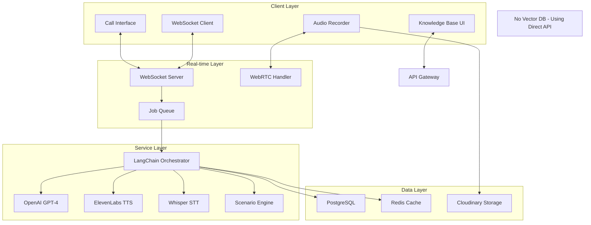

# AI Mock Call - Technical Specifications

## System Architecture

### High-Level Architecture



## Technology Stack

### Core Technologies

| Component | Technology | Version | Purpose |
|-----------|------------|---------|---------|
| Runtime | Node.js | 20.x | Server runtime |
| Framework | Next.js | 15.x | Full-stack framework |
| Real-time | Socket.io | 4.x | WebSocket management |
| WebRTC | SimplePeer | 9.x | P2P audio streaming |
| AI Model | GPT-4 | Latest | Customer simulation (direct API) |
| TTS | ElevenLabs | v1 | Voice synthesis |
| STT | Whisper | v3 | Speech recognition |
| Orchestration | LangChain | 0.3.x | Lightweight workflow (no RAG) |
| Database | PostgreSQL | 15.x | Primary storage |
| Cache | Redis | 7.x | Session state |
| Queue | Bull | 4.x | Job processing |

**Note**: Vector DB (Pinecone/Weaviate) is NOT used. Mock call scenarios are managed via direct API calls with structured prompts.

## Real-time Communication

### WebSocket Architecture

```typescript
// server/websocket/call-server.ts
import { Server, Socket } from 'socket.io';
import { CallSession } from '@/types/call';

export class MockCallServer {
  private io: Server;
  private sessions: Map<string, CallSession> = new Map();

  constructor(server: any) {
    this.io = new Server(server, {
      cors: {
        origin: process.env.NEXT_PUBLIC_APP_URL,
        credentials: true
      },
      transports: ['websocket', 'polling']
    });

    this.setupEventHandlers();
  }

  private setupEventHandlers() {
    this.io.on('connection', (socket: Socket) => {
      // Call initiation
      socket.on('call:start', async (data) => {
        const session = await this.createCallSession(data);
        this.sessions.set(session.id, session);
        socket.join(`call:${session.id}`);
        socket.emit('call:ready', session);
      });

      // Audio streaming
      socket.on('audio:stream', async (data) => {
        await this.processAudioStream(data);
      });

      // Call control
      socket.on('call:hold', (sessionId) => {
        this.holdCall(sessionId);
      });

      socket.on('call:end', async (sessionId) => {
        await this.endCall(sessionId);
      });
    });
  }

  private async processAudioStream(data: AudioStreamData) {
    // Process incoming audio
    // Convert to text
    // Generate AI response
    // Convert to speech
    // Stream back to client
  }
}
```

### WebRTC Configuration

```typescript
// lib/webrtc/call-connection.ts
export class CallConnection {
  private peerConnection: RTCPeerConnection;
  private localStream: MediaStream;
  private remoteStream: MediaStream;

  constructor() {
    this.peerConnection = new RTCPeerConnection({
      iceServers: [
        { urls: 'stun:stun.l.google.com:19302' },
        {
          urls: process.env.TURN_SERVER_URL,
          username: process.env.TURN_USERNAME,
          credential: process.env.TURN_CREDENTIAL
        }
      ],
      iceCandidatePoolSize: 10
    });
  }

  async initializeCall(): Promise<void> {
    // Get user media
    this.localStream = await navigator.mediaDevices.getUserMedia({
      audio: {
        echoCancellation: true,
        noiseSuppression: true,
        autoGainControl: true,
        sampleRate: 48000,
        channelCount: 1
      }
    });

    // Add tracks to peer connection
    this.localStream.getTracks().forEach(track => {
      this.peerConnection.addTrack(track, this.localStream);
    });

    // Handle remote stream
    this.peerConnection.ontrack = (event) => {
      this.remoteStream = event.streams[0];
    };
  }
}
```

## Scenario Engine

### Scenario Management System

```typescript
// lib/scenarios/scenario-engine.ts
export class ScenarioEngine {
  private scenarios: Map<string, Scenario> = new Map();
  private activeScenario: ActiveScenario | null = null;

  async loadScenario(scenarioId: string): Promise<Scenario> {
    // Load from database
    const scenario = await db.scenario.findUnique({
      where: { id: scenarioId },
      include: {
        customerProfile: true,
        contextData: true,
        evaluationCriteria: true
      }
    });

    // Initialize AI context
    const context = this.buildContext(scenario);

    // Create LangChain prompt
    const prompt = this.createPrompt(scenario, context);

    return {
      ...scenario,
      context,
      prompt,
      state: 'initialized'
    };
  }

  private buildContext(scenario: Scenario): ScenarioContext {
    return {
      customerPersona: scenario.customerProfile,
      emotionalState: scenario.initialMood,
      issueDetails: scenario.problemDescription,
      expectedResolution: scenario.targetOutcome,
      companyPolicies: scenario.applicablePolicies,
      availableSolutions: scenario.solutionOptions
    };
  }
}
```

### Dynamic Customer Behavior

```typescript
// lib/ai/customer-simulation.ts
import { ChatOpenAI } from "@langchain/openai";
import { ConversationChain } from "langchain/chains";

export class CustomerSimulator {
  private model: ChatOpenAI;
  private chain: ConversationChain;
  private emotionalState: EmotionalState;

  constructor(scenario: Scenario) {
    this.model = new ChatOpenAI({
      modelName: "gpt-4-turbo-preview",
      temperature: 0.8, // Higher for more variability
      maxTokens: 200,
      streaming: true
    });

    this.emotionalState = {
      frustration: scenario.initialFrustration,
      satisfaction: 50,
      patience: scenario.customerPatience,
      cooperation: scenario.cooperationLevel
    };

    this.initializeChain(scenario);
  }

  private initializeChain(scenario: Scenario) {
    const systemPrompt = `
    You are simulating a customer calling a call center.

    Customer Profile:
    - Name: ${scenario.customerName}
    - Age: ${scenario.customerAge}
    - Personality: ${scenario.personality}
    - Issue: ${scenario.issue}
    - Emotional State: ${scenario.mood}

    Behavior Guidelines:
    - Frustration Level: ${this.emotionalState.frustration}/100
    - Patience Level: ${this.emotionalState.patience}/100
    - Speaking Style: ${scenario.speakingStyle}

    Important:
    - Respond naturally as this customer would
    - Show emotion through word choice and tone
    - Interrupt if frustrated (frustration > 70)
    - Ask for supervisor if very unsatisfied
    - Can be convinced with good service
    `;

    this.chain = new ConversationChain({
      llm: this.model,
      verbose: false,
      memory: new BufferMemory({
        memoryKey: "history",
        returnMessages: true
      })
    });
  }

  async generateResponse(agentMessage: string): Promise<CustomerResponse> {
    // Adjust emotional state based on agent's response
    this.updateEmotionalState(agentMessage);

    // Generate response
    const response = await this.chain.call({
      input: agentMessage,
      emotionalState: this.emotionalState
    });

    // Determine if customer will interrupt
    const willInterrupt = this.emotionalState.frustration > 70 &&
                         Math.random() > 0.5;

    return {
      text: response.text,
      emotion: this.emotionalState,
      interrupt: willInterrupt,
      audioIntensity: this.calculateAudioIntensity()
    };
  }

  private updateEmotionalState(agentMessage: string) {
    // Analyze agent's response
    const sentiment = this.analyzeSentiment(agentMessage);

    // Update based on agent's behavior
    if (sentiment.empathy > 0.7) {
      this.emotionalState.frustration -= 10;
      this.emotionalState.satisfaction += 5;
    }

    if (sentiment.solution > 0.8) {
      this.emotionalState.satisfaction += 15;
      this.emotionalState.cooperation += 10;
    }

    // Clamp values
    Object.keys(this.emotionalState).forEach(key => {
      this.emotionalState[key] = Math.max(0, Math.min(100, this.emotionalState[key]));
    });
  }
}
```

## Voice Processing

### ElevenLabs Integration

```typescript
// lib/voice/elevenlabs-service.ts
export class ElevenLabsService {
  private apiKey: string;
  private voiceProfiles: Map<string, VoiceProfile>;

  constructor() {
    this.apiKey = process.env.ELEVENLABS_API_KEY!;
    this.initializeVoiceProfiles();
  }

  private initializeVoiceProfiles() {
    this.voiceProfiles = new Map([
      ['angry_customer', {
        voiceId: 'voice_id_1',
        stability: 0.6,
        similarityBoost: 0.8,
        style: 'aggressive',
        speakingRate: 1.2
      }],
      ['confused_elder', {
        voiceId: 'voice_id_2',
        stability: 0.8,
        similarityBoost: 0.7,
        style: 'slow',
        speakingRate: 0.8
      }],
      ['professional', {
        voiceId: 'voice_id_3',
        stability: 0.75,
        similarityBoost: 0.75,
        style: 'formal',
        speakingRate: 1.0
      }]
    ]);
  }

  async synthesizeSpeech(
    text: string,
    profile: string,
    emotion: EmotionalState
  ): Promise<AudioStream> {
    const voice = this.voiceProfiles.get(profile);

    // Adjust voice parameters based on emotion
    const adjustedParams = this.adjustVoiceForEmotion(voice!, emotion);

    const response = await fetch('https://api.elevenlabs.io/v1/text-to-speech', {
      method: 'POST',
      headers: {
        'xi-api-key': this.apiKey,
        'Content-Type': 'application/json'
      },
      body: JSON.stringify({
        text,
        voice_settings: adjustedParams,
        model_id: 'eleven_monolingual_v1'
      })
    });

    return response.body;
  }

  private adjustVoiceForEmotion(
    voice: VoiceProfile,
    emotion: EmotionalState
  ): VoiceSettings {
    const adjusted = { ...voice };

    // High frustration = faster, less stable
    if (emotion.frustration > 70) {
      adjusted.speakingRate *= 1.3;
      adjusted.stability *= 0.8;
    }

    // Low patience = more interruptions
    if (emotion.patience < 30) {
      adjusted.speakingRate *= 1.2;
    }

    return adjusted;
  }
}
```

### Audio Processing Pipeline

```typescript
// lib/audio/processing-pipeline.ts
export class AudioProcessingPipeline {
  private whisperClient: WhisperClient;
  private noiseFilter: NoiseFilter;
  private audioBuffer: AudioBuffer;

  async processIncomingAudio(audioStream: ReadableStream): Promise<Transcription> {
    // 1. Buffer audio chunks
    const audioData = await this.bufferAudio(audioStream);

    // 2. Apply noise reduction
    const cleanAudio = await this.noiseFilter.process(audioData);

    // 3. Convert to appropriate format
    const formatted = this.formatForWhisper(cleanAudio);

    // 4. Send to Whisper
    const transcription = await this.whisperClient.transcribe(formatted);

    // 5. Post-process transcription
    return this.postProcess(transcription);
  }

  private async bufferAudio(stream: ReadableStream): Promise<AudioData> {
    const reader = stream.getReader();
    const chunks: Uint8Array[] = [];

    while (true) {
      const { done, value } = await reader.read();
      if (done) break;
      chunks.push(value);
    }

    return this.concatenateChunks(chunks);
  }

  private formatForWhisper(audio: AudioData): WhisperFormat {
    // Convert to 16kHz, mono, 16-bit PCM
    return {
      sampleRate: 16000,
      channels: 1,
      bitDepth: 16,
      data: audio.pcmData
    };
  }
}
```

## Database Schema

### Call Session Models

```prisma
model CallSession {
  id              String   @id @default(cuid())
  userId          String
  scenarioId      String
  status          CallStatus @default(IN_PROGRESS)

  // Timing
  startTime       DateTime @default(now())
  endTime         DateTime?
  duration        Int?     // seconds

  // Audio
  recordingUrl    String?
  transcriptUrl   String?

  // Performance
  evaluation      CallEvaluation?
  events          CallEvent[]
  messages        CallMessage[]

  // Relations
  user            User     @relation(fields: [userId], references: [id])
  scenario        Scenario @relation(fields: [scenarioId], references: [id])

  @@index([userId, status])
  @@index([scenarioId])
}

model Scenario {
  id              String   @id @default(cuid())
  name            String
  category        ScenarioCategory
  difficulty      Difficulty
  estimatedTime   Int      // minutes

  // Customer profile
  customerName    String
  customerAge     Int
  personality     String
  mood            String
  issue           String   @db.Text

  // Context
  companyContext  Json     // Company policies, products, etc.
  targetOutcome   String
  acceptableSolutions Json // Array of valid resolutions

  // AI Configuration
  systemPrompt    String   @db.Text
  voiceProfile    String
  interruptionRate Float   @default(0.1)

  // Usage
  timesPlayed     Int      @default(0)
  avgScore        Float    @default(0)
  isActive        Boolean  @default(true)

  sessions        CallSession[]

  @@index([category, difficulty])
}

model CallEvaluation {
  id              String   @id @default(cuid())
  sessionId       String   @unique
  session         CallSession @relation(fields: [sessionId], references: [id])

  // Scores (0-100)
  greetingScore   Float
  listeningScore  Float
  solutionScore   Float
  communicationScore Float
  empathyScore    Float
  closingScore    Float
  overallScore    Float

  // Metrics
  firstCallResolution Boolean
  handleTime      Int      // seconds
  holdTime        Int      // seconds
  customerSatisfaction Float

  // Detailed feedback
  strengths       String[]
  improvements    String[]
  transcript      Json     // Full conversation transcript
  keyMoments      Json     // Important moments in the call

  evaluatedAt     DateTime @default(now())

  @@index([overallScore])
}

model CallEvent {
  id              String   @id @default(cuid())
  sessionId       String
  session         CallSession @relation(fields: [sessionId], references: [id])

  eventType       String   // hold, transfer, note, solution_offered
  timestamp       DateTime @default(now())
  data            Json?    // Event-specific data

  @@index([sessionId, timestamp])
}
```

## Performance Optimization

### Audio Streaming Optimization

```typescript
// lib/streaming/audio-streamer.ts
export class AudioStreamer {
  private mediaSource: MediaSource;
  private sourceBuffer: SourceBuffer;
  private queue: ArrayBuffer[] = [];

  constructor() {
    this.mediaSource = new MediaSource();
    this.mediaSource.addEventListener('sourceopen', () => {
      this.sourceBuffer = this.mediaSource.addSourceBuffer('audio/webm; codecs=opus');
      this.processQueue();
    });
  }

  async streamAudio(chunks: AsyncIterator<ArrayBuffer>) {
    for await (const chunk of chunks) {
      if (this.sourceBuffer.updating) {
        this.queue.push(chunk);
      } else {
        this.sourceBuffer.appendBuffer(chunk);
      }
    }
  }

  private processQueue() {
    if (!this.sourceBuffer.updating && this.queue.length > 0) {
      const chunk = this.queue.shift()!;
      this.sourceBuffer.appendBuffer(chunk);
    }
  }
}
```

### Caching Strategy

```typescript
// lib/cache/scenario-cache.ts
export class ScenarioCache {
  private redis: Redis;
  private memoryCache: LRUCache<string, CachedScenario>;

  constructor() {
    this.redis = new Redis(process.env.REDIS_URL);
    this.memoryCache = new LRUCache({
      max: 100,
      ttl: 1000 * 60 * 15 // 15 minutes
    });
  }

  async getScenario(id: string): Promise<Scenario | null> {
    // L1: Memory cache
    const memoryCached = this.memoryCache.get(id);
    if (memoryCached) return memoryCached;

    // L2: Redis cache
    const redisCached = await this.redis.get(`scenario:${id}`);
    if (redisCached) {
      const scenario = JSON.parse(redisCached);
      this.memoryCache.set(id, scenario);
      return scenario;
    }

    // L3: Database
    const scenario = await db.scenario.findUnique({ where: { id } });
    if (scenario) {
      await this.redis.setex(
        `scenario:${id}`,
        3600,
        JSON.stringify(scenario)
      );
      this.memoryCache.set(id, scenario);
    }

    return scenario;
  }
}
```

## Security & Compliance

### Call Recording Compliance

```typescript
// lib/compliance/recording-manager.ts
export class RecordingManager {
  async startRecording(sessionId: string, consent: boolean): Promise<void> {
    if (!consent) {
      throw new Error('User consent required for recording');
    }

    // Log consent
    await this.logConsent(sessionId, consent);

    // Start encrypted recording
    await this.initializeEncryptedRecording(sessionId);

    // Set auto-deletion policy
    await this.setRetentionPolicy(sessionId, 30); // 30 days
  }

  private async initializeEncryptedRecording(sessionId: string) {
    const encryptionKey = await this.generateEncryptionKey();

    // Store key securely
    await this.storeKey(sessionId, encryptionKey);

    // Initialize encrypted stream
    return new EncryptedAudioStream(encryptionKey);
  }
}
```

### Rate Limiting

```typescript
const callRateLimits = {
  start: {
    points: 3,      // Number of calls
    duration: 3600, // Per hour
    blockDuration: 3600
  },
  audio: {
    points: 100,    // Audio chunks
    duration: 60,   // Per minute
    blockDuration: 60
  }
};
```

## Monitoring & Analytics

### Call Metrics Collection

```typescript
interface CallMetrics {
  // Performance
  audioLatency: number;
  responseTime: number;
  processingTime: number;

  // Quality
  audioQuality: number;
  transcriptionAccuracy: number;
  aiResponseRelevance: number;

  // User behavior
  interruptionCount: number;
  silenceSeconds: number;
  talkOverEvents: number;

  // System
  cpuUsage: number;
  memoryUsage: number;
  bandwidthUsage: number;
}
```

---

*Document Version: 1.0*
*Last Updated: October 2025*
*Next Review: November 2025*