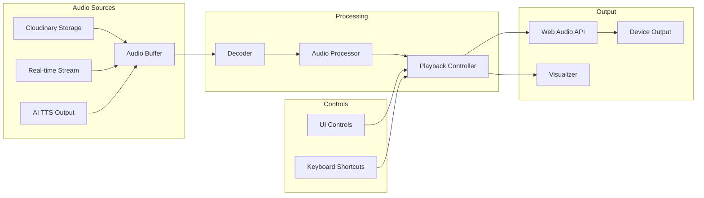

# Audio Playback - Implementation Guide

## Overview

The audio playback system provides seamless audio playback functionality for recorded conversations, AI-generated responses, and real-time audio streams. This document covers playback implementation, synchronization, and user experience optimization.

## Playback Architecture

### System Components



## Audio Player Implementation

### Core Audio Player

```typescript
// lib/audio/audio-player.ts
export class AudioPlayer {
  private audioContext: AudioContext | null = null;
  private sourceNode: AudioBufferSourceNode | null = null;
  private gainNode: GainNode | null = null;
  private analyserNode: AnalyserNode | null = null;
  private audioBuffer: AudioBuffer | null = null;

  // Playback state
  private isPlaying: boolean = false;
  private isPaused: boolean = false;
  private currentTime: number = 0;
  private startTime: number = 0;
  private pauseTime: number = 0;

  // Effects chain
  private compressorNode: DynamicsCompressorNode | null = null;
  private equalizerNodes: BiquadFilterNode[] = [];

  constructor(private config: PlayerConfig = defaultConfig) {
    this.initializeAudioContext();
  }

  private initializeAudioContext(): void {
    this.audioContext = new (window.AudioContext || window.webkitAudioContext)({
      latencyHint: 'interactive',
      sampleRate: 48000
    });

    this.setupAudioNodes();
  }

  private setupAudioNodes(): void {
    if (!this.audioContext) return;

    // Create gain node for volume control
    this.gainNode = this.audioContext.createGain();
    this.gainNode.gain.value = this.config.initialVolume || 1.0;

    // Create analyser for visualization
    this.analyserNode = this.audioContext.createAnalyser();
    this.analyserNode.fftSize = 2048;
    this.analyserNode.smoothingTimeConstant = 0.8;

    // Create compressor for dynamic range
    this.compressorNode = this.audioContext.createDynamicsCompressor();
    this.setupCompressor();

    // Create equalizer
    this.setupEqualizer();

    // Connect nodes
    this.connectAudioNodes();
  }

  private setupCompressor(): void {
    if (!this.compressorNode || !this.audioContext) return;

    this.compressorNode.threshold.setValueAtTime(-24, this.audioContext.currentTime);
    this.compressorNode.knee.setValueAtTime(30, this.audioContext.currentTime);
    this.compressorNode.ratio.setValueAtTime(12, this.audioContext.currentTime);
    this.compressorNode.attack.setValueAtTime(0.003, this.audioContext.currentTime);
    this.compressorNode.release.setValueAtTime(0.25, this.audioContext.currentTime);
  }

  private setupEqualizer(): void {
    if (!this.audioContext) return;

    const frequencies = [60, 170, 350, 1000, 3500, 10000];
    const types: BiquadFilterType[] = ['lowshelf', 'peaking', 'peaking', 'peaking', 'peaking', 'highshelf'];

    frequencies.forEach((freq, index) => {
      const filter = this.audioContext!.createBiquadFilter();
      filter.type = types[index];
      filter.frequency.value = freq;
      filter.Q.value = 1;
      filter.gain.value = 0;

      this.equalizerNodes.push(filter);
    });
  }

  private connectAudioNodes(): void {
    if (!this.audioContext) return;

    // Chain: source -> compressor -> equalizer -> gain -> analyser -> destination
    let previousNode: AudioNode = this.compressorNode!;

    // Connect through equalizer
    this.equalizerNodes.forEach((filter, index) => {
      if (index === 0) {
        // First connection from compressor
        previousNode = filter;
      } else {
        this.equalizerNodes[index - 1].connect(filter);
        previousNode = filter;
      }
    });

    // Final connections
    previousNode.connect(this.gainNode!);
    this.gainNode!.connect(this.analyserNode!);
    this.analyserNode!.connect(this.audioContext.destination);
  }

  async loadAudio(url: string): Promise<void> {
    try {
      const response = await fetch(url);
      const arrayBuffer = await response.arrayBuffer();

      if (!this.audioContext) {
        this.initializeAudioContext();
      }

      this.audioBuffer = await this.audioContext!.decodeAudioData(arrayBuffer);
      this.onLoadComplete?.(this.audioBuffer.duration);
    } catch (error) {
      console.error('Failed to load audio:', error);
      this.onError?.(error);
    }
  }

  play(): void {
    if (this.isPlaying || !this.audioBuffer || !this.audioContext) return;

    // Create new source node
    this.sourceNode = this.audioContext.createBufferSource();
    this.sourceNode.buffer = this.audioBuffer;

    // Connect to audio graph
    this.sourceNode.connect(this.compressorNode || this.gainNode!);

    // Set up playback position
    const offset = this.isPaused ? this.pauseTime : this.currentTime;

    // Start playback
    this.sourceNode.start(0, offset);
    this.startTime = this.audioContext.currentTime - offset;

    // Set up end handler
    this.sourceNode.onended = () => {
      if (this.isPlaying) {
        this.stop();
        this.onEnded?.();
      }
    };

    this.isPlaying = true;
    this.isPaused = false;
    this.onPlay?.();
  }

  pause(): void {
    if (!this.isPlaying || this.isPaused || !this.audioContext) return;

    this.pauseTime = this.audioContext.currentTime - this.startTime;
    this.stop();
    this.isPaused = true;
    this.onPause?.();
  }

  stop(): void {
    if (this.sourceNode) {
      try {
        this.sourceNode.stop();
        this.sourceNode.disconnect();
      } catch (e) {
        // Ignore if already stopped
      }
      this.sourceNode = null;
    }

    this.isPlaying = false;
    this.isPaused = false;
    this.currentTime = 0;
    this.pauseTime = 0;
    this.onStop?.();
  }

  seek(time: number): void {
    const wasPlaying = this.isPlaying;

    this.stop();
    this.currentTime = Math.max(0, Math.min(time, this.audioBuffer?.duration || 0));

    if (wasPlaying) {
      this.play();
    }

    this.onSeek?.(this.currentTime);
  }

  getCurrentTime(): number {
    if (!this.audioContext) return 0;

    if (this.isPlaying && !this.isPaused) {
      return this.audioContext.currentTime - this.startTime;
    } else if (this.isPaused) {
      return this.pauseTime;
    } else {
      return this.currentTime;
    }
  }

  setVolume(volume: number): void {
    if (this.gainNode && this.audioContext) {
      const clampedVolume = Math.max(0, Math.min(1, volume));
      this.gainNode.gain.exponentialRampToValueAtTime(
        clampedVolume,
        this.audioContext.currentTime + 0.1
      );
    }
  }

  setPlaybackRate(rate: number): void {
    if (this.sourceNode) {
      this.sourceNode.playbackRate.value = Math.max(0.25, Math.min(4, rate));
    }
  }

  setEqualizerGain(bandIndex: number, gain: number): void {
    if (bandIndex >= 0 && bandIndex < this.equalizerNodes.length) {
      this.equalizerNodes[bandIndex].gain.value = Math.max(-12, Math.min(12, gain));
    }
  }
}
```

### Streaming Audio Player

```typescript
// lib/audio/streaming-player.ts
export class StreamingAudioPlayer {
  private mediaSource: MediaSource | null = null;
  private sourceBuffer: SourceBuffer | null = null;
  private audioElement: HTMLAudioElement | null = null;
  private queue: Uint8Array[] = [];
  private isSourceOpen: boolean = false;

  constructor() {
    this.initializePlayer();
  }

  private initializePlayer(): void {
    // Create audio element
    this.audioElement = new Audio();
    this.audioElement.controls = false;
    this.audioElement.autoplay = true;

    // Create MediaSource
    this.mediaSource = new MediaSource();
    this.audioElement.src = URL.createObjectURL(this.mediaSource);

    // Set up MediaSource events
    this.mediaSource.addEventListener('sourceopen', () => {
      this.onSourceOpen();
    });

    this.mediaSource.addEventListener('sourceended', () => {
      console.log('Source ended');
    });

    this.mediaSource.addEventListener('sourceclose', () => {
      console.log('Source closed');
    });
  }

  private onSourceOpen(): void {
    if (!this.mediaSource) return;

    // Create source buffer for audio
    const mimeType = 'audio/webm; codecs="opus"';

    if (MediaSource.isTypeSupported(mimeType)) {
      this.sourceBuffer = this.mediaSource.addSourceBuffer(mimeType);
      this.setupSourceBuffer();
      this.isSourceOpen = true;
      this.processQueue();
    } else {
      console.error('Unsupported MIME type:', mimeType);
    }
  }

  private setupSourceBuffer(): void {
    if (!this.sourceBuffer) return;

    this.sourceBuffer.addEventListener('updateend', () => {
      this.processQueue();
    });

    this.sourceBuffer.addEventListener('error', (e) => {
      console.error('SourceBuffer error:', e);
    });
  }

  appendAudioData(data: Uint8Array): void {
    this.queue.push(data);

    if (this.isSourceOpen && !this.sourceBuffer?.updating) {
      this.processQueue();
    }
  }

  private processQueue(): void {
    if (!this.sourceBuffer || this.sourceBuffer.updating || this.queue.length === 0) {
      return;
    }

    const data = this.queue.shift()!;

    try {
      this.sourceBuffer.appendBuffer(data);
    } catch (error) {
      console.error('Failed to append buffer:', error);
      // Re-queue the data
      this.queue.unshift(data);
    }
  }

  play(): void {
    this.audioElement?.play();
  }

  pause(): void {
    this.audioElement?.pause();
  }

  setVolume(volume: number): void {
    if (this.audioElement) {
      this.audioElement.volume = Math.max(0, Math.min(1, volume));
    }
  }

  getCurrentTime(): number {
    return this.audioElement?.currentTime || 0;
  }

  getDuration(): number {
    return this.audioElement?.duration || 0;
  }
}
```

## Transcript Synchronization

### Synchronized Transcript Player

```typescript
// lib/audio/transcript-sync.ts
interface TranscriptSegment {
  id: string;
  speaker: 'agent' | 'customer';
  text: string;
  startTime: number;
  endTime: number;
  confidence?: number;
}

export class TranscriptSyncManager {
  private segments: TranscriptSegment[] = [];
  private currentSegmentIndex: number = -1;
  private highlightCallback?: (segmentId: string | null) => void;

  loadTranscript(segments: TranscriptSegment[]): void {
    this.segments = segments.sort((a, b) => a.startTime - b.startTime);
  }

  updatePosition(currentTime: number): void {
    const segmentIndex = this.findSegmentAtTime(currentTime);

    if (segmentIndex !== this.currentSegmentIndex) {
      this.currentSegmentIndex = segmentIndex;

      if (segmentIndex >= 0) {
        const segment = this.segments[segmentIndex];
        this.highlightCallback?.(segment.id);
        this.onSegmentChange?.(segment);
      } else {
        this.highlightCallback?.(null);
      }
    }
  }

  private findSegmentAtTime(time: number): number {
    return this.segments.findIndex(segment =>
      time >= segment.startTime && time < segment.endTime
    );
  }

  seekToSegment(segmentId: string): number | null {
    const segment = this.segments.find(s => s.id === segmentId);
    return segment ? segment.startTime : null;
  }

  getSegmentText(startTime: number, endTime: number): string {
    return this.segments
      .filter(s => s.startTime >= startTime && s.endTime <= endTime)
      .map(s => s.text)
      .join(' ');
  }

  exportSubtitles(format: 'vtt' | 'srt'): string {
    if (format === 'vtt') {
      return this.exportWebVTT();
    } else {
      return this.exportSRT();
    }
  }

  private exportWebVTT(): string {
    let vtt = 'WEBVTT\n\n';

    this.segments.forEach((segment, index) => {
      const startTime = this.formatTime(segment.startTime, 'vtt');
      const endTime = this.formatTime(segment.endTime, 'vtt');

      vtt += `${index + 1}\n`;
      vtt += `${startTime} --> ${endTime}\n`;
      vtt += `<v ${segment.speaker}>${segment.text}</v>\n\n`;
    });

    return vtt;
  }

  private exportSRT(): string {
    let srt = '';

    this.segments.forEach((segment, index) => {
      const startTime = this.formatTime(segment.startTime, 'srt');
      const endTime = this.formatTime(segment.endTime, 'srt');

      srt += `${index + 1}\n`;
      srt += `${startTime} --> ${endTime}\n`;
      srt += `${segment.text}\n\n`;
    });

    return srt;
  }

  private formatTime(seconds: number, format: 'vtt' | 'srt'): string {
    const hours = Math.floor(seconds / 3600);
    const minutes = Math.floor((seconds % 3600) / 60);
    const secs = Math.floor(seconds % 60);
    const ms = Math.floor((seconds % 1) * 1000);

    const separator = format === 'vtt' ? '.' : ',';

    return `${String(hours).padStart(2, '0')}:${String(minutes).padStart(2, '0')}:${String(secs).padStart(2, '0')}${separator}${String(ms).padStart(3, '0')}`;
  }
}
```

## Audio Visualization

### Waveform Visualizer

```typescript
// lib/audio/visualizer.ts
export class AudioVisualizer {
  private canvas: HTMLCanvasElement;
  private ctx: CanvasRenderingContext2D;
  private analyser: AnalyserNode;
  private dataArray: Uint8Array;
  private animationId: number | null = null;

  constructor(
    canvas: HTMLCanvasElement,
    analyser: AnalyserNode,
    private options: VisualizerOptions = {}
  ) {
    this.canvas = canvas;
    this.ctx = canvas.getContext('2d')!;
    this.analyser = analyser;

    // Set up data array
    const bufferLength = this.analyser.frequencyBinCount;
    this.dataArray = new Uint8Array(bufferLength);

    // Set canvas size
    this.resizeCanvas();
    window.addEventListener('resize', () => this.resizeCanvas());
  }

  private resizeCanvas(): void {
    const dpr = window.devicePixelRatio || 1;
    const rect = this.canvas.getBoundingClientRect();

    this.canvas.width = rect.width * dpr;
    this.canvas.height = rect.height * dpr;

    this.ctx.scale(dpr, dpr);
  }

  startVisualization(type: 'waveform' | 'frequency' | 'spectrogram' = 'waveform'): void {
    switch (type) {
      case 'waveform':
        this.drawWaveform();
        break;
      case 'frequency':
        this.drawFrequency();
        break;
      case 'spectrogram':
        this.drawSpectrogram();
        break;
    }
  }

  private drawWaveform(): void {
    this.animationId = requestAnimationFrame(() => this.drawWaveform());

    // Get waveform data
    this.analyser.getByteTimeDomainData(this.dataArray);

    // Clear canvas
    const { width, height } = this.canvas.getBoundingClientRect();
    this.ctx.fillStyle = this.options.backgroundColor || '#000';
    this.ctx.fillRect(0, 0, width, height);

    // Draw waveform
    this.ctx.lineWidth = this.options.lineWidth || 2;
    this.ctx.strokeStyle = this.options.waveColor || '#00ff00';
    this.ctx.beginPath();

    const sliceWidth = width / this.dataArray.length;
    let x = 0;

    for (let i = 0; i < this.dataArray.length; i++) {
      const v = this.dataArray[i] / 128.0;
      const y = v * height / 2;

      if (i === 0) {
        this.ctx.moveTo(x, y);
      } else {
        this.ctx.lineTo(x, y);
      }

      x += sliceWidth;
    }

    this.ctx.lineTo(width, height / 2);
    this.ctx.stroke();
  }

  private drawFrequency(): void {
    this.animationId = requestAnimationFrame(() => this.drawFrequency());

    // Get frequency data
    this.analyser.getByteFrequencyData(this.dataArray);

    // Clear canvas
    const { width, height } = this.canvas.getBoundingClientRect();
    this.ctx.fillStyle = this.options.backgroundColor || '#000';
    this.ctx.fillRect(0, 0, width, height);

    // Draw frequency bars
    const barWidth = (width / this.dataArray.length) * 2.5;
    let x = 0;

    for (let i = 0; i < this.dataArray.length; i++) {
      const barHeight = (this.dataArray[i] / 255) * height;

      // Create gradient
      const gradient = this.ctx.createLinearGradient(0, height, 0, height - barHeight);
      gradient.addColorStop(0, this.options.barColorBottom || '#0066ff');
      gradient.addColorStop(1, this.options.barColorTop || '#00ff00');

      this.ctx.fillStyle = gradient;
      this.ctx.fillRect(x, height - barHeight, barWidth, barHeight);

      x += barWidth + 1;
    }
  }

  private drawSpectrogram(): void {
    // Implementation for spectrogram visualization
    // This would create a heat map of frequencies over time
  }

  stopVisualization(): void {
    if (this.animationId) {
      cancelAnimationFrame(this.animationId);
      this.animationId = null;
    }
  }
}

interface VisualizerOptions {
  backgroundColor?: string;
  waveColor?: string;
  lineWidth?: number;
  barColorTop?: string;
  barColorBottom?: string;
  smoothing?: number;
}
```

## Playback Controls UI

### Audio Control Component

```tsx
// components/audio/AudioControls.tsx
import React, { useState, useRef, useEffect } from 'react';
import { AudioPlayer } from '@/lib/audio/audio-player';

export function AudioControls({ audioUrl }: { audioUrl: string }) {
  const playerRef = useRef<AudioPlayer | null>(null);
  const [isPlaying, setIsPlaying] = useState(false);
  const [currentTime, setCurrentTime] = useState(0);
  const [duration, setDuration] = useState(0);
  const [volume, setVolume] = useState(1);
  const [playbackRate, setPlaybackRate] = useState(1);

  useEffect(() => {
    playerRef.current = new AudioPlayer();

    playerRef.current.onLoadComplete = (dur) => setDuration(dur);
    playerRef.current.onPlay = () => setIsPlaying(true);
    playerRef.current.onPause = () => setIsPlaying(false);
    playerRef.current.onStop = () => setIsPlaying(false);
    playerRef.current.onSeek = (time) => setCurrentTime(time);

    playerRef.current.loadAudio(audioUrl);

    // Update time
    const interval = setInterval(() => {
      if (playerRef.current && isPlaying) {
        setCurrentTime(playerRef.current.getCurrentTime());
      }
    }, 100);

    return () => {
      clearInterval(interval);
      playerRef.current?.stop();
    };
  }, [audioUrl]);

  const togglePlayPause = () => {
    if (isPlaying) {
      playerRef.current?.pause();
    } else {
      playerRef.current?.play();
    }
  };

  const handleSeek = (e: React.ChangeEvent<HTMLInputElement>) => {
    const time = parseFloat(e.target.value);
    playerRef.current?.seek(time);
  };

  const handleVolumeChange = (e: React.ChangeEvent<HTMLInputElement>) => {
    const vol = parseFloat(e.target.value);
    setVolume(vol);
    playerRef.current?.setVolume(vol);
  };

  const handlePlaybackRateChange = (rate: number) => {
    setPlaybackRate(rate);
    playerRef.current?.setPlaybackRate(rate);
  };

  const formatTime = (seconds: number): string => {
    const mins = Math.floor(seconds / 60);
    const secs = Math.floor(seconds % 60);
    return `${mins}:${secs.toString().padStart(2, '0')}`;
  };

  return (
    <div className="audio-controls">
      <div className="controls-row">
        <button onClick={togglePlayPause}>
          {isPlaying ? '⏸️' : '▶️'}
        </button>

        <div className="time-display">
          {formatTime(currentTime)} / {formatTime(duration)}
        </div>

        <input
          type="range"
          min="0"
          max={duration}
          value={currentTime}
          onChange={handleSeek}
          className="seek-slider"
        />
      </div>

      <div className="controls-row">
        <div className="volume-control">
          🔊
          <input
            type="range"
            min="0"
            max="1"
            step="0.1"
            value={volume}
            onChange={handleVolumeChange}
          />
        </div>

        <div className="speed-control">
          Speed:
          {[0.5, 0.75, 1, 1.25, 1.5, 2].map(rate => (
            <button
              key={rate}
              onClick={() => handlePlaybackRateChange(rate)}
              className={playbackRate === rate ? 'active' : ''}
            >
              {rate}x
            </button>
          ))}
        </div>
      </div>
    </div>
  );
}
```

## Keyboard Shortcuts

```typescript
// lib/audio/keyboard-controls.ts
export class KeyboardControls {
  private shortcuts: Map<string, () => void> = new Map();

  constructor(private player: AudioPlayer) {
    this.registerShortcuts();
    this.attachListeners();
  }

  private registerShortcuts(): void {
    // Playback controls
    this.shortcuts.set(' ', () => this.togglePlayPause());
    this.shortcuts.set('k', () => this.togglePlayPause());

    // Seek controls
    this.shortcuts.set('ArrowLeft', () => this.seek(-5));
    this.shortcuts.set('ArrowRight', () => this.seek(5));
    this.shortcuts.set('j', () => this.seek(-10));
    this.shortcuts.set('l', () => this.seek(10));
    this.shortcuts.set('0', () => this.player.seek(0));

    // Volume controls
    this.shortcuts.set('ArrowUp', () => this.adjustVolume(0.1));
    this.shortcuts.set('ArrowDown', () => this.adjustVolume(-0.1));
    this.shortcuts.set('m', () => this.toggleMute());

    // Speed controls
    this.shortcuts.set(',', () => this.adjustSpeed(-0.25));
    this.shortcuts.set('.', () => this.adjustSpeed(0.25));

    // Loop controls
    this.shortcuts.set('r', () => this.toggleLoop());
  }

  private attachListeners(): void {
    document.addEventListener('keydown', (e) => {
      // Ignore if typing in input
      if (e.target instanceof HTMLInputElement || e.target instanceof HTMLTextAreaElement) {
        return;
      }

      const handler = this.shortcuts.get(e.key);
      if (handler) {
        e.preventDefault();
        handler();
      }
    });
  }

  private togglePlayPause(): void {
    if (this.player.isPlaying) {
      this.player.pause();
    } else {
      this.player.play();
    }
  }

  private seek(seconds: number): void {
    const currentTime = this.player.getCurrentTime();
    this.player.seek(currentTime + seconds);
  }

  private adjustVolume(delta: number): void {
    const currentVolume = this.player.getVolume();
    this.player.setVolume(currentVolume + delta);
  }

  private adjustSpeed(delta: number): void {
    const currentRate = this.player.getPlaybackRate();
    this.player.setPlaybackRate(currentRate + delta);
  }
}
```

## Performance Optimization

### Audio Preloading

```typescript
class AudioPreloader {
  private cache: Map<string, AudioBuffer> = new Map();
  private audioContext: AudioContext;

  constructor() {
    this.audioContext = new AudioContext();
  }

  async preload(urls: string[]): Promise<void> {
    const promises = urls.map(url => this.loadAndCache(url));
    await Promise.all(promises);
  }

  private async loadAndCache(url: string): Promise<void> {
    if (this.cache.has(url)) return;

    try {
      const response = await fetch(url);
      const arrayBuffer = await response.arrayBuffer();
      const audioBuffer = await this.audioContext.decodeAudioData(arrayBuffer);

      this.cache.set(url, audioBuffer);
    } catch (error) {
      console.error(`Failed to preload ${url}:`, error);
    }
  }

  getBuffer(url: string): AudioBuffer | undefined {
    return this.cache.get(url);
  }

  clearCache(): void {
    this.cache.clear();
  }
}
```

---

*Document Version: 1.0*
*Last Updated: October 2025*
*Next Review: November 2025*