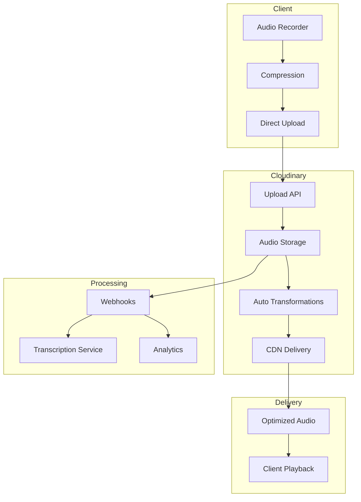

# Audio Storage - Cloudinary Implementation

## Overview

The audio storage system leverages Cloudinary's powerful media management platform for secure, efficient storage and delivery of audio recordings from AI Chit Chat and Mock Call sessions. Cloudinary provides built-in CDN, automatic optimization, and on-the-fly transformations.

## Storage Architecture

### Why Cloudinary?

| Feature | Cloudinary Advantage |
|---------|---------------------|
| **CDN** | Global CDN included, no extra setup |
| **Transformations** | On-the-fly audio processing |
| **Auto-Format** | Automatic format optimization |
| **Storage** | Automatic backup and redundancy |
| **API** | Comprehensive REST and SDK APIs |
| **Security** | Built-in signed URLs and access control |
| **Analytics** | Usage analytics and reporting |
| **Cost** | Pay-as-you-go, no minimum |

### Architecture Overview



## Cloudinary Setup

### Account Configuration

```typescript
// config/cloudinary.config.ts
export const cloudinaryConfig = {
  cloud_name: process.env.CLOUDINARY_CLOUD_NAME,
  api_key: process.env.CLOUDINARY_API_KEY,
  api_secret: process.env.CLOUDINARY_API_SECRET,

  // Upload presets for different scenarios
  presets: {
    chitChat: 'hirexp_chit_chat_audio',
    mockCall: 'hirexp_mock_call_audio'
  },

  // Folder structure
  folders: {
    root: 'hirexp',
    audio: 'hirexp/audio',
    chitChat: 'hirexp/audio/chit-chat',
    mockCall: 'hirexp/audio/mock-call',
    avatars: 'hirexp/avatars'
  }
};
```

### Environment Variables

```bash
# .env.local
CLOUDINARY_CLOUD_NAME=hirexp
CLOUDINARY_API_KEY=your_api_key
CLOUDINARY_API_SECRET=your_api_secret
CLOUDINARY_UPLOAD_PRESET=hirexp_audio_preset
NEXT_PUBLIC_CLOUDINARY_CLOUD_NAME=hirexp
```

## Storage Service Implementation

### Main Storage Service

```typescript
// lib/storage/cloudinary-storage.service.ts
import { v2 as cloudinary, UploadApiResponse, UploadApiErrorResponse } from 'cloudinary';
import { Readable } from 'stream';

export interface AudioUploadOptions {
  userId: string;
  sessionId: string;
  type: 'chit-chat' | 'mock-call';
  duration?: number;
  metadata?: Record<string, any>;
}

export interface UploadResult {
  url: string;
  secureUrl: string;
  publicId: string;
  format: string;
  duration: number;
  bytes: number;
  audioInfo: {
    codec: string;
    bitRate: number;
    frequency: number;
    channels: number;
  };
}

export class CloudinaryAudioStorage {
  constructor() {
    // Configure Cloudinary
    cloudinary.config({
      cloud_name: process.env.CLOUDINARY_CLOUD_NAME,
      api_key: process.env.CLOUDINARY_API_KEY,
      api_secret: process.env.CLOUDINARY_API_SECRET,
      secure: true
    });
  }

  /**
   * Upload audio file with automatic optimization
   */
  async uploadAudio(
    audioBuffer: Buffer,
    options: AudioUploadOptions
  ): Promise<UploadResult> {
    const { userId, sessionId, type, metadata } = options;

    // Generate organized path
    const publicId = this.generatePublicId(userId, sessionId, type);

    return new Promise((resolve, reject) => {
      const uploadStream = cloudinary.uploader.upload_stream(
        {
          resource_type: 'video', // Audio files use 'video' type
          public_id: publicId,
          folder: `hirexp/audio/${type}`,

          // Metadata and tags
          tags: [type, userId, sessionId],
          context: {
            userId,
            sessionId,
            type,
            recordedAt: new Date().toISOString(),
            ...metadata
          },

          // Transformations
          eager: [
            {
              format: 'mp3',
              audio_codec: 'mp3',
              audio_frequency: 44100,
              bit_rate: '128k',
              fetch_format: 'auto'
            },
            {
              format: 'wav',
              audio_codec: 'pcm_s16le',
              audio_frequency: 16000, // Optimal for speech recognition
            }
          ],
          eager_async: true,
          eager_notification_url: `${process.env.API_URL}/webhooks/cloudinary`,

          // Access control
          type: 'authenticated',
          access_mode: 'authenticated',

          // Backup
          backup: true,

          // Quality optimization
          quality: 'auto:good',

          // Analytics
          phash: true,
          colors: false,
          faces: false
        },
        (error: UploadApiErrorResponse | undefined, result: UploadApiResponse | undefined) => {
          if (error) {
            console.error('Cloudinary upload error:', error);
            reject(new Error(`Upload failed: ${error.message}`));
          } else if (result) {
            resolve({
              url: result.url,
              secureUrl: result.secure_url,
              publicId: result.public_id,
              format: result.format,
              duration: result.duration || 0,
              bytes: result.bytes,
              audioInfo: {
                codec: result.audio?.codec || 'unknown',
                bitRate: result.audio?.bit_rate || 0,
                frequency: result.audio?.frequency || 0,
                channels: result.audio?.channels || 1
              }
            });
          }
        }
      );

      // Convert buffer to stream and pipe to upload
      const bufferStream = Readable.from(audioBuffer);
      bufferStream.pipe(uploadStream);
    });
  }

  /**
   * Generate signed URL for secure playback
   */
  async getPlaybackUrl(
    publicId: string,
    options?: {
      format?: string;
      quality?: string;
      startTime?: number;
      endTime?: number;
      expires?: number;
    }
  ): Promise<string> {
    const transformation: any = [];

    // Audio quality
    if (options?.quality) {
      transformation.push({ quality: options.quality });
    }

    // Trimming
    if (options?.startTime !== undefined) {
      transformation.push({ start_offset: options.startTime });
    }
    if (options?.endTime !== undefined) {
      transformation.push({ end_offset: options.endTime });
    }

    // Format conversion
    if (options?.format) {
      transformation.push({ fetch_format: options.format });
    }

    // Generate signed URL
    const expiresAt = Math.floor(Date.now() / 1000) + (options?.expires || 7200); // 2 hours default

    return cloudinary.url(publicId, {
      resource_type: 'video',
      type: 'authenticated',
      transformation,
      secure: true,
      sign_url: true,
      auth_token: {
        duration: options?.expires || 7200,
        start_time: Math.floor(Date.now() / 1000)
      }
    });
  }

  /**
   * Upload audio directly from client (get signed upload params)
   */
  async getUploadSignature(options: AudioUploadOptions): Promise<{
    signature: string;
    timestamp: number;
    uploadParams: Record<string, any>;
    apiKey: string;
    cloudName: string;
  }> {
    const timestamp = Math.round(Date.now() / 1000);
    const publicId = this.generatePublicId(options.userId, options.sessionId, options.type);

    const params = {
      timestamp,
      public_id: publicId,
      folder: `hirexp/audio/${options.type}`,
      tags: [options.type, options.userId].join(','),
      context: `userId=${options.userId}|sessionId=${options.sessionId}|type=${options.type}`,
      upload_preset: process.env.CLOUDINARY_UPLOAD_PRESET
    };

    const signature = cloudinary.utils.api_sign_request(
      params,
      process.env.CLOUDINARY_API_SECRET!
    );

    return {
      signature,
      timestamp,
      uploadParams: params,
      apiKey: process.env.CLOUDINARY_API_KEY!,
      cloudName: process.env.CLOUDINARY_CLOUD_NAME!
    };
  }

  /**
   * Delete audio file
   */
  async deleteAudio(publicId: string): Promise<void> {
    await cloudinary.uploader.destroy(publicId, {
      resource_type: 'video',
      invalidate: true
    });
  }

  /**
   * Bulk delete user's audio files
   */
  async deleteUserAudio(userId: string): Promise<void> {
    // Delete by prefix (all user's files)
    await cloudinary.api.delete_resources_by_prefix(
      `hirexp/audio/chit-chat/${userId}`,
      { resource_type: 'video' }
    );

    await cloudinary.api.delete_resources_by_prefix(
      `hirexp/audio/mock-call/${userId}`,
      { resource_type: 'video' }
    );
  }

  /**
   * Generate organized public ID
   */
  private generatePublicId(userId: string, sessionId: string, type: string): string {
    const date = new Date();
    const year = date.getFullYear();
    const month = String(date.getMonth() + 1).padStart(2, '0');
    const day = String(date.getDate()).padStart(2, '0');
    const timestamp = Date.now();

    return `${type}/${year}/${month}/${day}/${userId}/${sessionId}_${timestamp}`;
  }

  /**
   * Get usage statistics
   */
  async getUsageStats(userId?: string): Promise<{
    totalStorage: number;
    bandwidth: number;
    transformations: number;
    files: number;
  }> {
    const prefix = userId
      ? `hirexp/audio/*/${userId}`
      : 'hirexp/audio';

    const result = await cloudinary.api.usage({
      date: new Date().toISOString().split('T')[0]
    });

    return {
      totalStorage: result.storage.usage,
      bandwidth: result.bandwidth.usage,
      transformations: result.transformations.usage,
      files: result.requests
    };
  }
}
```

### Client-Side Upload Component

```typescript
// components/audio/cloudinary-upload.tsx
'use client';

import { useState, useCallback } from 'react';
import { useDropzone } from 'react-dropzone';

interface CloudinaryUploadProps {
  onUploadComplete: (result: UploadResult) => void;
  sessionId: string;
  userId: string;
  type: 'chit-chat' | 'mock-call';
}

export function CloudinaryAudioUpload({
  onUploadComplete,
  sessionId,
  userId,
  type
}: CloudinaryUploadProps) {
  const [uploading, setUploading] = useState(false);
  const [progress, setProgress] = useState(0);

  const uploadToCloudinary = async (file: File) => {
    setUploading(true);

    try {
      // Get upload signature from backend
      const signatureResponse = await fetch('/api/storage/signature', {
        method: 'POST',
        headers: { 'Content-Type': 'application/json' },
        body: JSON.stringify({ sessionId, userId, type })
      });

      const { signature, timestamp, uploadParams, apiKey, cloudName } =
        await signatureResponse.json();

      // Create form data
      const formData = new FormData();
      formData.append('file', file);
      formData.append('api_key', apiKey);
      formData.append('timestamp', timestamp.toString());
      formData.append('signature', signature);

      // Add all upload params
      Object.entries(uploadParams).forEach(([key, value]) => {
        if (key !== 'timestamp') {
          formData.append(key, value as string);
        }
      });

      // Upload to Cloudinary
      const xhr = new XMLHttpRequest();

      xhr.upload.addEventListener('progress', (e) => {
        if (e.lengthComputable) {
          const percentComplete = (e.loaded / e.total) * 100;
          setProgress(Math.round(percentComplete));
        }
      });

      xhr.addEventListener('load', () => {
        if (xhr.status === 200) {
          const result = JSON.parse(xhr.responseText);
          onUploadComplete(result);
          setUploading(false);
          setProgress(0);
        }
      });

      xhr.addEventListener('error', () => {
        console.error('Upload failed');
        setUploading(false);
        setProgress(0);
      });

      xhr.open('POST', `https://api.cloudinary.com/v1_1/${cloudName}/video/upload`);
      xhr.send(formData);

    } catch (error) {
      console.error('Upload error:', error);
      setUploading(false);
      setProgress(0);
    }
  };

  const onDrop = useCallback((acceptedFiles: File[]) => {
    const file = acceptedFiles[0];
    if (file) {
      uploadToCloudinary(file);
    }
  }, []);

  const { getRootProps, getInputProps, isDragActive } = useDropzone({
    onDrop,
    accept: {
      'audio/*': ['.mp3', '.wav', '.webm', '.m4a', '.ogg']
    },
    maxFiles: 1,
    disabled: uploading
  });

  return (
    <div
      {...getRootProps()}
      className={`border-2 border-dashed rounded-lg p-6 text-center cursor-pointer
        ${isDragActive ? 'border-blue-500 bg-blue-50' : 'border-gray-300'}
        ${uploading ? 'opacity-50 cursor-not-allowed' : ''}`}
    >
      <input {...getInputProps()} />

      {uploading ? (
        <div className="space-y-2">
          <p>Uploading... {progress}%</p>
          <div className="w-full bg-gray-200 rounded-full h-2.5">
            <div
              className="bg-blue-600 h-2.5 rounded-full transition-all"
              style={{ width: `${progress}%` }}
            />
          </div>
        </div>
      ) : (
        <div>
          {isDragActive ? (
            <p>Drop the audio file here...</p>
          ) : (
            <p>Drag & drop an audio file here, or click to select</p>
          )}
        </div>
      )}
    </div>
  );
}
```

## File Organization

### Cloudinary Folder Structure

```
cloudinary://hirexp/
├── audio/
│   ├── chit-chat/
│   │   └── 2025/
│   │       └── 10/
│   │           └── 14/
│   │               └── user_abc123/
│   │                   ├── session_001_1234567890.webm
│   │                   ├── session_001_1234567890.mp3 (auto-generated)
│   │                   └── session_001_1234567890.wav (auto-generated)
│   └── mock-call/
│       └── 2025/
│           └── 10/
│               └── 14/
│                   └── user_xyz789/
│                       └── call_001_1234567890.webm
├── avatars/
│   └── users/
│       ├── user_abc123.jpg
│       └── user_xyz789.png
└── thumbnails/
    └── (auto-generated audio waveforms)
```

## Metadata Management

```typescript
// lib/storage/metadata.service.ts
import { prisma } from '@/lib/prisma';

interface AudioMetadata {
  fileId: string;
  cloudinaryPublicId: string;
  cloudinaryUrl: string;
  userId: string;
  sessionId: string;
  type: 'chit-chat' | 'mock-call';
  duration: number;
  format: string;
  size: number;
  recordedAt: Date;
  transcriptionUrl?: string;
  status: 'uploaded' | 'processing' | 'ready' | 'failed';
}

export class MetadataService {
  async saveMetadata(metadata: AudioMetadata): Promise<void> {
    await prisma.audioRecording.create({
      data: {
        ...metadata,
        cloudinaryData: {
          publicId: metadata.cloudinaryPublicId,
          url: metadata.cloudinaryUrl,
          format: metadata.format
        }
      }
    });
  }

  async updateTranscription(
    fileId: string,
    transcriptionUrl: string
  ): Promise<void> {
    await prisma.audioRecording.update({
      where: { fileId },
      data: {
        transcriptionUrl,
        transcriptionStatus: 'completed'
      }
    });
  }

  async getMetadata(fileId: string): Promise<AudioMetadata | null> {
    const record = await prisma.audioRecording.findUnique({
      where: { fileId }
    });

    return record;
  }

  async getUserRecordings(userId: string): Promise<AudioMetadata[]> {
    return await prisma.audioRecording.findMany({
      where: { userId },
      orderBy: { recordedAt: 'desc' }
    });
  }
}
```

## Transformation & Optimization

### Audio Processing

```typescript
// lib/storage/audio-transform.service.ts
export class AudioTransformService {
  private cloudinary: CloudinaryAudioStorage;

  constructor() {
    this.cloudinary = new CloudinaryAudioStorage();
  }

  /**
   * Get optimized audio URL based on client capabilities
   */
  async getOptimizedAudioUrl(
    publicId: string,
    clientInfo: {
      bandwidth?: 'low' | 'medium' | 'high';
      preferredFormat?: string;
      device?: 'mobile' | 'desktop';
    }
  ): Promise<string> {
    const quality = this.determineQuality(clientInfo);
    const format = this.determineFormat(clientInfo);

    const transformations: any = [
      { quality },
      { fetch_format: format }
    ];

    // Mobile optimizations
    if (clientInfo.device === 'mobile') {
      transformations.push(
        { bit_rate: '64k' },
        { audio_frequency: 22050 }
      );
    }

    return cloudinary.url(publicId, {
      resource_type: 'video',
      transformation: transformations,
      secure: true
    });
  }

  private determineQuality(clientInfo: any): string {
    switch (clientInfo.bandwidth) {
      case 'low': return 'auto:low';
      case 'medium': return 'auto:good';
      case 'high': return 'auto:best';
      default: return 'auto:good';
    }
  }

  private determineFormat(clientInfo: any): string {
    // Auto format selection based on browser
    if (clientInfo.preferredFormat) {
      return clientInfo.preferredFormat;
    }
    return 'auto'; // Let Cloudinary decide
  }

  /**
   * Generate audio waveform visualization
   */
  async generateWaveform(publicId: string): Promise<string> {
    return cloudinary.url(publicId, {
      resource_type: 'video',
      transformation: [
        { flags: 'waveform' },
        { color: '#3B82F6' },
        { width: 500, height: 100 }
      ],
      format: 'png',
      secure: true
    });
  }

  /**
   * Extract audio snippet
   */
  async extractSnippet(
    publicId: string,
    startTime: number,
    duration: number
  ): Promise<string> {
    return cloudinary.url(publicId, {
      resource_type: 'video',
      transformation: [
        { start_offset: startTime },
        { duration }
      ],
      secure: true
    });
  }
}
```

## Webhooks & Processing

### Cloudinary Webhook Handler

```typescript
// app/api/webhooks/cloudinary/route.ts
import { NextRequest, NextResponse } from 'next/server';
import crypto from 'crypto';

export async function POST(req: NextRequest) {
  try {
    // Verify webhook signature
    const signature = req.headers.get('X-Cld-Signature');
    const timestamp = req.headers.get('X-Cld-Timestamp');
    const body = await req.text();

    if (!verifyWebhookSignature(body, signature!, timestamp!)) {
      return NextResponse.json({ error: 'Invalid signature' }, { status: 401 });
    }

    const data = JSON.parse(body);

    // Handle different notification types
    switch (data.notification_type) {
      case 'upload':
        await handleUploadComplete(data);
        break;

      case 'eager':
        await handleTransformationComplete(data);
        break;

      case 'delete':
        await handleDeleteComplete(data);
        break;
    }

    return NextResponse.json({ success: true });
  } catch (error) {
    console.error('Webhook error:', error);
    return NextResponse.json(
      { error: 'Webhook processing failed' },
      { status: 500 }
    );
  }
}

function verifyWebhookSignature(
  body: string,
  signature: string,
  timestamp: string
): boolean {
  const expectedSignature = crypto
    .createHash('sha256')
    .update(body + timestamp + process.env.CLOUDINARY_API_SECRET)
    .digest('hex');

  return signature === expectedSignature;
}

async function handleUploadComplete(data: any) {
  // Update database with upload status
  await prisma.audioRecording.update({
    where: { cloudinaryPublicId: data.public_id },
    data: {
      status: 'ready',
      cloudinaryUrl: data.secure_url,
      duration: data.duration,
      format: data.format,
      bytes: data.bytes
    }
  });

  // Trigger transcription
  await triggerTranscription(data.public_id, data.secure_url);
}

async function handleTransformationComplete(data: any) {
  // Update transformation URLs in database
  console.log('Transformation complete:', data.public_id);
}

async function triggerTranscription(publicId: string, audioUrl: string) {
  // Send to transcription service (e.g., Whisper API)
  const transcriptionJob = await fetch('/api/transcription/start', {
    method: 'POST',
    headers: { 'Content-Type': 'application/json' },
    body: JSON.stringify({ publicId, audioUrl })
  });

  console.log('Transcription started:', await transcriptionJob.json());
}
```

## Security & Privacy

### Access Control

```typescript
// lib/storage/access-control.ts
export class AudioAccessControl {
  /**
   * Check if user has access to audio file
   */
  async canAccessAudio(
    userId: string,
    audioFileId: string
  ): Promise<boolean> {
    const audioFile = await prisma.audioRecording.findUnique({
      where: { id: audioFileId },
      include: {
        user: true,
        session: {
          include: {
            participants: true
          }
        }
      }
    });

    if (!audioFile) return false;

    // Owner has access
    if (audioFile.userId === userId) return true;

    // Instructors can access student recordings
    const user = await prisma.user.findUnique({
      where: { id: userId },
      include: { role: true }
    });

    if (user?.role === 'INSTRUCTOR') {
      // Check if instructor has access to this student
      const hasStudentAccess = await this.instructorHasStudentAccess(
        userId,
        audioFile.userId
      );
      return hasStudentAccess;
    }

    // Admin has access to all
    if (user?.role === 'ADMIN') return true;

    return false;
  }

  private async instructorHasStudentAccess(
    instructorId: string,
    studentId: string
  ): Promise<boolean> {
    const relationship = await prisma.instructorStudent.findFirst({
      where: {
        instructorId,
        studentId,
        active: true
      }
    });

    return !!relationship;
  }
}
```

### GDPR Compliance

```typescript
// lib/storage/gdpr-compliance.ts
export class GDPRCompliance {
  private cloudinary: CloudinaryAudioStorage;

  constructor() {
    this.cloudinary = new CloudinaryAudioStorage();
  }

  /**
   * Handle user data deletion request
   */
  async handleDeletionRequest(userId: string): Promise<void> {
    // Get all user's audio files
    const userFiles = await prisma.audioRecording.findMany({
      where: { userId }
    });

    // Delete from Cloudinary
    for (const file of userFiles) {
      await this.cloudinary.deleteAudio(file.cloudinaryPublicId);
    }

    // Delete from database
    await prisma.audioRecording.deleteMany({
      where: { userId }
    });

    // Delete user avatars
    await cloudinary.api.delete_resources_by_prefix(
      `hirexp/avatars/users/${userId}`,
      { type: 'upload' }
    );

    // Log deletion for compliance
    await this.logDeletion(userId, userFiles.length);
  }

  /**
   * Export user's audio data
   */
  async exportUserData(userId: string): Promise<{
    recordings: any[];
    downloadUrls: string[];
    metadata: any;
  }> {
    const recordings = await prisma.audioRecording.findMany({
      where: { userId },
      include: {
        session: true,
        transcription: true
      }
    });

    const downloadUrls = await Promise.all(
      recordings.map(r =>
        this.cloudinary.getPlaybackUrl(r.cloudinaryPublicId, {
          expires: 86400 // 24 hour access
        })
      )
    );

    return {
      recordings,
      downloadUrls,
      metadata: {
        exportedAt: new Date(),
        totalFiles: recordings.length,
        totalSize: recordings.reduce((sum, r) => sum + r.bytes, 0)
      }
    };
  }

  private async logDeletion(userId: string, fileCount: number): Promise<void> {
    await prisma.gdprLog.create({
      data: {
        userId,
        action: 'DATA_DELETION',
        details: {
          audioFilesDeleted: fileCount,
          deletedAt: new Date()
        }
      }
    });
  }
}
```

## Cost Management

### Usage Monitoring

```typescript
// lib/storage/cost-monitor.ts
export class CloudinaryCostMonitor {
  /**
   * Get current month usage and costs
   */
  async getCurrentMonthUsage(): Promise<{
    storage: { gb: number; cost: number };
    bandwidth: { gb: number; cost: number };
    transformations: { count: number; cost: number };
    total: number;
  }> {
    const usage = await cloudinary.api.usage({
      date: new Date().toISOString().split('T')[0]
    });

    // Cloudinary pricing (example rates - check actual pricing)
    const rates = {
      storage: 0.08, // per GB per month
      bandwidth: 0.08, // per GB
      transformations: 0.0008 // per transformation
    };

    const storageCost = (usage.storage.usage / 1e9) * rates.storage;
    const bandwidthCost = (usage.bandwidth.usage / 1e9) * rates.bandwidth;
    const transformationCost = usage.transformations.usage * rates.transformations;

    return {
      storage: {
        gb: usage.storage.usage / 1e9,
        cost: storageCost
      },
      bandwidth: {
        gb: usage.bandwidth.usage / 1e9,
        cost: bandwidthCost
      },
      transformations: {
        count: usage.transformations.usage,
        cost: transformationCost
      },
      total: storageCost + bandwidthCost + transformationCost
    };
  }

  /**
   * Set up usage alerts
   */
  async setupUsageAlerts(thresholds: {
    storage?: number; // GB
    bandwidth?: number; // GB
    cost?: number; // USD
  }): Promise<void> {
    // Monitor and alert when thresholds are exceeded
    const usage = await this.getCurrentMonthUsage();

    if (thresholds.storage && usage.storage.gb > thresholds.storage) {
      await this.sendAlert('STORAGE_THRESHOLD_EXCEEDED', usage.storage);
    }

    if (thresholds.bandwidth && usage.bandwidth.gb > thresholds.bandwidth) {
      await this.sendAlert('BANDWIDTH_THRESHOLD_EXCEEDED', usage.bandwidth);
    }

    if (thresholds.cost && usage.total > thresholds.cost) {
      await this.sendAlert('COST_THRESHOLD_EXCEEDED', { total: usage.total });
    }
  }

  private async sendAlert(type: string, data: any): Promise<void> {
    // Send notification to admins
    console.log(`ALERT: ${type}`, data);
    // Implement email/Slack notification
  }
}
```

## Best Practices

1. **Upload Strategy**
   - Use direct browser uploads to reduce server load
   - Implement chunked uploads for large files
   - Set maximum file size limits (e.g., 100MB)

2. **Optimization**
   - Use auto format delivery for best browser compatibility
   - Implement quality tiers based on user bandwidth
   - Cache transformation URLs

3. **Security**
   - Always use signed URLs for sensitive content
   - Set appropriate access modes (public/authenticated)
   - Implement user-level access control

4. **Cost Control**
   - Set up auto-deletion for old files
   - Monitor usage regularly
   - Use webhook notifications instead of polling
   - Implement client-side compression before upload

5. **Performance**
   - Use Cloudinary's CDN for global delivery
   - Implement lazy loading for audio files
   - Cache metadata in database
   - Use eager transformations for common formats

---

*Document Version: 2.0*
*Last Updated: October 2025*
*Platform: Cloudinary*