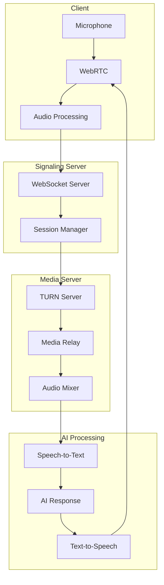

# Audio Streaming - Real-time Communication

## Overview

The audio streaming system enables real-time, bidirectional audio communication for AI Mock Call sessions. This document covers WebRTC implementation, WebSocket streaming, and optimization strategies for low-latency audio delivery.

## Streaming Architecture

### System Components



## WebRTC Implementation

### Peer Connection Setup

```typescript
// lib/streaming/webrtc-manager.ts
export class WebRTCManager {
  private peerConnection: RTCPeerConnection | null = null;
  private localStream: MediaStream | null = null;
  private remoteStream: MediaStream | null = null;
  private dataChannel: RTCDataChannel | null = null;

  private configuration: RTCConfiguration = {
    iceServers: [
      {
        urls: 'stun:stun.l.google.com:19302'
      },
      {
        urls: 'turn:turn.hirexp.com:3478',
        username: 'turnuser',
        credential: process.env.TURN_CREDENTIAL
      },
      {
        urls: 'turn:turn.hirexp.com:5349',
        username: 'turnuser',
        credential: process.env.TURN_CREDENTIAL,
        credentialType: 'password'
      }
    ],
    iceCandidatePoolSize: 10,
    iceTransportPolicy: 'all',
    bundlePolicy: 'max-bundle',
    rtcpMuxPolicy: 'require'
  };

  async initialize(): Promise<void> {
    // Create peer connection
    this.peerConnection = new RTCPeerConnection(this.configuration);

    // Set up event handlers
    this.setupPeerConnectionEvents();

    // Create data channel for metadata
    this.dataChannel = this.peerConnection.createDataChannel('metadata', {
      ordered: true,
      maxRetransmits: 3
    });

    // Get user media
    await this.setupLocalStream();

    // Add local stream to peer connection
    this.addLocalStreamToPeerConnection();
  }

  private async setupLocalStream(): Promise<void> {
    try {
      this.localStream = await navigator.mediaDevices.getUserMedia({
        audio: {
          echoCancellation: true,
          noiseSuppression: true,
          autoGainControl: true,
          sampleRate: 48000,
          channelCount: 1,
          sampleSize: 16,

          // Advanced constraints
          googEchoCancellation: true,
          googAutoGainControl: true,
          googNoiseSuppression: true,
          googHighpassFilter: true,
          googTypingNoiseDetection: true
        }
      });
    } catch (error) {
      throw new Error('Failed to access microphone: ' + error.message);
    }
  }

  private setupPeerConnectionEvents(): void {
    if (!this.peerConnection) return;

    // ICE candidate event
    this.peerConnection.onicecandidate = (event) => {
      if (event.candidate) {
        this.sendSignalingMessage({
          type: 'ice-candidate',
          candidate: event.candidate
        });
      }
    };

    // Track event for remote stream
    this.peerConnection.ontrack = (event) => {
      this.remoteStream = event.streams[0];
      this.onRemoteStream?.(this.remoteStream);
    };

    // Connection state changes
    this.peerConnection.onconnectionstatechange = () => {
      console.log('Connection state:', this.peerConnection?.connectionState);
      this.handleConnectionStateChange();
    };

    // ICE connection state
    this.peerConnection.oniceconnectionstatechange = () => {
      console.log('ICE state:', this.peerConnection?.iceConnectionState);
      this.handleICEStateChange();
    };
  }

  private handleConnectionStateChange(): void {
    const state = this.peerConnection?.connectionState;

    switch (state) {
      case 'connected':
        this.onConnected?.();
        break;
      case 'disconnected':
        this.attemptReconnection();
        break;
      case 'failed':
        this.handleConnectionFailure();
        break;
    }
  }

  async createOffer(): Promise<void> {
    if (!this.peerConnection) return;

    const offer = await this.peerConnection.createOffer({
      offerToReceiveAudio: true,
      offerToReceiveVideo: false,
      voiceActivityDetection: true
    });

    await this.peerConnection.setLocalDescription(offer);

    this.sendSignalingMessage({
      type: 'offer',
      sdp: offer
    });
  }

  async handleAnswer(answer: RTCSessionDescriptionInit): Promise<void> {
    if (!this.peerConnection) return;

    await this.peerConnection.setRemoteDescription(answer);
  }

  async handleIceCandidate(candidate: RTCIceCandidateInit): Promise<void> {
    if (!this.peerConnection) return;

    await this.peerConnection.addIceCandidate(candidate);
  }
}
```

### Signaling Server

```typescript
// server/signaling/websocket-server.ts
import { Server, Socket } from 'socket.io';

export class SignalingServer {
  private io: Server;
  private rooms: Map<string, Room> = new Map();

  constructor(httpServer: any) {
    this.io = new Server(httpServer, {
      cors: {
        origin: process.env.CLIENT_URL,
        credentials: true
      },
      transports: ['websocket', 'polling']
    });

    this.setupEventHandlers();
  }

  private setupEventHandlers(): void {
    this.io.on('connection', (socket: Socket) => {
      console.log('Client connected:', socket.id);

      socket.on('join-room', async (data: JoinRoomData) => {
        await this.handleJoinRoom(socket, data);
      });

      socket.on('offer', async (data: SignalingMessage) => {
        await this.handleOffer(socket, data);
      });

      socket.on('answer', async (data: SignalingMessage) => {
        await this.handleAnswer(socket, data);
      });

      socket.on('ice-candidate', async (data: SignalingMessage) => {
        await this.handleIceCandidate(socket, data);
      });

      socket.on('disconnect', () => {
        this.handleDisconnect(socket);
      });
    });
  }

  private async handleJoinRoom(socket: Socket, data: JoinRoomData): Promise<void> {
    const { roomId, userId, role } = data;

    // Create or get room
    let room = this.rooms.get(roomId);
    if (!room) {
      room = {
        id: roomId,
        participants: new Map(),
        createdAt: Date.now()
      };
      this.rooms.set(roomId, room);
    }

    // Add participant
    room.participants.set(socket.id, {
      socketId: socket.id,
      userId,
      role,
      joinedAt: Date.now()
    });

    // Join socket.io room
    socket.join(roomId);

    // Notify others
    socket.to(roomId).emit('peer-joined', {
      socketId: socket.id,
      userId,
      role
    });

    // Send room state
    socket.emit('room-state', {
      roomId,
      participants: Array.from(room.participants.values())
    });
  }

  private async handleOffer(socket: Socket, data: SignalingMessage): Promise<void> {
    const { roomId, targetSocketId, sdp } = data;

    socket.to(targetSocketId).emit('offer', {
      fromSocketId: socket.id,
      sdp
    });
  }

  private async handleAnswer(socket: Socket, data: SignalingMessage): Promise<void> {
    const { targetSocketId, sdp } = data;

    socket.to(targetSocketId).emit('answer', {
      fromSocketId: socket.id,
      sdp
    });
  }

  private async handleIceCandidate(socket: Socket, data: SignalingMessage): Promise<void> {
    const { targetSocketId, candidate } = data;

    socket.to(targetSocketId).emit('ice-candidate', {
      fromSocketId: socket.id,
      candidate
    });
  }
}
```

## WebSocket Audio Streaming

### Audio Stream Manager

```typescript
// lib/streaming/audio-stream-manager.ts
export class AudioStreamManager {
  private ws: WebSocket | null = null;
  private audioQueue: ArrayBuffer[] = [];
  private isPlaying: boolean = false;
  private audioContext: AudioContext;
  private sourceBuffer: SourceBuffer | null = null;

  constructor(private config: StreamConfig) {
    this.audioContext = new AudioContext();
  }

  async connect(sessionId: string): Promise<void> {
    const wsUrl = `${process.env.NEXT_PUBLIC_WS_URL}/audio-stream`;
    this.ws = new WebSocket(wsUrl);

    this.ws.binaryType = 'arraybuffer';

    this.ws.onopen = () => {
      this.sendMessage({
        type: 'join',
        sessionId,
        role: 'agent'
      });
    };

    this.ws.onmessage = (event) => {
      this.handleMessage(event);
    };

    this.ws.onerror = (error) => {
      console.error('WebSocket error:', error);
      this.reconnect();
    };

    this.ws.onclose = () => {
      console.log('WebSocket closed');
      this.cleanup();
    };
  }

  private handleMessage(event: MessageEvent): void {
    if (event.data instanceof ArrayBuffer) {
      // Audio data
      this.handleAudioData(event.data);
    } else {
      // Control message
      const message = JSON.parse(event.data);
      this.handleControlMessage(message);
    }
  }

  private handleAudioData(data: ArrayBuffer): void {
    // Add to queue
    this.audioQueue.push(data);

    // Start playing if not already
    if (!this.isPlaying) {
      this.startPlayback();
    }
  }

  private async startPlayback(): Promise<void> {
    this.isPlaying = true;

    while (this.audioQueue.length > 0) {
      const audioData = this.audioQueue.shift()!;
      await this.playAudioChunk(audioData);
    }

    this.isPlaying = false;
  }

  private async playAudioChunk(data: ArrayBuffer): Promise<void> {
    return new Promise((resolve) => {
      // Decode audio data
      this.audioContext.decodeAudioData(data, (audioBuffer) => {
        const source = this.audioContext.createBufferSource();
        source.buffer = audioBuffer;
        source.connect(this.audioContext.destination);

        source.onended = () => {
          resolve();
        };

        source.start();
      });
    });
  }

  sendAudioData(audioData: ArrayBuffer): void {
    if (this.ws && this.ws.readyState === WebSocket.OPEN) {
      this.ws.send(audioData);
    } else {
      console.warn('WebSocket not ready, buffering audio');
      this.bufferAudioData(audioData);
    }
  }

  private bufferAudioData(data: ArrayBuffer): void {
    // Implement circular buffer for reliability
    if (this.audioBuffer.length < this.config.maxBufferSize) {
      this.audioBuffer.push(data);
    } else {
      // Drop oldest chunk
      this.audioBuffer.shift();
      this.audioBuffer.push(data);
    }
  }
}
```

### Adaptive Bitrate Streaming

```typescript
class AdaptiveBitrateController {
  private currentBitrate: number = 128000;
  private networkSpeed: number = 0;
  private packetLoss: number = 0;
  private latency: number = 0;

  constructor() {
    this.startNetworkMonitoring();
  }

  private startNetworkMonitoring(): void {
    setInterval(() => {
      this.measureNetworkConditions();
      this.adjustBitrate();
    }, 1000);
  }

  private async measureNetworkConditions(): Promise<void> {
    // Measure RTT
    const startTime = Date.now();
    await this.sendPing();
    this.latency = Date.now() - startTime;

    // Get connection stats
    const stats = await this.getConnectionStats();
    this.packetLoss = stats.packetsLost / stats.packetsSent;
    this.networkSpeed = stats.availableOutgoingBandwidth;
  }

  private adjustBitrate(): void {
    const conditions = this.evaluateNetworkConditions();

    switch (conditions) {
      case 'excellent':
        this.increaseBitrate();
        break;
      case 'good':
        // Maintain current bitrate
        break;
      case 'fair':
        this.decreaseBitrate();
        break;
      case 'poor':
        this.switchToMinimumBitrate();
        break;
    }
  }

  private evaluateNetworkConditions(): NetworkCondition {
    if (this.latency < 50 && this.packetLoss < 0.01) {
      return 'excellent';
    } else if (this.latency < 100 && this.packetLoss < 0.03) {
      return 'good';
    } else if (this.latency < 200 && this.packetLoss < 0.05) {
      return 'fair';
    } else {
      return 'poor';
    }
  }

  private increaseBitrate(): void {
    const maxBitrate = 256000;
    this.currentBitrate = Math.min(this.currentBitrate * 1.2, maxBitrate);
    this.applyBitrateChange();
  }

  private decreaseBitrate(): void {
    const minBitrate = 32000;
    this.currentBitrate = Math.max(this.currentBitrate * 0.8, minBitrate);
    this.applyBitrateChange();
  }

  private applyBitrateChange(): void {
    // Update encoder settings
    if (this.audioEncoder) {
      this.audioEncoder.configure({
        codec: 'opus',
        sampleRate: 48000,
        numberOfChannels: 1,
        bitrate: this.currentBitrate
      });
    }

    // Notify server of bitrate change
    this.sendControlMessage({
      type: 'bitrate-change',
      bitrate: this.currentBitrate
    });
  }
}
```

## Audio Codec Optimization

### Opus Configuration

```typescript
class OpusEncoder {
  private encoder: any; // OpusEncoder instance
  private config: OpusConfig;

  constructor(config: OpusConfig) {
    this.config = config;
    this.initializeEncoder();
  }

  private initializeEncoder(): void {
    this.encoder = new OpusEncoder(
      this.config.sampleRate,
      this.config.channels,
      this.config.application
    );

    // Set complexity (0-10)
    this.encoder.setComplexity(this.config.complexity || 10);

    // Set bitrate
    this.encoder.setBitrate(this.config.bitrate);

    // Enable DTX (Discontinuous Transmission)
    this.encoder.setDTX(this.config.dtx || false);

    // Enable FEC (Forward Error Correction)
    this.encoder.setInBandFEC(this.config.fec || true);

    // Set packet loss percentage
    this.encoder.setExpectedPacketLoss(this.config.expectedLoss || 5);

    // Set VBR (Variable Bitrate)
    this.encoder.setVBR(this.config.vbr || true);

    // Set VBR constraint
    if (this.config.vbr) {
      this.encoder.setVBRConstraint(this.config.vbrConstrained || false);
    }
  }

  encode(pcmData: Float32Array): Uint8Array {
    // Convert float32 to int16
    const int16Data = this.float32ToInt16(pcmData);

    // Encode frame
    const frameSize = this.config.frameSize || 960; // 20ms at 48kHz
    const encoded = this.encoder.encode(int16Data, frameSize);

    return encoded;
  }

  private float32ToInt16(float32Array: Float32Array): Int16Array {
    const int16Array = new Int16Array(float32Array.length);

    for (let i = 0; i < float32Array.length; i++) {
      const sample = Math.max(-1, Math.min(1, float32Array[i]));
      int16Array[i] = sample < 0 ? sample * 0x8000 : sample * 0x7FFF;
    }

    return int16Array;
  }
}

interface OpusConfig {
  sampleRate: 8000 | 12000 | 16000 | 24000 | 48000;
  channels: 1 | 2;
  application: 'voip' | 'audio' | 'restricted_lowdelay';
  bitrate: number;
  complexity?: number;
  dtx?: boolean;
  fec?: boolean;
  expectedLoss?: number;
  vbr?: boolean;
  vbrConstrained?: boolean;
  frameSize?: number;
}

// Optimal configurations for different scenarios
const opusPresets = {
  voiceHighQuality: {
    sampleRate: 48000,
    channels: 1,
    application: 'voip',
    bitrate: 128000,
    complexity: 10,
    dtx: true,
    fec: true,
    expectedLoss: 5,
    vbr: true,
    vbrConstrained: false
  },

  voiceLowLatency: {
    sampleRate: 16000,
    channels: 1,
    application: 'restricted_lowdelay',
    bitrate: 64000,
    complexity: 5,
    dtx: false,
    fec: true,
    expectedLoss: 10,
    vbr: false
  },

  voiceLowBandwidth: {
    sampleRate: 8000,
    channels: 1,
    application: 'voip',
    bitrate: 32000,
    complexity: 10,
    dtx: true,
    fec: false,
    expectedLoss: 0,
    vbr: true
  }
};
```

## Latency Optimization

### Jitter Buffer Implementation

```typescript
class JitterBuffer {
  private buffer: Map<number, AudioPacket> = new Map();
  private playoutDelay: number = 100; // ms
  private minDelay: number = 50;
  private maxDelay: number = 500;
  private targetBufferSize: number = 3; // packets

  constructor() {
    this.startPlayoutTimer();
  }

  addPacket(packet: AudioPacket): void {
    // Add to buffer with sequence number
    this.buffer.set(packet.sequenceNumber, packet);

    // Adjust buffer size based on jitter
    this.adjustBufferSize();

    // Trigger immediate playout if buffer was empty
    if (this.buffer.size === 1) {
      this.schedulePlayback();
    }
  }

  private adjustBufferSize(): void {
    const jitter = this.calculateJitter();

    if (jitter > 50) {
      // High jitter, increase buffer
      this.targetBufferSize = Math.min(this.targetBufferSize + 1, 10);
      this.playoutDelay = Math.min(this.playoutDelay + 20, this.maxDelay);
    } else if (jitter < 20 && this.buffer.size > this.targetBufferSize) {
      // Low jitter, decrease buffer
      this.targetBufferSize = Math.max(this.targetBufferSize - 1, 2);
      this.playoutDelay = Math.max(this.playoutDelay - 10, this.minDelay);
    }
  }

  private calculateJitter(): number {
    // Calculate inter-arrival time variance
    const packets = Array.from(this.buffer.values());
    if (packets.length < 2) return 0;

    const deltas = [];
    for (let i = 1; i < packets.length; i++) {
      const delta = packets[i].timestamp - packets[i - 1].timestamp;
      deltas.push(delta);
    }

    const mean = deltas.reduce((a, b) => a + b, 0) / deltas.length;
    const variance = deltas.reduce((acc, val) => acc + Math.pow(val - mean, 2), 0) / deltas.length;

    return Math.sqrt(variance);
  }

  private async playNextPacket(): Promise<void> {
    if (this.buffer.size === 0) return;

    // Get packet with lowest sequence number
    const sequences = Array.from(this.buffer.keys()).sort((a, b) => a - b);
    const nextSequence = sequences[0];
    const packet = this.buffer.get(nextSequence);

    if (packet) {
      this.buffer.delete(nextSequence);
      await this.playAudioPacket(packet);
    }
  }

  private schedulePlayback(): void {
    setTimeout(() => {
      this.playNextPacket();
      if (this.buffer.size > 0) {
        this.schedulePlayback();
      }
    }, this.playoutDelay);
  }
}
```

### Echo Cancellation

```typescript
class EchoCancellation {
  private referenceSignal: Float32Array | null = null;
  private adaptiveFilter: AdaptiveFilter;

  constructor() {
    this.adaptiveFilter = new AdaptiveFilter({
      filterLength: 512,
      stepSize: 0.1,
      leakFactor: 0.999
    });
  }

  process(
    microphoneSignal: Float32Array,
    speakerSignal: Float32Array
  ): Float32Array {
    // Store reference signal from speaker
    this.referenceSignal = speakerSignal;

    // Apply adaptive filter
    const filteredSignal = this.adaptiveFilter.process(
      microphoneSignal,
      this.referenceSignal
    );

    // Apply non-linear processing
    const nlpSignal = this.nonLinearProcessing(filteredSignal);

    // Apply comfort noise
    const output = this.addComfortNoise(nlpSignal);

    return output;
  }

  private nonLinearProcessing(signal: Float32Array): Float32Array {
    const output = new Float32Array(signal.length);
    const threshold = 0.01;

    for (let i = 0; i < signal.length; i++) {
      if (Math.abs(signal[i]) < threshold) {
        // Suppress residual echo
        output[i] = signal[i] * 0.1;
      } else {
        output[i] = signal[i];
      }
    }

    return output;
  }

  private addComfortNoise(signal: Float32Array): Float32Array {
    const output = new Float32Array(signal.length);
    const noiseLevel = 0.001;

    for (let i = 0; i < signal.length; i++) {
      const noise = (Math.random() - 0.5) * 2 * noiseLevel;
      output[i] = signal[i] + noise;
    }

    return output;
  }
}
```

## Performance Monitoring

### Stream Analytics

```typescript
class StreamAnalytics {
  private metrics: StreamMetrics = {
    bitrate: 0,
    packetLoss: 0,
    jitter: 0,
    latency: 0,
    bufferLevel: 0,
    audioLevel: 0
  };

  async collectMetrics(connection: RTCPeerConnection): Promise<StreamMetrics> {
    const stats = await connection.getStats();

    stats.forEach(stat => {
      if (stat.type === 'inbound-rtp' && stat.mediaType === 'audio') {
        this.metrics.bitrate = stat.bytesReceived * 8 / stat.timestamp;
        this.metrics.packetLoss = stat.packetsLost / (stat.packetsReceived + stat.packetsLost);
        this.metrics.jitter = stat.jitter;
      }

      if (stat.type === 'candidate-pair' && stat.state === 'succeeded') {
        this.metrics.latency = stat.currentRoundTripTime * 1000;
      }

      if (stat.type === 'media-source' && stat.kind === 'audio') {
        this.metrics.audioLevel = stat.audioLevel;
      }
    });

    return this.metrics;
  }

  detectIssues(): StreamIssues[] {
    const issues: StreamIssues[] = [];

    if (this.metrics.packetLoss > 0.05) {
      issues.push({
        type: 'high-packet-loss',
        severity: 'warning',
        value: this.metrics.packetLoss,
        recommendation: 'Reduce bitrate or check network connection'
      });
    }

    if (this.metrics.latency > 200) {
      issues.push({
        type: 'high-latency',
        severity: this.metrics.latency > 500 ? 'critical' : 'warning',
        value: this.metrics.latency,
        recommendation: 'Use closer server or reduce processing'
      });
    }

    if (this.metrics.jitter > 30) {
      issues.push({
        type: 'high-jitter',
        severity: 'warning',
        value: this.metrics.jitter,
        recommendation: 'Increase jitter buffer size'
      });
    }

    return issues;
  }
}
```

---

*Document Version: 1.0*
*Last Updated: October 2025*
*Next Review: November 2025*