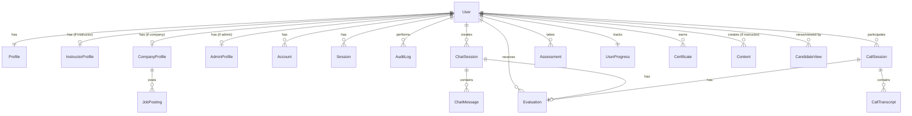

# Authentication Database Schema

## Complete Prisma Schema

```prisma
// prisma/schema.prisma

generator client {
  provider = "prisma-client-js"
}

datasource db {
  provider = "postgresql"
  url      = env("DATABASE_URL")
}

// ============================================
// AUTHENTICATION & USER MODELS
// ============================================

enum UserRole {
  TRAINEE
  INSTRUCTOR
  COMPANY
  ADMIN
}

enum AccountStatus {
  ACTIVE
  SUSPENDED
  DEACTIVATED
  PENDING_VERIFICATION
}

model User {
  id                String        @id @default(cuid())
  email             String        @unique @db.VarChar(255)
  emailVerified     DateTime?
  password          String?       // Null for OAuth users
  role              UserRole      @default(TRAINEE)
  status            AccountStatus @default(PENDING_VERIFICATION)
  lastLoginAt       DateTime?
  failedLoginAttempts Int         @default(0)
  lockedUntil       DateTime?
  createdAt         DateTime      @default(now())
  updatedAt         DateTime      @updatedAt

  // Relationships
  profile           Profile?
  accounts          Account[]     // OAuth accounts
  sessions          Session[]     // Active sessions
  verificationTokens VerificationToken[]
  passwordResetTokens PasswordResetToken[]
  auditLogs         AuditLog[]    // Actions performed by user
  targetAuditLogs   AuditLog[]    @relation("TargetUser") // Actions performed on user

  // Feature relationships
  chatSessions      ChatSession[]
  callSessions      CallSession[]
  assessments       Assessment[]
  progress          UserProgress?
  evaluations       Evaluation[]
  certificates      Certificate[]

  // Role-specific relationships
  instructorProfile InstructorProfile?
  companyProfile    CompanyProfile?
  adminProfile      AdminProfile?

  // Content created (for instructors)
  createdContent    Content[]     @relation("ContentCreator")

  // Company relationships
  companyViews      CandidateView[] @relation("ViewedCandidate")
  viewedByCompanies CandidateView[] @relation("ViewingCompany")

  @@index([email])
  @@index([role])
  @@index([status])
  @@map("users")
}

model Profile {
  id                String    @id @default(cuid())
  userId            String    @unique
  name              String?   @db.VarChar(255)
  avatar            String?   @db.Text
  bio               String?   @db.Text
  phone             String?   @db.VarChar(20)
  dateOfBirth       DateTime?
  gender            String?
  location          String?
  timezone          String?   @default("UTC")
  languages         String[]  // Array of language codes
  skills            String[]
  experience        String?   @db.Text
  education         String?   @db.Text
  linkedIn          String?
  github            String?
  website           String?

  // Preferences
  preferences       Json      @default("{}")
  // Example: {
  //   emailNotifications: true,
  //   smsNotifications: false,
  //   marketingEmails: true,
  //   theme: "light",
  //   language: "en"
  // }

  createdAt         DateTime  @default(now())
  updatedAt         DateTime  @updatedAt

  user              User      @relation(fields: [userId], references: [id], onDelete: Cascade)

  @@map("profiles")
}

// Role-specific profiles
model InstructorProfile {
  id                String    @id @default(cuid())
  userId            String    @unique
  specializations   String[]  // Areas of expertise
  certifications    String[]  // Teaching certifications
  yearsOfExperience Int?
  rating            Float     @default(0)
  totalStudents     Int       @default(0)
  totalHours        Int       @default(0)
  isVerified        Boolean   @default(false)
  verifiedAt        DateTime?

  createdAt         DateTime  @default(now())
  updatedAt         DateTime  @updatedAt

  user              User      @relation(fields: [userId], references: [id], onDelete: Cascade)

  @@map("instructor_profiles")
}

model CompanyProfile {
  id                String    @id @default(cuid())
  userId            String    @unique
  companyName       String    @db.VarChar(255)
  companyLogo       String?
  industry          String?
  companySize       String?   // e.g., "1-10", "11-50", "51-200"
  website           String?
  description       String?   @db.Text
  address           String?
  country           String?
  isVerified        Boolean   @default(false)
  verifiedAt        DateTime?
  hiringQuota       Int       @default(10) // Monthly hiring limit

  createdAt         DateTime  @default(now())
  updatedAt         DateTime  @updatedAt

  user              User      @relation(fields: [userId], references: [id], onDelete: Cascade)
  jobPostings       JobPosting[]

  @@map("company_profiles")
}

model AdminProfile {
  id                String    @id @default(cuid())
  userId            String    @unique
  department        String?
  accessLevel       Int       @default(1) // 1: Basic, 2: Senior, 3: Super Admin
  permissions       String[]  // Granular permissions

  createdAt         DateTime  @default(now())
  updatedAt         DateTime  @updatedAt

  user              User      @relation(fields: [userId], references: [id], onDelete: Cascade)

  @@map("admin_profiles")
}

// ============================================
// NEXTAUTH MODELS
// ============================================

model Account {
  id                String  @id @default(cuid())
  userId            String
  type              String
  provider          String
  providerAccountId String
  refresh_token     String? @db.Text
  access_token      String? @db.Text
  expires_at        Int?
  token_type        String?
  scope             String?
  id_token          String? @db.Text
  session_state     String?

  user User @relation(fields: [userId], references: [id], onDelete: Cascade)

  @@unique([provider, providerAccountId])
  @@index([userId])
  @@map("accounts")
}

model Session {
  id           String   @id @default(cuid())
  sessionToken String   @unique
  userId       String
  expires      DateTime
  ipAddress    String?
  userAgent    String?

  user         User     @relation(fields: [userId], references: [id], onDelete: Cascade)

  @@index([userId])
  @@map("sessions")
}

model VerificationToken {
  id         String   @id @default(cuid())
  email      String
  token      String   @unique
  expires    DateTime

  @@unique([email, token])
  @@map("verification_tokens")
}

model PasswordResetToken {
  id         String   @id @default(cuid())
  email      String
  token      String   @unique
  expires    DateTime
  used       Boolean  @default(false)

  @@unique([email, token])
  @@map("password_reset_tokens")
}

// ============================================
// AUDIT & SECURITY
// ============================================

enum AuditAction {
  // Authentication actions
  SIGN_IN
  SIGN_OUT
  SIGN_UP
  PASSWORD_RESET
  PASSWORD_CHANGED
  EMAIL_VERIFIED

  // Profile actions
  PROFILE_UPDATED
  AVATAR_CHANGED

  // Admin actions
  ROLE_CHANGED
  USER_SUSPENDED
  USER_ACTIVATED
  USER_DELETED

  // Permission actions
  PERMISSION_GRANTED
  PERMISSION_REVOKED

  // Content actions
  CONTENT_CREATED
  CONTENT_UPDATED
  CONTENT_DELETED

  // System actions
  SETTINGS_CHANGED
  API_KEY_CREATED
  API_KEY_REVOKED
}

model AuditLog {
  id           String      @id @default(cuid())
  userId       String?     // Who performed the action
  targetUserId String?     // Who was affected (if applicable)
  action       AuditAction
  details      Json        // Additional context
  ipAddress    String?
  userAgent    String?
  createdAt    DateTime    @default(now())

  user         User?       @relation(fields: [userId], references: [id], onDelete: SetNull)
  targetUser   User?       @relation("TargetUser", fields: [targetUserId], references: [id], onDelete: SetNull)

  @@index([userId])
  @@index([targetUserId])
  @@index([action])
  @@index([createdAt])
  @@map("audit_logs")
}

// ============================================
// FEATURE MODELS (AI Training)
// ============================================

model ChatSession {
  id                String    @id @default(cuid())
  userId            String
  topic             String
  difficulty        String
  status            SessionStatus @default(ACTIVE)
  startedAt         DateTime  @default(now())
  endedAt           DateTime?
  duration          Int?      // in seconds

  user              User      @relation(fields: [userId], references: [id], onDelete: Cascade)
  messages          ChatMessage[]
  evaluation        Evaluation?

  @@index([userId])
  @@index([status])
  @@map("chat_sessions")
}

model ChatMessage {
  id                String    @id @default(cuid())
  sessionId         String
  role              MessageRole
  content           String    @db.Text
  audioUrl          String?
  timestamp         DateTime  @default(now())

  session           ChatSession @relation(fields: [sessionId], references: [id], onDelete: Cascade)

  @@index([sessionId])
  @@map("chat_messages")
}

model CallSession {
  id                String    @id @default(cuid())
  userId            String
  scenario          String
  difficulty        String
  status            SessionStatus @default(ACTIVE)
  startedAt         DateTime  @default(now())
  endedAt           DateTime?
  duration          Int?      // in seconds
  recordingUrl      String?

  user              User      @relation(fields: [userId], references: [id], onDelete: Cascade)
  transcript        CallTranscript[]
  evaluation        Evaluation?

  @@index([userId])
  @@index([status])
  @@map("call_sessions")
}

model CallTranscript {
  id                String    @id @default(cuid())
  sessionId         String
  speaker           String    // "user" or "ai"
  text              String    @db.Text
  timestamp         DateTime  @default(now())

  session           CallSession @relation(fields: [sessionId], references: [id], onDelete: Cascade)

  @@index([sessionId])
  @@map("call_transcripts")
}

model Assessment {
  id                String    @id @default(cuid())
  userId            String
  type              String    // "grammar", "vocabulary", "reading", etc.
  score             Float
  totalQuestions    Int
  correctAnswers    Int
  timeTaken         Int       // in seconds
  completedAt       DateTime  @default(now())

  user              User      @relation(fields: [userId], references: [id], onDelete: Cascade)

  @@index([userId])
  @@index([type])
  @@map("assessments")
}

model Evaluation {
  id                String    @id @default(cuid())
  userId            String
  sessionType       SessionType
  sessionId         String    @unique
  scores            Json      // Detailed scoring metrics
  feedback          Json      // AI-generated feedback
  strengths         String[]
  improvements      String[]
  overallScore      Float
  createdAt         DateTime  @default(now())

  user              User      @relation(fields: [userId], references: [id], onDelete: Cascade)
  chatSession       ChatSession? @relation(fields: [sessionId], references: [id])
  callSession       CallSession? @relation(fields: [sessionId], references: [id])

  @@index([userId])
  @@map("evaluations")
}

model UserProgress {
  id                String   @id @default(cuid())
  userId            String   @unique
  overallProgress   Float    @default(0)
  certificateProgress Float  @default(0)
  totalTimeSpent    Int      @default(0) // in seconds
  modulesCompleted  Int      @default(0)
  currentStreak     Int      @default(0)
  longestStreak     Int      @default(0)
  lastActivityDate  DateTime?
  level             String   @default("beginner")
  points            Int      @default(0)
  badges            String[] // Badge IDs earned

  createdAt         DateTime @default(now())
  updatedAt         DateTime @updatedAt

  user              User     @relation(fields: [userId], references: [id], onDelete: Cascade)

  @@map("user_progress")
}

model Certificate {
  id                String   @id @default(cuid())
  userId            String
  certificateCode   String   @unique
  issuedAt          DateTime @default(now())
  validUntil        DateTime?
  skills            Json     // Verified skills and scores
  overallScore      Float
  verificationUrl   String   // Public URL for verification

  user              User     @relation(fields: [userId], references: [id], onDelete: Cascade)

  @@index([userId])
  @@index([certificateCode])
  @@map("certificates")
}

// ============================================
// CONTENT MANAGEMENT (for Instructors)
// ============================================

model Content {
  id                String   @id @default(cuid())
  creatorId         String   // Instructor who created
  title             String
  description       String?  @db.Text
  type              ContentType
  category          String
  difficulty        String
  data              Json     // Content data (questions, scenarios, etc.)
  isPublished       Boolean  @default(false)
  publishedAt       DateTime?
  views             Int      @default(0)
  rating            Float    @default(0)

  createdAt         DateTime @default(now())
  updatedAt         DateTime @updatedAt

  creator           User     @relation("ContentCreator", fields: [creatorId], references: [id], onDelete: Cascade)

  @@index([creatorId])
  @@index([type])
  @@index([isPublished])
  @@map("content")
}

// ============================================
// COMPANY FEATURES
// ============================================

model JobPosting {
  id                String   @id @default(cuid())
  companyId         String
  title             String
  description       String   @db.Text
  requirements      String[]
  requiredSkills    String[]
  experienceLevel   String
  location          String?
  salary            String?
  isActive          Boolean  @default(true)
  applicants        Int      @default(0)

  createdAt         DateTime @default(now())
  updatedAt         DateTime @updatedAt

  company           CompanyProfile @relation(fields: [companyId], references: [id], onDelete: Cascade)

  @@index([companyId])
  @@index([isActive])
  @@map("job_postings")
}

model CandidateView {
  id                String   @id @default(cuid())
  candidateId       String   // Trainee being viewed
  companyUserId     String   // Company user viewing
  viewedAt          DateTime @default(now())
  notes             String?  @db.Text
  isInterested      Boolean @default(false)

  candidate         User     @relation("ViewedCandidate", fields: [candidateId], references: [id], onDelete: Cascade)
  companyUser       User     @relation("ViewingCompany", fields: [companyUserId], references: [id], onDelete: Cascade)

  @@unique([candidateId, companyUserId])
  @@index([candidateId])
  @@index([companyUserId])
  @@map("candidate_views")
}

// ============================================
// ENUMS
// ============================================

enum SessionStatus {
  ACTIVE
  COMPLETED
  ABANDONED
}

enum MessageRole {
  USER
  ASSISTANT
  SYSTEM
}

enum SessionType {
  CHAT
  CALL
}

enum ContentType {
  CHAT_SCENARIO
  CALL_SCENARIO
  ASSESSMENT
  LESSON
  EXERCISE
}
```

## Database Relationships Diagram



## Key Design Decisions

### 1. User Role System

The schema uses a single `User` table with an enum-based role system and separate profile tables for role-specific data:

**Advantages**:
- Simplified authentication logic
- Easy role switching if needed
- Shared user data across roles
- Clean separation of concerns

**Implementation**:
```sql
-- Example query to get instructor with profile
SELECT u.*, p.*, ip.*
FROM users u
LEFT JOIN profiles p ON u.id = p.user_id
LEFT JOIN instructor_profiles ip ON u.id = ip.user_id
WHERE u.role = 'INSTRUCTOR' AND u.id = $1;
```

### 2. Audit Logging

Comprehensive audit logging tracks all security-sensitive actions:

```sql
-- Example audit log entry
INSERT INTO audit_logs (user_id, target_user_id, action, details, ip_address)
VALUES (
  'admin-123',
  'user-456',
  'ROLE_CHANGED',
  '{"from": "TRAINEE", "to": "INSTRUCTOR", "reason": "Completed training"}',
  '192.168.1.1'
);
```

### 3. Session Management

Sessions are stored in the database with additional metadata for security:

```sql
-- Active sessions query
SELECT COUNT(*) as active_sessions,
       MAX(expires) as last_activity
FROM sessions
WHERE user_id = $1 AND expires > NOW();
```

### 4. Profile Flexibility

The `Profile` table uses a JSON field for preferences, allowing flexibility without schema changes:

```sql
-- Update user preferences
UPDATE profiles
SET preferences = jsonb_set(
  preferences,
  '{emailNotifications}',
  'true'
)
WHERE user_id = $1;
```

## Indexes for Performance

### Critical Indexes

```sql
-- User authentication
CREATE INDEX idx_users_email ON users(email);
CREATE INDEX idx_users_role ON users(role);
CREATE INDEX idx_users_status ON users(status);

-- Session management
CREATE INDEX idx_sessions_user_id ON sessions(user_id);
CREATE INDEX idx_sessions_expires ON sessions(expires);

-- Audit logging
CREATE INDEX idx_audit_logs_user_id ON audit_logs(user_id);
CREATE INDEX idx_audit_logs_action ON audit_logs(action);
CREATE INDEX idx_audit_logs_created_at ON audit_logs(created_at);

-- Feature usage
CREATE INDEX idx_chat_sessions_user_id ON chat_sessions(user_id);
CREATE INDEX idx_evaluations_user_id ON evaluations(user_id);
```

## Data Migration Scripts

### Initial Setup

```sql
-- Enable extensions
CREATE EXTENSION IF NOT EXISTS "uuid-ossp";
CREATE EXTENSION IF NOT EXISTS "pgcrypto";

-- Create enum types
CREATE TYPE user_role AS ENUM ('TRAINEE', 'INSTRUCTOR', 'COMPANY', 'ADMIN');
CREATE TYPE account_status AS ENUM ('ACTIVE', 'SUSPENDED', 'DEACTIVATED', 'PENDING_VERIFICATION');
```

### Role Migration (if upgrading from 3-role system)

```sql
-- Add INSTRUCTOR role to existing enum
ALTER TYPE user_role ADD VALUE 'INSTRUCTOR' AFTER 'TRAINEE';

-- Create instructor profiles for existing users
INSERT INTO instructor_profiles (user_id, created_at, updated_at)
SELECT id, NOW(), NOW()
FROM users
WHERE role = 'INSTRUCTOR';
```

## Security Considerations

### 1. Password Storage
- Passwords are hashed using bcrypt with 12 rounds
- OAuth users have null passwords

### 2. Token Management
- Verification tokens expire after 24 hours
- Password reset tokens expire after 1 hour
- Tokens are deleted after use

### 3. Row-Level Security
```sql
-- Example RLS policy
CREATE POLICY user_profile_policy ON profiles
  FOR ALL
  USING (user_id = current_user_id());
```

### 4. Data Retention
```sql
-- Clean up expired tokens
DELETE FROM verification_tokens WHERE expires < NOW() - INTERVAL '7 days';
DELETE FROM password_reset_tokens WHERE expires < NOW() - INTERVAL '7 days';
DELETE FROM sessions WHERE expires < NOW() - INTERVAL '30 days';
```

## Backup Strategy

### Daily Backups
```bash
# Automated daily backup
pg_dump -h localhost -U postgres -d hirexp \
  --exclude-table=sessions \
  --exclude-table=audit_logs \
  -f backup_$(date +%Y%m%d).sql
```

### Point-in-Time Recovery
```sql
-- Enable WAL archiving for PITR
ALTER SYSTEM SET wal_level = replica;
ALTER SYSTEM SET archive_mode = on;
ALTER SYSTEM SET archive_command = 'cp %p /backup/wal/%f';
```

## Performance Optimization

### Connection Pooling
```javascript
// prisma configuration
const prisma = new PrismaClient({
  datasources: {
    db: {
      url: process.env.DATABASE_URL,
    },
  },
  log: ['error', 'warn'],
  connectionLimit: 20,
})
```

### Query Optimization
```sql
-- Materialized view for user statistics
CREATE MATERIALIZED VIEW user_statistics AS
SELECT
  u.id,
  u.role,
  COUNT(DISTINCT cs.id) as total_chats,
  COUNT(DISTINCT cls.id) as total_calls,
  AVG(e.overall_score) as avg_score,
  up.total_time_spent
FROM users u
LEFT JOIN chat_sessions cs ON u.id = cs.user_id
LEFT JOIN call_sessions cls ON u.id = cls.user_id
LEFT JOIN evaluations e ON u.id = e.user_id
LEFT JOIN user_progress up ON u.id = up.user_id
GROUP BY u.id, u.role, up.total_time_spent;

-- Refresh periodically
REFRESH MATERIALIZED VIEW user_statistics;
```