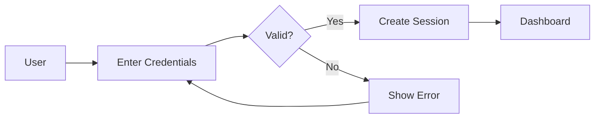
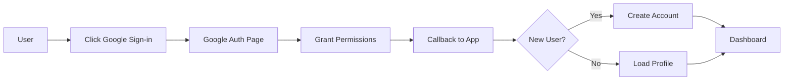
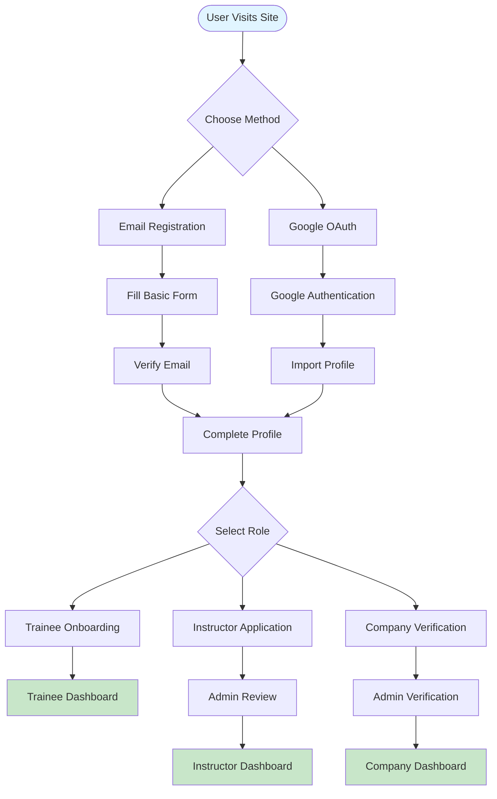
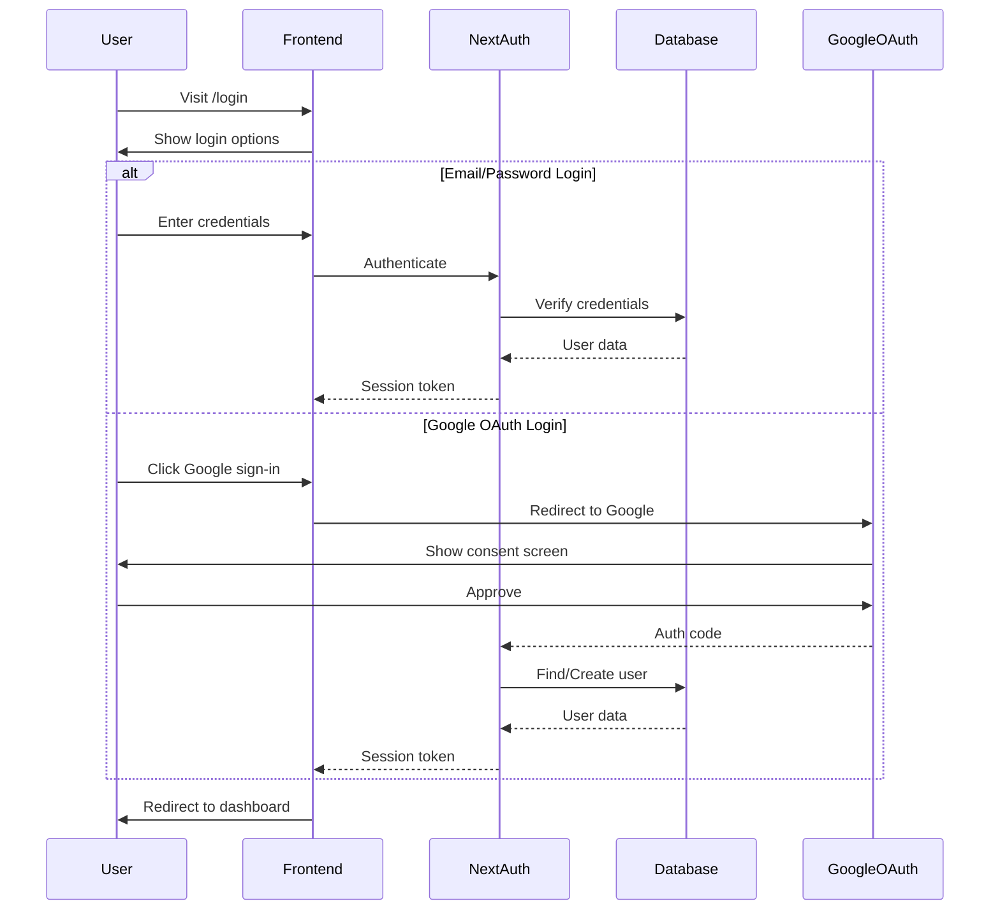
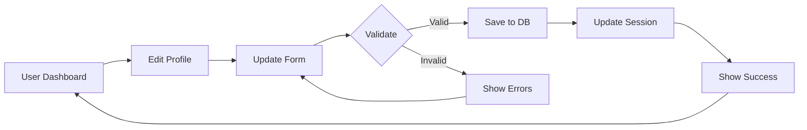
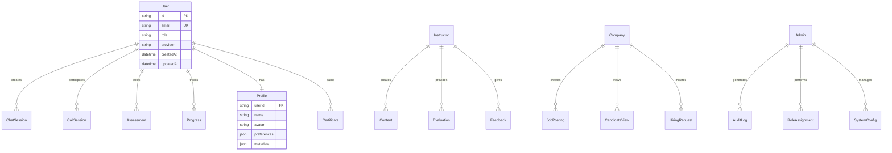

# Authentication & Authorization System Overview

## System Overview

The HireXp platform implements a comprehensive authentication and authorization system supporting four distinct user roles, multiple authentication methods, and granular permission controls. The system ensures secure access to platform features while maintaining a smooth user experience across different user types.

## User Roles

### 1. Trainee Role
**Purpose**: Job seekers using the platform for English training

**Key Characteristics**:
- Primary users of the training modules
- Progress tracked across all activities
- Certificate eligibility upon completion
- Can update personal profile and preferences

**Access Rights**:
- AI Chit Chat module
- AI Mock Call module
- English Assessments
- AI Interview preparation
- Typing tests
- Personal progress dashboard
- Certificate generation

### 2. Instructor Role
**Purpose**: Content creators and trainers who guide and evaluate trainees

**Key Characteristics**:
- Can create and manage training content
- Access to trainee performance data
- Can provide manual feedback and evaluations
- Can customize training scenarios

**Access Rights**:
- Content management system
- Trainee progress monitoring
- Evaluation override capabilities
- Custom scenario creation
- Feedback management
- Analytics dashboard
- Communication with trainees

### 3. Company Role
**Purpose**: Organizations seeking trained English-speaking talent

**Key Characteristics**:
- Access to candidate pool
- Can view verified trainee certifications
- Hiring pipeline management
- Performance prediction analytics

**Access Rights**:
- Candidate search and filtering
- Trainee profile viewing (with consent)
- Performance metrics access
- Hiring dashboard
- Communication with certified trainees
- Bulk candidate management
- Custom requirement setting

### 4. Admin Role
**Purpose**: System administrators managing the platform

**Key Characteristics**:
- Full system access
- User role management
- Platform configuration
- Security oversight

**Access Rights**:
- All platform features
- User management console
- Role assignment interface
- System configuration
- Analytics and reporting
- Audit log access
- Payment management
- API key management

## Authentication Methods

### 1. Email/Password Authentication
Traditional authentication method with enhanced security features:



**Features**:
- Secure password requirements (min 8 chars, mixed case, numbers, symbols)
- Password strength indicator
- Forgot password flow with email reset
- Email verification for new accounts

### 2. Google OAuth 2.0
Streamlined authentication using Google accounts:



**Features**:
- One-click sign-in
- Automatic email verification
- Profile picture import
- Secure token exchange

## User Journey Flows

### Registration Flow



### Login Flow



### Profile Update Flow



## Permission System

### Page-Level Permissions

| Page/Route | Trainee | Instructor | Company | Admin | Public |
|------------|---------|------------|---------|-------|--------|
| `/` (Homepage) | ✅ | ✅ | ✅ | ✅ | ✅ |
| `/login` | ✅ | ✅ | ✅ | ✅ | ✅ |
| `/register` | ✅ | ✅ | ✅ | ✅ | ✅ |
| `/dashboard` | ✅ | ✅ | ✅ | ✅ | ❌ |
| `/dashboard/trainee/*` | ✅ | ❌ | ❌ | ✅ | ❌ |
| `/dashboard/instructor/*` | ❌ | ✅ | ❌ | ✅ | ❌ |
| `/dashboard/company/*` | ❌ | ❌ | ✅ | ✅ | ❌ |
| `/dashboard/admin/*` | ❌ | ❌ | ❌ | ✅ | ❌ |
| `/training/*` | ✅ | ✅ | ❌ | ✅ | ❌ |
| `/candidates` | ❌ | ❌ | ✅ | ✅ | ❌ |
| `/content-management` | ❌ | ✅ | ❌ | ✅ | ❌ |
| `/profile` | ✅ | ✅ | ✅ | ✅ | ❌ |
| `/settings` | ✅ | ✅ | ✅ | ✅ | ❌ |

### Feature-Level Permissions

| Feature | Trainee | Instructor | Company | Admin |
|---------|---------|------------|---------|-------|
| AI Chit Chat | ✅ | ✅ (Demo) | ❌ | ✅ |
| AI Mock Call | ✅ | ✅ (Demo) | ❌ | ✅ |
| View Own Progress | ✅ | ✅ | ✅ | ✅ |
| View Others' Progress | ❌ | ✅ (Students) | ✅ (Candidates) | ✅ |
| Create Content | ❌ | ✅ | ❌ | ✅ |
| Evaluate Users | ❌ | ✅ | ❌ | ✅ |
| Hire Candidates | ❌ | ❌ | ✅ | ❌ |
| Assign Roles | ❌ | ❌ | ❌ | ✅ |
| System Config | ❌ | ❌ | ❌ | ✅ |

## Security Features

### Authentication Security
- **Password Hashing**: BCrypt with salt rounds = 12
- **Session Management**: JWT with 15-minute access tokens
- **Refresh Tokens**: 7-day refresh tokens with rotation
- **Rate Limiting**: Max 5 login attempts per 15 minutes
- **Account Lockout**: 30-minute lockout after 10 failed attempts

### Authorization Security
- **Role-Based Access Control (RBAC)**: Granular permission system
- **API Route Protection**: Middleware-based authentication checks
- **CSRF Protection**: Token validation for state-changing operations
- **Session Validation**: Real-time session verification

### Data Security
- **Encryption**: All sensitive data encrypted at rest
- **HTTPS Only**: Enforced SSL/TLS for all connections
- **Secure Cookies**: HttpOnly, Secure, SameSite attributes
- **Input Sanitization**: XSS and SQL injection prevention

## Admin Features

### User Management Dashboard

```
Admin Dashboard
├── User Management
│   ├── View All Users
│   ├── Search & Filter
│   ├── Role Assignment
│   └── Account Actions
├── Role Management
│   ├── View Permissions
│   ├── Modify Roles
│   └── Audit Trail
├── System Settings
│   ├── Authentication Config
│   ├── OAuth Settings
│   └── Security Policies
└── Analytics
    ├── User Statistics
    ├── Role Distribution
    └── Login Analytics
```

### Role Assignment Process

1. **Admin Initiates**: Admin navigates to user management
2. **User Selection**: Search and select target user
3. **Role Change**: Select new role from dropdown
4. **Confirmation**: Confirm role change with reason
5. **Notification**: User receives email notification
6. **Audit Log**: Action recorded in system logs

## User Data Relationships

### Database Relationships



## Integration Points

### With AI Features
- User ID linked to all AI sessions
- Progress tracking per user
- Personalized AI responses based on role
- Role-specific evaluation criteria

### With Progress System
- Role determines progress metrics
- Instructors see aggregate progress
- Companies see candidate readiness
- Admins see platform-wide analytics

### With Content System
- Instructors create/modify content
- Trainees consume content
- Companies define requirements
- Admins oversee all content

## Best Practices

### For Implementation
1. Use NextAuth.js for standardized auth flow
2. Implement proper session management
3. Always validate permissions server-side
4. Log all authentication events
5. Use environment variables for secrets

### For Security
1. Never store plain text passwords
2. Implement proper CORS policies
3. Use HTTPS in production
4. Regular security audits
5. Keep dependencies updated

### For User Experience
1. Clear role selection during registration
2. Smooth OAuth flow
3. Helpful error messages
4. Quick session recovery
5. Remember me functionality

## Migration Strategy

### From Existing System
If migrating from an existing auth system:

1. **Data Export**: Export existing user data
2. **Schema Mapping**: Map old schema to new
3. **Password Reset**: Force password reset for security
4. **Role Assignment**: Default existing users to appropriate roles
5. **Communication**: Notify users of changes

### Future Enhancements
- Multi-factor authentication (MFA)
- Biometric authentication
- SSO with additional providers
- Advanced session management
- Delegated administration