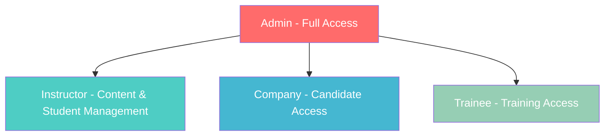

# Permissions Matrix

## Overview

This document defines the complete permissions matrix for the HireXp platform, covering page access, feature permissions, API endpoints, and data visibility for each role.

## Role Hierarchy



## Page-Level Permissions

### Public Pages (No Authentication Required)

| Page | URL Path | Description |
|------|----------|-------------|
| Homepage | `/` | Landing page |
| About | `/about` | About the platform |
| Features | `/features` | Platform features |
| Pricing | `/pricing` | Pricing plans |
| Login | `/auth/login` | User login |
| Register | `/auth/register` | User registration |
| Forgot Password | `/auth/forgot-password` | Password reset |
| Verify Email | `/auth/verify-email` | Email verification |
| Terms | `/terms` | Terms of service |
| Privacy | `/privacy` | Privacy policy |

### Authenticated Pages

| Page | URL Path | Trainee | Instructor | Company | Admin |
|------|----------|---------|------------|---------|-------|
| **Dashboard** |||||
| Main Dashboard | `/dashboard` | ✅ | ✅ | ✅ | ✅ |
| Trainee Dashboard | `/dashboard/trainee` | ✅ | ❌ | ❌ | ✅ |
| Instructor Dashboard | `/dashboard/instructor` | ❌ | ✅ | ❌ | ✅ |
| Company Dashboard | `/dashboard/company` | ❌ | ❌ | ✅ | ✅ |
| Admin Dashboard | `/dashboard/admin` | ❌ | ❌ | ❌ | ✅ |
| **Training Modules** |||||
| AI Chit Chat | `/training/chat` | ✅ | ✅* | ❌ | ✅ |
| AI Mock Call | `/training/call` | ✅ | ✅* | ❌ | ✅ |
| English Assessment | `/training/assessment` | ✅ | ✅* | ❌ | ✅ |
| AI Interview | `/training/interview` | ✅ | ✅* | ❌ | ✅ |
| Typing Test | `/training/typing` | ✅ | ✅* | ❌ | ✅ |
| **Progress & Analytics** |||||
| My Progress | `/progress` | ✅ | ✅ | ✅ | ✅ |
| Student Progress | `/progress/students` | ❌ | ✅ | ❌ | ✅ |
| Platform Analytics | `/analytics` | ❌ | ❌ | ❌ | ✅ |
| **Content Management** |||||
| Content Library | `/content` | ✅ (view) | ✅ | ❌ | ✅ |
| Content Creator | `/content/create` | ❌ | ✅ | ❌ | ✅ |
| Content Editor | `/content/edit/:id` | ❌ | ✅** | ❌ | ✅ |
| **Candidate Management** |||||
| Candidate Pool | `/candidates` | ❌ | ❌ | ✅ | ✅ |
| Candidate Profile | `/candidates/:id` | ❌ | ❌ | ✅ | ✅ |
| Job Postings | `/jobs` | ✅ (view) | ✅ (view) | ✅ | ✅ |
| Create Job | `/jobs/create` | ❌ | ❌ | ✅ | ✅ |
| **User Management** |||||
| Profile | `/profile` | ✅ | ✅ | ✅ | ✅ |
| Settings | `/settings` | ✅ | ✅ | ✅ | ✅ |
| Users List | `/admin/users` | ❌ | ❌ | ❌ | ✅ |
| User Details | `/admin/users/:id` | ❌ | ❌ | ❌ | ✅ |
| Role Management | `/admin/roles` | ❌ | ❌ | ❌ | ✅ |

**Notes:**
- ✅* = Instructors access training modules for demo/review purposes
- ✅** = Instructors can only edit their own content

## Feature-Level Permissions

### Training Features

| Feature | Trainee | Instructor | Company | Admin |
|---------|---------|------------|---------|-------|
| **AI Chit Chat** |||||
| Start new session | ✅ | ✅ | ❌ | ✅ |
| View own sessions | ✅ | ✅ | ❌ | ✅ |
| View others' sessions | ❌ | ✅*** | ❌ | ✅ |
| Download transcripts | ✅ | ✅ | ❌ | ✅ |
| **AI Mock Call** |||||
| Initiate call | ✅ | ✅ | ❌ | ✅ |
| Access recordings | ✅ (own) | ✅ | ❌ | ✅ |
| **Assessments** |||||
| Take assessment | ✅ | ✅ | ❌ | ✅ |
| View results | ✅ (own) | ✅ | ❌ | ✅ |
| Create assessments | ❌ | ✅ | ❌ | ✅ |
| **Evaluations** |||||
| Receive AI evaluation | ✅ | ✅ | ❌ | ✅ |
| Manual evaluation | ❌ | ✅ | ❌ | ✅ |
| Override AI scores | ❌ | ✅ | ❌ | ✅ |

**Notes:**
- ✅*** = Instructors can only view their assigned students' sessions

### Content Management

| Feature | Trainee | Instructor | Company | Admin |
|---------|---------|------------|---------|-------|
| View public content | ✅ | ✅ | ✅ | ✅ |
| Create content | ❌ | ✅ | ❌ | ✅ |
| Edit own content | ❌ | ✅ | ❌ | ✅ |
| Edit others' content | ❌ | ❌ | ❌ | ✅ |
| Delete own content | ❌ | ✅ | ❌ | ✅ |
| Delete others' content | ❌ | ❌ | ❌ | ✅ |
| Publish content | ❌ | ✅ | ❌ | ✅ |
| Unpublish content | ❌ | ✅ (own) | ❌ | ✅ |

### User Management

| Feature | Trainee | Instructor | Company | Admin |
|---------|---------|------------|---------|-------|
| View own profile | ✅ | ✅ | ✅ | ✅ |
| Edit own profile | ✅ | ✅ | ✅ | ✅ |
| View others' profiles | ❌ | ✅**** | ✅**** | ✅ |
| Change own password | ✅ | ✅ | ✅ | ✅ |
| Reset others' password | ❌ | ❌ | ❌ | ✅ |
| Assign roles | ❌ | ❌ | ❌ | ✅ |
| Suspend accounts | ❌ | ❌ | ❌ | ✅ |
| Delete accounts | ❌ | ❌ | ❌ | ✅ |

**Notes:**
- ✅**** = Limited view (public information only)

## API Endpoint Permissions

### Authentication Endpoints

| Endpoint | Method | Path | Trainee | Instructor | Company | Admin |
|----------|--------|------|---------|------------|---------|-------|
| Register | POST | `/api/auth/register` | ✅ | ✅ | ✅ | ❌ |
| Login | POST | `/api/auth/login` | ✅ | ✅ | ✅ | ✅ |
| Logout | POST | `/api/auth/logout` | ✅ | ✅ | ✅ | ✅ |
| Refresh Token | POST | `/api/auth/refresh` | ✅ | ✅ | ✅ | ✅ |
| Verify Email | GET | `/api/auth/verify-email` | ✅ | ✅ | ✅ | ✅ |
| Forgot Password | POST | `/api/auth/forgot-password` | ✅ | ✅ | ✅ | ✅ |
| Reset Password | POST | `/api/auth/reset-password` | ✅ | ✅ | ✅ | ✅ |

### User Endpoints

| Endpoint | Method | Path | Trainee | Instructor | Company | Admin |
|----------|--------|------|---------|------------|---------|-------|
| Get Current User | GET | `/api/user/me` | ✅ | ✅ | ✅ | ✅ |
| Update Profile | PUT | `/api/user/profile` | ✅ | ✅ | ✅ | ✅ |
| Upload Avatar | POST | `/api/user/avatar` | ✅ | ✅ | ✅ | ✅ |
| Change Password | POST | `/api/user/change-password` | ✅ | ✅ | ✅ | ✅ |
| Update Preferences | PATCH | `/api/user/preferences` | ✅ | ✅ | ✅ | ✅ |
| Delete Account | DELETE | `/api/user/account` | ✅ | ✅ | ✅ | ✅ |

### Training Endpoints

| Endpoint | Method | Path | Trainee | Instructor | Company | Admin |
|----------|--------|------|---------|------------|---------|-------|
| Create Chat Session | POST | `/api/chat` | ✅ | ✅ | ❌ | ✅ |
| Send Chat Message | POST | `/api/chat/:id/messages` | ✅ | ✅ | ❌ | ✅ |
| Get Chat History | GET | `/api/chat/:id` | ✅ (own) | ✅ | ❌ | ✅ |
| Start Mock Call | POST | `/api/call` | ✅ | ✅ | ❌ | ✅ |
| End Mock Call | POST | `/api/call/:id/end` | ✅ | ✅ | ❌ | ✅ |
| Get Evaluation | GET | `/api/evaluation/:id` | ✅ (own) | ✅ | ❌ | ✅ |

### Content Endpoints

| Endpoint | Method | Path | Trainee | Instructor | Company | Admin |
|----------|--------|------|---------|------------|---------|-------|
| List Content | GET | `/api/content` | ✅ | ✅ | ❌ | ✅ |
| Get Content | GET | `/api/content/:id` | ✅ | ✅ | ❌ | ✅ |
| Create Content | POST | `/api/content` | ❌ | ✅ | ❌ | ✅ |
| Update Content | PUT | `/api/content/:id` | ❌ | ✅ (own) | ❌ | ✅ |
| Delete Content | DELETE | `/api/content/:id` | ❌ | ✅ (own) | ❌ | ✅ |

### Admin Endpoints

| Endpoint | Method | Path | Trainee | Instructor | Company | Admin |
|----------|--------|------|---------|------------|---------|-------|
| List Users | GET | `/api/admin/users` | ❌ | ❌ | ❌ | ✅ |
| Get User | GET | `/api/admin/users/:id` | ❌ | ❌ | ❌ | ✅ |
| Update User Role | PUT | `/api/admin/users/:id/role` | ❌ | ❌ | ❌ | ✅ |
| Suspend User | PUT | `/api/admin/users/:id/suspend` | ❌ | ❌ | ❌ | ✅ |
| Get Audit Logs | GET | `/api/admin/audit-logs` | ❌ | ❌ | ❌ | ✅ |
| System Stats | GET | `/api/admin/stats` | ❌ | ❌ | ❌ | ✅ |

## Data Visibility Rules

### User Data

| Data Type | Own Data | Other Users' Data | Visibility Rules |
|-----------|----------|-------------------|------------------|
| **Trainee sees:** ||||
| Basic Profile | ✅ | ❌ | Only own data |
| Progress | ✅ | ❌ | Only own progress |
| Evaluations | ✅ | ❌ | Only own evaluations |
| Certificates | ✅ | ❌ | Only own certificates |
| **Instructor sees:** ||||
| Basic Profile | ✅ | ✅ (students) | Students assigned to them |
| Progress | ✅ | ✅ (students) | Aggregate and individual |
| Evaluations | ✅ | ✅ (students) | Can view and override |
| Content Stats | ✅ | ❌ | Only own content stats |
| **Company sees:** ||||
| Basic Profile | ✅ | ✅ (candidates) | Certified candidates only |
| Certificates | N/A | ✅ | Verified certificates |
| Skills | N/A | ✅ | From evaluations |
| Contact Info | N/A | ✅* | With candidate consent |
| **Admin sees:** ||||
| All Data | ✅ | ✅ | Full access to all data |

**Notes:**
- ✅* = Requires explicit consent from candidate

### Sensitive Data Access

| Data Type | Trainee | Instructor | Company | Admin |
|-----------|---------|------------|---------|-------|
| Email addresses | Own | Students | Candidates* | All |
| Phone numbers | Own | ❌ | Candidates* | All |
| Payment info | Own | Own | Own | All |
| Session recordings | Own | Students | ❌ | All |
| IP addresses | ❌ | ❌ | ❌ | All |
| Login history | Own | ❌ | ❌ | All |

**Notes:**
- Candidates* = Only with explicit consent

## Component-Level Permissions

### UI Component Visibility

```typescript
// Component visibility based on role
interface ComponentPermissions {
  component: string;
  roles: UserRole[];
  condition?: (user: User) => boolean;
}

const componentPermissions: ComponentPermissions[] = [
  {
    component: "AdminPanel",
    roles: [UserRole.ADMIN]
  },
  {
    component: "InstructorTools",
    roles: [UserRole.INSTRUCTOR, UserRole.ADMIN]
  },
  {
    component: "CandidateSearch",
    roles: [UserRole.COMPANY, UserRole.ADMIN]
  },
  {
    component: "TrainingModules",
    roles: [UserRole.TRAINEE, UserRole.INSTRUCTOR, UserRole.ADMIN]
  },
  {
    component: "RoleAssignment",
    roles: [UserRole.ADMIN]
  },
  {
    component: "ContentCreator",
    roles: [UserRole.INSTRUCTOR, UserRole.ADMIN]
  },
  {
    component: "StudentProgress",
    roles: [UserRole.INSTRUCTOR, UserRole.ADMIN],
    condition: (user) => user.instructorProfile?.isVerified === true
  }
];
```

## Permission Inheritance

### Role Escalation Path

1. **Trainee → Instructor**
   - Requirements: Complete training, pass evaluation
   - Admin approval required
   - Keeps trainee permissions + gains instructor permissions

2. **Trainee → Company**
   - Not a direct path (different account type)
   - Requires new registration as company

3. **Any Role → Admin**
   - Only by super admin assignment
   - Cannot self-assign
   - Requires multi-factor authentication

## Special Permissions

### Time-Based Permissions

| Permission | Description | Roles | Duration |
|------------|-------------|-------|----------|
| Trial Access | Full trainee features | Trainee | 7 days |
| Demo Access | Limited instructor features | Instructor | During onboarding |
| Evaluation Period | Extended candidate viewing | Company | 30 days |

### Conditional Permissions

| Permission | Condition | Applies To |
|------------|-----------|------------|
| Create Premium Content | Verified instructor status | Instructor |
| Bulk Candidate Export | Active subscription | Company |
| Advanced Analytics | Premium plan | All roles |
| API Access | API key generated | Company, Admin |

## Security Considerations

### Permission Checks

1. **Frontend Checks** (for UX only)
   ```typescript
   if (hasPermission(user, 'content.create')) {
     showCreateButton();
   }
   ```

2. **Backend Checks** (authoritative)
   ```typescript
   if (!hasPermission(user, 'content.create')) {
     throw new ForbiddenError();
   }
   ```

3. **Database-Level Checks** (RLS)
   ```sql
   CREATE POLICY content_policy ON content
     FOR ALL
     USING (
       user_role = 'ADMIN' OR
       (user_role = 'INSTRUCTOR' AND creator_id = current_user_id())
     );
   ```

### Permission Audit

All permission changes are logged:
- Who made the change
- What permission was changed
- When it was changed
- Why it was changed (reason required)
- Previous value

## Implementation Guidelines

### Role Check Implementation

```typescript
// Middleware for route protection
export function requireRole(roles: UserRole[]) {
  return async (req: Request, res: Response, next: NextFunction) => {
    const user = req.user;

    if (!user || !roles.includes(user.role)) {
      return res.status(403).json({
        error: 'Insufficient permissions'
      });
    }

    next();
  };
}

// Usage
router.get('/admin/users',
  requireAuth,
  requireRole([UserRole.ADMIN]),
  getUsersHandler
);
```

### Dynamic Permission Loading

```typescript
// Load permissions based on role
async function loadUserPermissions(userId: string): Promise<Permission[]> {
  const user = await prisma.user.findUnique({
    where: { id: userId },
    include: {
      role: {
        include: {
          permissions: true
        }
      }
    }
  });

  return user.role.permissions;
}
```

## Compliance Requirements

- GDPR: Users can only access their own personal data unless explicit consent
- CCPA: California users have additional data rights
- COPPA: No accounts for users under 13
- FERPA: Educational records protection for US users

## Regular Review

This permissions matrix should be reviewed:
- Monthly: For operational adjustments
- Quarterly: For role refinements
- Annually: For complete audit
- On-demand: For security incidents