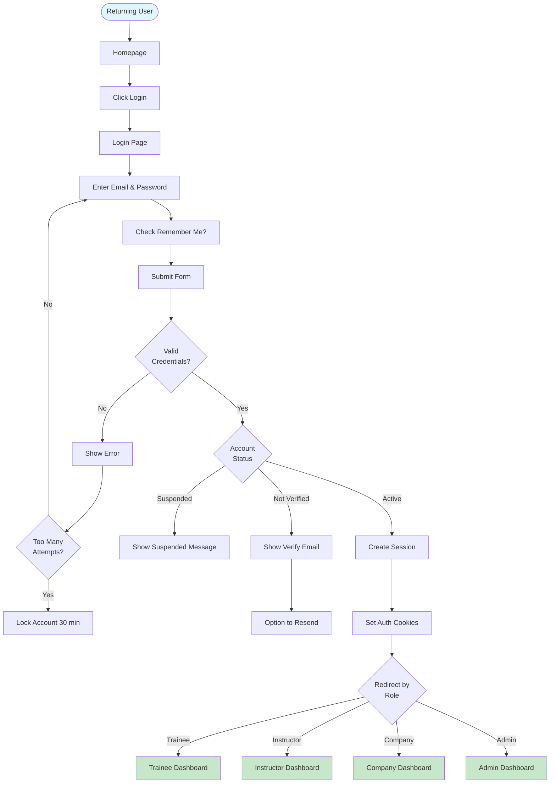

# User Flows Documentation

## Overview

This document details all user interaction flows for authentication and user management in the HireXp platform, including registration, login, profile management, and role-specific workflows.

## Registration Flows

### 1. Trainee Registration Flow


### 2. Instructor Registration Flow


### 3. Company Registration Flow

```mermaid
flowchart TD
    Start([Company HR]) --> Landing[Landing Page]
    Landing --> CompanyCTA[Click For Companies]

    CompanyCTA --> CompanyInfo[Company Benefits Page]
    CompanyInfo --> GetStarted[Click Get Started]

    GetStarted --> CompanyReg[Company Registration Form]
    CompanyReg --> FillCompany[Fill Company Details<br/>- Company Name<br/>- Industry<br/>- Size<br/>- Website]

    FillCompany --> FillContact[Fill Contact Person Info]
    FillContact --> FillBilling[Billing Information<br/>(Optional for Trial)]

    FillBilling --> Verify{Verify<br/>Company}
    Verify -->|Invalid| VerifyError[Company Verification Failed]
    VerifyError --> Support[Contact Support]

    Verify -->|Valid| CreateCompany[Create Company Account]
    CreateCompany --> SendVerify[Send Verification Email]
    SendVerify --> VerifyDomain[Domain Verification]

    VerifyDomain --> Trial{Start<br/>Trial?}
    Trial -->|Yes| EnableTrial[Enable 30-Day Trial]
    Trial -->|No| SelectPlan[Select Subscription Plan]

    EnableTrial --> CompanyDash[Company Dashboard]
    SelectPlan --> Payment[Payment Process]
    Payment --> CompanyDash

    style Start fill:#e1f5ff
    style CompanyDash fill:#c8e6c9
```

### 4. Google OAuth Registration


## Login Flows

### 1. Standard Login Flow



### 2. Password Reset Flow

```mermaid
flowchart TD
    Start([Forgot Password]) --> LoginPage[Login Page]
    LoginPage --> ForgotLink[Click Forgot Password]

    ForgotLink --> ResetPage[Password Reset Page]
    ResetPage --> EnterEmail[Enter Email Address]

    EnterEmail --> Submit[Submit Request]
    Submit --> CheckEmail{Email<br/>Exists?}

    CheckEmail -->|Yes| GenerateToken[Generate Reset Token]
    CheckEmail -->|No| SameMessage[Show Success Message<br/>(Security: Same as Yes)]

    GenerateToken --> SendEmail[Send Reset Email]
    SendEmail --> SameMessage

    SameMessage --> UserEmail[User Checks Email]
    UserEmail --> ClickReset[Click Reset Link]

    ClickReset --> ValidateToken{Valid<br/>Token?}
    ValidateToken -->|No| ExpiredToken[Show Token Expired]
    ExpiredToken --> RequestNew[Request New Link]

    ValidateToken -->|Yes| NewPassPage[New Password Page]
    NewPassPage --> EnterNewPass[Enter New Password]
    EnterNewPass --> ConfirmPass[Confirm Password]

    ConfirmPass --> ValidatePass{Valid<br/>Password?}
    ValidatePass -->|No| PassError[Show Requirements]
    PassError --> EnterNewPass

    ValidatePass -->|Yes| UpdatePass[Update Password]
    UpdatePass --> InvalidateSessions[Invalidate All Sessions]
    InvalidateSessions --> SuccessMsg[Show Success]
    SuccessMsg --> RedirectLogin[Redirect to Login]

    style Start fill:#e1f5ff
    style RedirectLogin fill:#c8e6c9
```

## Profile Management Flows

### 1. Profile Update Flow


### 2. Avatar Upload Flow


## Role Management Flows

### 1. Admin Role Assignment Flow

```mermaid
flowchart TD
    Start([Admin User]) --> AdminDash[Admin Dashboard]
    AdminDash --> UsersMenu[Users Management]

    UsersMenu --> UsersList[Users List Page]
    UsersList --> SearchUser[Search/Filter Users]
    SearchUser --> SelectUser[Select User]

    SelectUser --> UserDetails[User Details Page]
    UserDetails --> RoleSection[Role Management Section]
    RoleSection --> ChangeRole[Click Change Role]

    ChangeRole --> RoleModal[Role Change Modal]
    RoleModal --> SelectNew[Select New Role]
    SelectNew --> EnterReason[Enter Reason<br/>(Required)]

    EnterReason --> Confirm{Confirm<br/>Change?}
    Confirm -->|No| Cancel[Close Modal]

    Confirm -->|Yes| ValidatePerms{Has<br/>Permission?}
    ValidatePerms -->|No| PermError[Permission Denied]

    ValidatePerms -->|Yes| UpdateRole[Update User Role]
    UpdateRole --> LogAudit[Create Audit Log]
    LogAudit --> InvalidateSession[Invalidate User Sessions]
    InvalidateSession --> SendNotification[Email User]

    SendNotification --> RefreshPage[Refresh User Details]
    RefreshPage --> ShowUpdated[Show Updated Role]

    style Start fill:#ff6b6b,color:#fff
    style ShowUpdated fill:#c8e6c9
```

### 2. Instructor Verification Flow


## Security Flows

### 1. Session Management Flow


### 2. Account Recovery Flow


## Onboarding Flows

### 1. Trainee Onboarding


### 2. Company Onboarding


## Error Handling Flows

### 1. Authentication Error Flow

```mermaid
flowchart TD
    Start([Error Occurs]) --> ErrorType{Error<br/>Type}

    ErrorType --> InvalidCreds[Invalid Credentials]
    ErrorType --> ExpiredToken[Expired Token]
    ErrorType --> NetworkError[Network Error]
    ErrorType --> ServerError[Server Error]

    InvalidCreds --> ShowError1[Show "Invalid email or password"]
    ShowError1 --> RetryLogin[Allow Retry]

    ExpiredToken --> ShowError2[Show "Session expired"]
    ShowError2 --> RedirectLogin[Redirect to Login]

    NetworkError --> ShowError3[Show "Connection failed"]
    ShowError3 --> RetryButton[Show Retry Button]
    RetryButton --> RetryAction[Retry Request]

    ServerError --> ShowError4[Show "Something went wrong"]
    ShowError4 --> LogError[Log Error Details]
    LogError --> SupportLink[Show Support Link]

    style Start fill:#ffcccc
```

## Mobile-Specific Flows

### 1. Mobile Authentication Flow

```mermaid
flowchart TD
    Start([Mobile User]) --> OpenApp[Open Mobile Browser]
    OpenApp --> LoadSite[Load HireXp Site]

    LoadSite --> MobileDetect[Detect Mobile Device]
    MobileDetect --> MobileLogin[Mobile-Optimized Login]

    MobileLogin --> Options{Auth<br/>Method}
    Options --> EmailPass[Email/Password]
    Options --> GoogleAuth[Google Auth]
    Options --> Biometric[Biometric Login<br/>(if saved)]

    EmailPass --> EnterCreds[Enter Credentials]
    GoogleAuth --> GoogleFlow[Google OAuth Flow]
    Biometric --> BiometricScan[Fingerprint/Face ID]

    EnterCreds --> Authenticate
    GoogleFlow --> Authenticate
    BiometricScan --> Authenticate[Authenticate User]

    Authenticate --> SaveSecure{Save<br/>Credentials?}
    SaveSecure -->|Yes| SecureStorage[Save to Secure Storage]
    SaveSecure -->|No| SessionOnly[Session Only]

    SecureStorage --> MobileDash[Mobile Dashboard]
    SessionOnly --> MobileDash

    style Start fill:#e1f5ff
    style MobileDash fill:#c8e6c9
```

## Compliance Flows

### 1. GDPR Consent Flow


## Integration Points

### With Training Modules
- Post-login redirect to last active module
- Session continuation across module switches
- Progress saves linked to user session

### With Progress Tracking
- Login triggers progress data load
- Logout saves current progress state
- Role changes affect visible progress metrics

### With Notification System
- Login triggers notification check
- Password changes send email alerts
- Role changes notify users immediately

## Best Practices

1. **Always show loading states** during authentication processes
2. **Provide clear error messages** with actionable next steps
3. **Implement retry mechanisms** for network failures
4. **Save user progress** before requiring re-authentication
5. **Use progressive disclosure** in registration forms
6. **Offer multiple authentication methods** for flexibility
7. **Maintain session across browser tabs**
8. **Clear sensitive data** on logout
9. **Implement proper back button handling**
10. **Test flows on multiple devices and browsers**