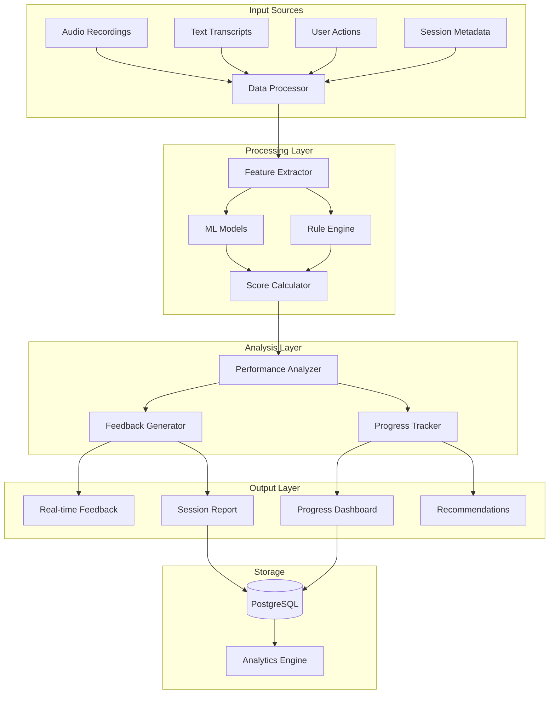
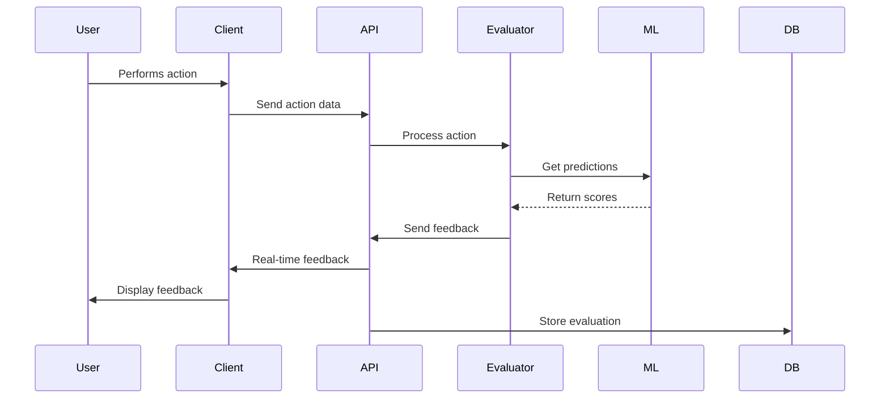
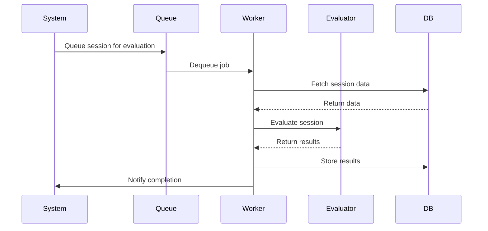

# Evaluation Engine - System Architecture

## Overview

The evaluation engine is the core system responsible for assessing user performance across all training modules. It provides real-time feedback, comprehensive post-session analysis, and adaptive learning recommendations based on individual progress.

## Architecture Overview

### System Components



## Core Components

### 1. Evaluation Service

```typescript
// lib/evaluation/evaluation.service.ts
export class EvaluationService {
  private evaluators: Map<ModuleType, IEvaluator> = new Map();
  private mlModels: Map<string, MLModel> = new Map();
  private ruleEngine: RuleEngine;
  private feedbackGenerator: FeedbackGenerator;

  constructor() {
    this.initializeEvaluators();
    this.loadMLModels();
    this.ruleEngine = new RuleEngine();
    this.feedbackGenerator = new FeedbackGenerator();
  }

  private initializeEvaluators(): void {
    this.evaluators.set('chit-chat', new ChitChatEvaluator());
    this.evaluators.set('mock-call', new MockCallEvaluator());
    this.evaluators.set('interview', new InterviewEvaluator());
    this.evaluators.set('typing', new TypingEvaluator());
    this.evaluators.set('assessment', new AssessmentEvaluator());
  }

  async evaluate(
    sessionData: SessionData,
    moduleType: ModuleType
  ): Promise<EvaluationResult> {
    const evaluator = this.evaluators.get(moduleType);

    if (!evaluator) {
      throw new Error(`No evaluator found for module type: ${moduleType}`);
    }

    // Extract features from session data
    const features = await this.extractFeatures(sessionData);

    // Run evaluation
    const scores = await evaluator.evaluate(features);

    // Apply business rules
    const adjustedScores = this.ruleEngine.applyRules(scores, sessionData);

    // Generate feedback
    const feedback = await this.feedbackGenerator.generate(adjustedScores, sessionData);

    // Track progress
    await this.trackProgress(sessionData.userId, adjustedScores);

    return {
      scores: adjustedScores,
      feedback,
      timestamp: new Date(),
      sessionId: sessionData.sessionId
    };
  }

  private async extractFeatures(sessionData: SessionData): Promise<Features> {
    const extractor = new FeatureExtractor();

    return {
      linguistic: await extractor.extractLinguisticFeatures(sessionData.transcript),
      acoustic: await extractor.extractAcousticFeatures(sessionData.audio),
      behavioral: await extractor.extractBehavioralFeatures(sessionData.actions),
      contextual: await extractor.extractContextualFeatures(sessionData.metadata)
    };
  }

  private async trackProgress(userId: string, scores: Scores): Promise<void> {
    const tracker = new ProgressTracker();
    await tracker.updateUserProgress(userId, scores);
  }
}
```

### 2. Module-Specific Evaluators

```typescript
// lib/evaluation/evaluators/base-evaluator.ts
export abstract class BaseEvaluator implements IEvaluator {
  protected metrics: Map<string, IMetric> = new Map();
  protected weights: Map<string, number> = new Map();

  constructor() {
    this.initializeMetrics();
    this.setWeights();
  }

  abstract initializeMetrics(): void;
  abstract setWeights(): void;

  async evaluate(features: Features): Promise<Scores> {
    const scores: Scores = {};

    // Calculate individual metric scores
    for (const [metricName, metric] of this.metrics) {
      scores[metricName] = await metric.calculate(features);
    }

    // Calculate weighted overall score
    scores.overall = this.calculateOverallScore(scores);

    return scores;
  }

  protected calculateOverallScore(scores: Scores): number {
    let weightedSum = 0;
    let totalWeight = 0;

    for (const [metricName, weight] of this.weights) {
      if (scores[metricName] !== undefined) {
        weightedSum += scores[metricName] * weight;
        totalWeight += weight;
      }
    }

    return totalWeight > 0 ? weightedSum / totalWeight : 0;
  }
}

// lib/evaluation/evaluators/chit-chat-evaluator.ts
export class ChitChatEvaluator extends BaseEvaluator {
  initializeMetrics(): void {
    this.metrics.set('grammar', new GrammarMetric());
    this.metrics.set('fluency', new FluencyMetric());
    this.metrics.set('vocabulary', new VocabularyMetric());
    this.metrics.set('comprehension', new ComprehensionMetric());
    this.metrics.set('pronunciation', new PronunciationMetric());
  }

  setWeights(): void {
    this.weights.set('grammar', 0.25);
    this.weights.set('fluency', 0.20);
    this.weights.set('vocabulary', 0.20);
    this.weights.set('comprehension', 0.20);
    this.weights.set('pronunciation', 0.15);
  }
}

// lib/evaluation/evaluators/mock-call-evaluator.ts
export class MockCallEvaluator extends BaseEvaluator {
  initializeMetrics(): void {
    this.metrics.set('greeting', new GreetingMetric());
    this.metrics.set('listening', new ListeningMetric());
    this.metrics.set('solution', new SolutionMetric());
    this.metrics.set('communication', new CommunicationMetric());
    this.metrics.set('empathy', new EmpathyMetric());
    this.metrics.set('closing', new ClosingMetric());
  }

  setWeights(): void {
    this.weights.set('greeting', 0.10);
    this.weights.set('listening', 0.20);
    this.weights.set('solution', 0.25);
    this.weights.set('communication', 0.20);
    this.weights.set('empathy', 0.15);
    this.weights.set('closing', 0.10);
  }
}
```

### 3. Feature Extraction

```typescript
// lib/evaluation/feature-extractor.ts
export class FeatureExtractor {
  private nlpProcessor: NLPProcessor;
  private audioProcessor: AudioProcessor;

  constructor() {
    this.nlpProcessor = new NLPProcessor();
    this.audioProcessor = new AudioProcessor();
  }

  async extractLinguisticFeatures(transcript: Transcript): Promise<LinguisticFeatures> {
    const text = transcript.messages.map(m => m.content).join(' ');

    return {
      // Lexical features
      tokenCount: this.nlpProcessor.tokenize(text).length,
      uniqueTokens: new Set(this.nlpProcessor.tokenize(text)).size,
      averageWordLength: this.calculateAverageWordLength(text),
      lexicalDiversity: this.calculateLexicalDiversity(text),

      // Syntactic features
      averageSentenceLength: this.calculateAverageSentenceLength(text),
      sentenceComplexity: await this.analyzeSentenceComplexity(text),
      grammarErrors: await this.detectGrammarErrors(text),

      // Semantic features
      topicCoherence: await this.analyzeTopicCoherence(transcript),
      sentimentScore: await this.analyzeSentiment(text),
      relevanceScore: await this.analyzeRelevance(transcript),

      // Discourse features
      turnTakingPattern: this.analyzeTurnTaking(transcript),
      responseLatency: this.calculateResponseLatency(transcript),
      interactionFlow: this.analyzeInteractionFlow(transcript)
    };
  }

  async extractAcousticFeatures(audio: AudioData): Promise<AcousticFeatures> {
    if (!audio) {
      return this.getDefaultAcousticFeatures();
    }

    return {
      // Prosodic features
      pitch: await this.audioProcessor.extractPitch(audio),
      pitchVariation: await this.audioProcessor.calculatePitchVariation(audio),
      energy: await this.audioProcessor.extractEnergy(audio),
      speakingRate: await this.audioProcessor.calculateSpeakingRate(audio),

      // Voice quality
      jitter: await this.audioProcessor.calculateJitter(audio),
      shimmer: await this.audioProcessor.calculateShimmer(audio),
      harmonicsToNoiseRatio: await this.audioProcessor.calculateHNR(audio),

      // Temporal features
      pauseDuration: await this.audioProcessor.analyzePauses(audio),
      silenceRatio: await this.audioProcessor.calculateSilenceRatio(audio),
      speechDuration: await this.audioProcessor.calculateSpeechDuration(audio),

      // Spectral features
      spectralCentroid: await this.audioProcessor.calculateSpectralCentroid(audio),
      formants: await this.audioProcessor.extractFormants(audio)
    };
  }

  async extractBehavioralFeatures(actions: UserAction[]): Promise<BehavioralFeatures> {
    return {
      // Interaction patterns
      actionCount: actions.length,
      actionTypes: this.categorizeActions(actions),
      actionTiming: this.analyzeActionTiming(actions),

      // Error patterns
      errorCount: actions.filter(a => a.type === 'error').length,
      errorRecovery: this.analyzeErrorRecovery(actions),

      // Engagement metrics
      sessionDuration: this.calculateSessionDuration(actions),
      activeTime: this.calculateActiveTime(actions),
      hesitationCount: this.countHesitations(actions),

      // Task completion
      completionRate: this.calculateCompletionRate(actions),
      efficiency: this.calculateEfficiency(actions)
    };
  }

  async extractContextualFeatures(metadata: SessionMetadata): Promise<ContextualFeatures> {
    return {
      // Session context
      moduleType: metadata.moduleType,
      difficulty: metadata.difficulty,
      scenarioType: metadata.scenarioType,

      // User context
      userLevel: metadata.userLevel,
      previousSessions: metadata.sessionCount,
      learningPath: metadata.learningPath,

      // Environmental context
      timeOfDay: metadata.timestamp.getHours(),
      dayOfWeek: metadata.timestamp.getDay(),
      sessionNumber: metadata.sessionNumber,

      // Performance context
      recentPerformance: metadata.recentScores,
      improvementTrend: this.calculateTrend(metadata.recentScores)
    };
  }
}
```

### 4. ML Model Integration

```typescript
// lib/evaluation/ml-models/model-manager.ts
export class MLModelManager {
  private models: Map<string, TensorFlowModel> = new Map();
  private modelConfigs: Map<string, ModelConfig> = new Map();

  async loadModels(): Promise<void> {
    // Load pre-trained models
    await this.loadModel('grammar-bert', '/models/grammar-bert');
    await this.loadModel('fluency-lstm', '/models/fluency-lstm');
    await this.loadModel('pronunciation-cnn', '/models/pronunciation-cnn');
    await this.loadModel('empathy-transformer', '/models/empathy-transformer');
  }

  private async loadModel(name: string, path: string): Promise<void> {
    const model = await tf.loadLayersModel(path);
    this.models.set(name, model);
    this.modelConfigs.set(name, await this.loadModelConfig(path));
  }

  async predict(modelName: string, input: TensorInput): Promise<Prediction> {
    const model = this.models.get(modelName);
    if (!model) {
      throw new Error(`Model ${modelName} not found`);
    }

    // Preprocess input
    const processedInput = await this.preprocessInput(input, modelName);

    // Make prediction
    const prediction = await model.predict(processedInput);

    // Postprocess output
    return this.postprocessOutput(prediction, modelName);
  }

  private async preprocessInput(input: TensorInput, modelName: string): Promise<tf.Tensor> {
    const config = this.modelConfigs.get(modelName)!;

    // Apply model-specific preprocessing
    switch (config.inputType) {
      case 'text':
        return this.preprocessText(input as string, config);
      case 'audio':
        return this.preprocessAudio(input as AudioData, config);
      case 'features':
        return this.preprocessFeatures(input as Features, config);
      default:
        throw new Error(`Unknown input type: ${config.inputType}`);
    }
  }

  private preprocessText(text: string, config: ModelConfig): tf.Tensor {
    // Tokenize and encode text
    const tokens = this.tokenizer.encode(text);

    // Pad or truncate to fixed length
    const paddedTokens = this.padSequence(tokens, config.maxLength);

    // Convert to tensor
    return tf.tensor2d([paddedTokens]);
  }

  private preprocessAudio(audio: AudioData, config: ModelConfig): tf.Tensor {
    // Extract spectrograms or other audio features
    const spectrogram = this.audioProcessor.computeSpectrogram(audio);

    // Normalize
    const normalized = tf.div(spectrogram, tf.scalar(255));

    // Reshape for model input
    return normalized.reshape(config.inputShape);
  }
}
```

### 5. Rule Engine

```typescript
// lib/evaluation/rule-engine.ts
export class RuleEngine {
  private rules: Rule[] = [];

  constructor() {
    this.loadRules();
  }

  private loadRules(): void {
    // Business rules for score adjustment
    this.rules = [
      {
        name: 'minimum-greeting-score',
        condition: (scores, data) => data.moduleType === 'mock-call' && scores.greeting < 50,
        action: (scores) => {
          scores.overall = Math.min(scores.overall, 60);
          return scores;
        }
      },
      {
        name: 'perfect-solution-bonus',
        condition: (scores, data) => scores.solution === 100,
        action: (scores) => {
          scores.overall = Math.min(100, scores.overall * 1.1);
          return scores;
        }
      },
      {
        name: 'empathy-requirement',
        condition: (scores, data) => data.scenarioType === 'complaint' && scores.empathy < 70,
        action: (scores) => {
          scores.overall = scores.overall * 0.9;
          return scores;
        }
      },
      {
        name: 'speed-penalty',
        condition: (scores, data) => data.duration > data.targetDuration * 1.5,
        action: (scores) => {
          scores.overall = scores.overall * 0.95;
          return scores;
        }
      },
      {
        name: 'first-attempt-bonus',
        condition: (scores, data) => data.attemptNumber === 1 && scores.overall > 80,
        action: (scores) => {
          scores.overall = Math.min(100, scores.overall + 5);
          return scores;
        }
      }
    ];
  }

  applyRules(scores: Scores, sessionData: SessionData): Scores {
    let adjustedScores = { ...scores };

    for (const rule of this.rules) {
      if (rule.condition(adjustedScores, sessionData)) {
        adjustedScores = rule.action(adjustedScores);

        // Log rule application
        this.logRuleApplication(rule.name, scores, adjustedScores);
      }
    }

    return adjustedScores;
  }

  private logRuleApplication(ruleName: string, original: Scores, adjusted: Scores): void {
    console.log(`Rule applied: ${ruleName}`, {
      original: original.overall,
      adjusted: adjusted.overall,
      delta: adjusted.overall - original.overall
    });
  }
}

interface Rule {
  name: string;
  condition: (scores: Scores, data: SessionData) => boolean;
  action: (scores: Scores) => Scores;
  priority?: number;
}
```

## Data Flow

### Real-time Evaluation Pipeline



### Batch Evaluation Pipeline



## Performance Optimization

### Caching Strategy

```typescript
// lib/evaluation/cache-manager.ts
export class EvaluationCacheManager {
  private memoryCache: LRUCache<string, EvaluationResult>;
  private redisCache: Redis;

  constructor() {
    this.memoryCache = new LRUCache({
      max: 1000,
      ttl: 1000 * 60 * 5 // 5 minutes
    });
    this.redisCache = new Redis(process.env.REDIS_URL);
  }

  async getCachedEvaluation(sessionId: string): Promise<EvaluationResult | null> {
    // L1: Memory cache
    const memoryCached = this.memoryCache.get(sessionId);
    if (memoryCached) {
      return memoryCached;
    }

    // L2: Redis cache
    const redisCached = await this.redisCache.get(`eval:${sessionId}`);
    if (redisCached) {
      const result = JSON.parse(redisCached);
      this.memoryCache.set(sessionId, result);
      return result;
    }

    return null;
  }

  async cacheEvaluation(sessionId: string, result: EvaluationResult): Promise<void> {
    // Store in both caches
    this.memoryCache.set(sessionId, result);
    await this.redisCache.setex(
      `eval:${sessionId}`,
      300, // 5 minutes TTL
      JSON.stringify(result)
    );
  }

  async invalidateCache(userId: string): Promise<void> {
    // Clear user-specific cached evaluations
    const keys = await this.redisCache.keys(`eval:*:${userId}`);
    if (keys.length > 0) {
      await this.redisCache.del(...keys);
    }
  }
}
```

### Parallel Processing

```typescript
// lib/evaluation/parallel-processor.ts
export class ParallelEvaluationProcessor {
  private workerPool: Worker[] = [];
  private taskQueue: Queue<EvaluationTask> = new Queue();

  constructor(workerCount: number = 4) {
    this.initializeWorkers(workerCount);
  }

  private initializeWorkers(count: number): void {
    for (let i = 0; i < count; i++) {
      const worker = new Worker('./evaluation-worker.js');
      worker.on('message', (result) => this.handleWorkerResult(result));
      this.workerPool.push(worker);
    }
  }

  async evaluateInParallel(tasks: EvaluationTask[]): Promise<EvaluationResult[]> {
    // Queue all tasks
    tasks.forEach(task => this.taskQueue.enqueue(task));

    // Distribute to workers
    const promises = tasks.map(task => this.processTask(task));

    // Wait for all to complete
    return Promise.all(promises);
  }

  private async processTask(task: EvaluationTask): Promise<EvaluationResult> {
    return new Promise((resolve, reject) => {
      const worker = this.getAvailableWorker();

      worker.postMessage({
        type: 'evaluate',
        data: task
      });

      worker.once('message', (result) => {
        if (result.error) {
          reject(result.error);
        } else {
          resolve(result.data);
        }
      });
    });
  }

  private getAvailableWorker(): Worker {
    // Simple round-robin selection
    // Could be enhanced with load balancing
    const worker = this.workerPool.shift()!;
    this.workerPool.push(worker);
    return worker;
  }
}
```

## Monitoring & Analytics

### Evaluation Metrics

```typescript
interface EvaluationMetrics {
  // Performance metrics
  evaluationLatency: number;
  throughput: number;
  errorRate: number;

  // Quality metrics
  accuracyScore: number;
  consistencyScore: number;

  // Usage metrics
  evaluationsPerHour: number;
  uniqueUsersEvaluated: number;

  // System metrics
  cacheHitRate: number;
  modelInferenceTime: number;
  queueLength: number;
}

class EvaluationMonitor {
  async collectMetrics(): Promise<EvaluationMetrics> {
    return {
      evaluationLatency: await this.measureLatency(),
      throughput: await this.calculateThroughput(),
      errorRate: await this.calculateErrorRate(),
      accuracyScore: await this.measureAccuracy(),
      consistencyScore: await this.measureConsistency(),
      evaluationsPerHour: await this.countEvaluations(),
      uniqueUsersEvaluated: await this.countUniqueUsers(),
      cacheHitRate: await this.calculateCacheHitRate(),
      modelInferenceTime: await this.measureInferenceTime(),
      queueLength: await this.getQueueLength()
    };
  }

  async detectAnomalies(metrics: EvaluationMetrics): Promise<Anomaly[]> {
    const anomalies: Anomaly[] = [];

    if (metrics.evaluationLatency > 1000) {
      anomalies.push({
        type: 'high-latency',
        value: metrics.evaluationLatency,
        severity: 'warning'
      });
    }

    if (metrics.errorRate > 0.05) {
      anomalies.push({
        type: 'high-error-rate',
        value: metrics.errorRate,
        severity: 'critical'
      });
    }

    return anomalies;
  }
}
```

---

*Document Version: 1.0*
*Last Updated: October 2025*
*Next Review: November 2025*