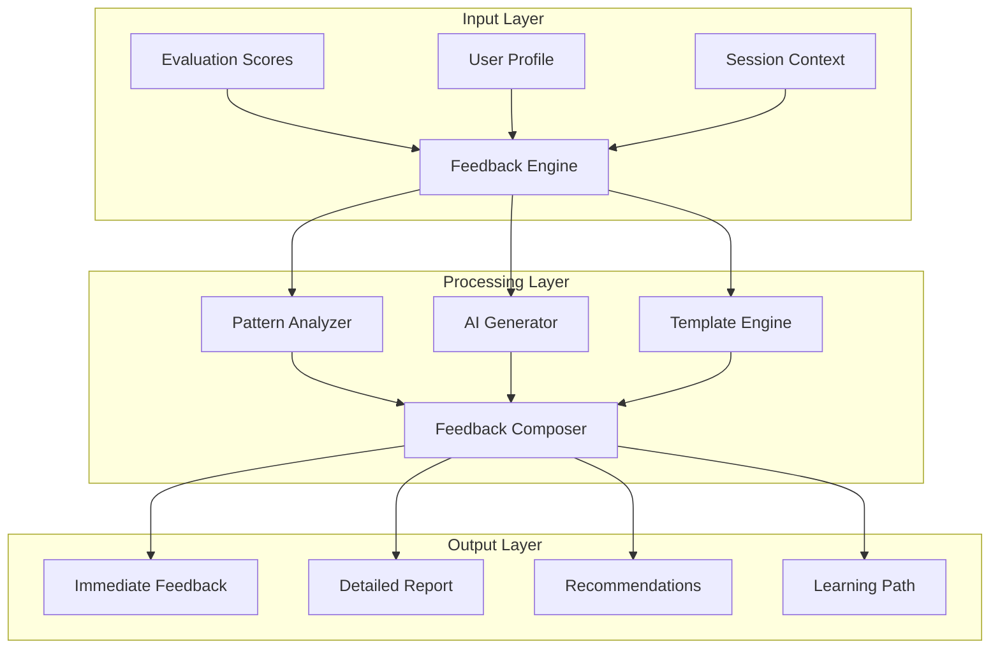

# Evaluation Engine - Feedback Generation

## Overview

The feedback generation system creates personalized, actionable feedback based on evaluation results. It uses AI-powered analysis to provide constructive guidance that helps users improve their English communication skills effectively.

## Feedback Generation Architecture

### System Components



## Feedback Generator Implementation

### Core Feedback Engine

```typescript
// lib/evaluation/feedback/feedback-generator.ts
export class FeedbackGenerator {
  private aiGenerator: OpenAIService;
  private templateEngine: TemplateEngine;
  private patternAnalyzer: PatternAnalyzer;
  private personalizationEngine: PersonalizationEngine;

  constructor() {
    this.aiGenerator = new OpenAIService();
    this.templateEngine = new TemplateEngine();
    this.patternAnalyzer = new PatternAnalyzer();
    this.personalizationEngine = new PersonalizationEngine();
  }

  async generateFeedback(
    evaluation: EvaluationResult,
    userProfile: UserProfile,
    sessionContext: SessionContext
  ): Promise<ComprehensiveFeedback> {
    // Analyze patterns in performance
    const patterns = await this.patternAnalyzer.analyze(evaluation);

    // Personalize based on user profile
    const personalizedContext = await this.personalizationEngine.contextualize(
      evaluation,
      userProfile
    );

    // Generate different types of feedback
    const feedback = {
      immediate: await this.generateImmediateFeedback(evaluation, patterns),
      detailed: await this.generateDetailedFeedback(evaluation, patterns, personalizedContext),
      recommendations: await this.generateRecommendations(patterns, userProfile),
      encouragement: await this.generateEncouragement(evaluation, userProfile),
      nextSteps: await this.generateNextSteps(patterns, userProfile, sessionContext)
    };

    return this.composeFinalFeedback(feedback);
  }

  private async generateImmediateFeedback(
    evaluation: EvaluationResult,
    patterns: PerformancePatterns
  ): Promise<ImmediateFeedback> {
    const feedback: ImmediateFeedback = {
      summary: this.generateSummary(evaluation),
      highlights: this.extractHighlights(evaluation),
      keyPoints: []
    };

    // Generate key points based on score thresholds
    if (evaluation.scores.overall >= 90) {
      feedback.keyPoints.push({
        type: 'success',
        message: 'Excellent performance! You demonstrated strong English skills.',
        icon: '🌟'
      });
    } else if (evaluation.scores.overall >= 70) {
      feedback.keyPoints.push({
        type: 'good',
        message: 'Good job! You\'re making solid progress.',
        icon: '👍'
      });
    } else {
      feedback.keyPoints.push({
        type: 'encouragement',
        message: 'Keep practicing! Every session helps you improve.',
        icon: '💪'
      });
    }

    // Add specific feedback for each metric
    for (const [metric, score] of Object.entries(evaluation.scores)) {
      if (metric === 'overall') continue;

      const point = this.generateMetricFeedback(metric, score);
      feedback.keyPoints.push(point);
    }

    return feedback;
  }

  private async generateDetailedFeedback(
    evaluation: EvaluationResult,
    patterns: PerformancePatterns,
    context: PersonalizedContext
  ): Promise<DetailedFeedback> {
    // Use AI to generate comprehensive feedback
    const prompt = this.buildDetailedFeedbackPrompt(evaluation, patterns, context);

    const aiResponse = await this.aiGenerator.generate(prompt);

    // Parse and structure AI response
    const structured = this.structureAIFeedback(aiResponse);

    return {
      strengths: structured.strengths,
      improvements: structured.improvements,
      examples: await this.generateExamples(patterns),
      comparisons: this.generateComparisons(evaluation, context),
      progress: this.analyzeProgress(context)
    };
  }

  private buildDetailedFeedbackPrompt(
    evaluation: EvaluationResult,
    patterns: PerformancePatterns,
    context: PersonalizedContext
  ): string {
    return `
      Analyze the following English learning performance and provide detailed feedback:

      Scores:
      - Overall: ${evaluation.scores.overall}/100
      - Grammar: ${evaluation.scores.grammar}/100
      - Fluency: ${evaluation.scores.fluency}/100
      - Vocabulary: ${evaluation.scores.vocabulary}/100
      - Pronunciation: ${evaluation.scores.pronunciation}/100
      - Comprehension: ${evaluation.scores.comprehension}/100

      Identified Patterns:
      ${JSON.stringify(patterns, null, 2)}

      User Context:
      - Level: ${context.userLevel}
      - Sessions Completed: ${context.sessionCount}
      - Learning Goals: ${context.goals.join(', ')}

      Please provide:
      1. Three specific strengths with examples
      2. Three areas for improvement with actionable advice
      3. Personalized learning recommendations
      4. Encouragement based on progress

      Format as structured JSON with clear, supportive language appropriate for ${context.userLevel} level learners.
    `;
  }
}
```

### Pattern Analysis

```typescript
// lib/evaluation/feedback/pattern-analyzer.ts
export class PatternAnalyzer {
  async analyze(evaluation: EvaluationResult): Promise<PerformancePatterns> {
    const patterns: PerformancePatterns = {
      errors: this.analyzeErrorPatterns(evaluation),
      strengths: this.identifyStrengthPatterns(evaluation),
      consistency: this.analyzeConsistency(evaluation),
      trends: this.identifyTrends(evaluation)
    };

    return patterns;
  }

  private analyzeErrorPatterns(evaluation: EvaluationResult): ErrorPattern[] {
    const patterns: ErrorPattern[] = [];

    // Analyze grammar errors
    if (evaluation.details?.grammarErrors) {
      const grammarPatterns = this.groupGrammarErrors(evaluation.details.grammarErrors);
      patterns.push(...grammarPatterns);
    }

    // Analyze pronunciation errors
    if (evaluation.details?.pronunciationErrors) {
      const pronunciationPatterns = this.groupPronunciationErrors(
        evaluation.details.pronunciationErrors
      );
      patterns.push(...pronunciationPatterns);
    }

    // Sort by frequency and impact
    return patterns.sort((a, b) => b.frequency - a.frequency);
  }

  private groupGrammarErrors(errors: GrammarError[]): ErrorPattern[] {
    const groups = new Map<string, GrammarError[]>();

    // Group by error type
    for (const error of errors) {
      const type = this.categorizeGrammarError(error);
      if (!groups.has(type)) {
        groups.set(type, []);
      }
      groups.get(type)!.push(error);
    }

    // Convert to patterns
    const patterns: ErrorPattern[] = [];
    for (const [type, errors] of groups) {
      if (errors.length >= 2) { // Pattern requires at least 2 occurrences
        patterns.push({
          type: 'grammar',
          subtype: type,
          frequency: errors.length,
          examples: errors.slice(0, 3).map(e => ({
            text: e.text,
            correction: e.correction,
            context: e.context
          })),
          impact: this.calculateImpact(type, errors.length),
          recommendation: this.getGrammarRecommendation(type)
        });
      }
    }

    return patterns;
  }

  private categorizeGrammarError(error: GrammarError): string {
    const categories = {
      'verb-tense': ['past', 'present', 'future', 'perfect', 'continuous'],
      'subject-verb': ['agreement', 'singular', 'plural'],
      'article': ['a', 'an', 'the', 'definite', 'indefinite'],
      'preposition': ['in', 'on', 'at', 'to', 'for'],
      'word-order': ['order', 'sequence', 'arrangement'],
      'pronoun': ['he', 'she', 'it', 'they', 'their']
    };

    for (const [category, keywords] of Object.entries(categories)) {
      if (keywords.some(keyword => error.type.toLowerCase().includes(keyword))) {
        return category;
      }
    }

    return 'other';
  }

  private identifyStrengthPatterns(evaluation: EvaluationResult): StrengthPattern[] {
    const strengths: StrengthPattern[] = [];

    // Identify consistently high-performing areas
    for (const [metric, score] of Object.entries(evaluation.scores)) {
      if (score >= 80) {
        strengths.push({
          area: metric,
          score: score,
          consistency: this.checkConsistency(metric, evaluation),
          examples: this.getStrengthExamples(metric, evaluation)
        });
      }
    }

    // Identify improvement patterns
    if (evaluation.previousScores) {
      const improvements = this.identifyImprovements(
        evaluation.scores,
        evaluation.previousScores
      );
      strengths.push(...improvements);
    }

    return strengths;
  }
}
```

### Feedback Templates

```typescript
// lib/evaluation/feedback/template-engine.ts
export class TemplateEngine {
  private templates: Map<string, FeedbackTemplate> = new Map();

  constructor() {
    this.loadTemplates();
  }

  private loadTemplates(): void {
    // Grammar feedback templates
    this.templates.set('grammar-high', {
      type: 'success',
      message: 'Your grammar is excellent! You consistently use correct sentence structures and verb tenses.',
      details: 'You demonstrated strong command of {specificAreas}.',
      suggestions: []
    });

    this.templates.set('grammar-medium', {
      type: 'progress',
      message: 'Your grammar is improving! You\'re making good progress with sentence construction.',
      details: 'You did well with {strengths}, but need practice with {weaknesses}.',
      suggestions: [
        'Focus on {primaryIssue} by practicing {exercise}',
        'Review {grammarTopic} rules and examples'
      ]
    });

    this.templates.set('grammar-low', {
      type: 'encouragement',
      message: 'Grammar takes time to master - keep practicing!',
      details: 'Let\'s focus on the basics: {fundamentals}.',
      suggestions: [
        'Start with simple sentences and gradually add complexity',
        'Practice {specificExercise} for 10 minutes daily',
        'Use grammar checking tools to learn from corrections'
      ]
    });

    // Fluency feedback templates
    this.templates.set('fluency-high', {
      type: 'success',
      message: 'You speak with natural flow and confidence!',
      details: 'Your speech rate of {wpm} WPM is excellent, with minimal hesitation.',
      suggestions: []
    });

    // ... more templates for each metric and level
  }

  generateFromTemplate(
    templateKey: string,
    data: TemplateData
  ): string {
    const template = this.templates.get(templateKey);
    if (!template) {
      return this.generateFallback(data);
    }

    return this.interpolate(template, data);
  }

  private interpolate(template: FeedbackTemplate, data: TemplateData): string {
    let message = template.message;
    let details = template.details;

    // Replace placeholders with actual data
    for (const [key, value] of Object.entries(data)) {
      const placeholder = `{${key}}`;
      message = message.replace(placeholder, String(value));
      details = details.replace(placeholder, String(value));
    }

    // Combine message and details
    let result = `${message} ${details}`;

    // Add suggestions if applicable
    if (template.suggestions.length > 0) {
      const suggestions = template.suggestions.map(s =>
        this.interpolateSuggestion(s, data)
      );
      result += '\n\nSuggestions:\n' + suggestions.map(s => `• ${s}`).join('\n');
    }

    return result;
  }
}
```

### Personalized Recommendations

```typescript
// lib/evaluation/feedback/recommendation-engine.ts
export class RecommendationEngine {
  async generateRecommendations(
    patterns: PerformancePatterns,
    userProfile: UserProfile
  ): Promise<Recommendation[]> {
    const recommendations: Recommendation[] = [];

    // Analyze weakest areas
    const weakAreas = this.identifyWeakAreas(patterns);

    // Generate targeted recommendations
    for (const area of weakAreas) {
      const recommendation = await this.createRecommendation(area, userProfile);
      recommendations.push(recommendation);
    }

    // Add progression recommendations
    const progressionRecs = this.generateProgressionRecommendations(userProfile);
    recommendations.push(...progressionRecs);

    // Prioritize recommendations
    return this.prioritizeRecommendations(recommendations, userProfile);
  }

  private async createRecommendation(
    weakArea: WeakArea,
    profile: UserProfile
  ): Promise<Recommendation> {
    const exercises = this.selectExercises(weakArea, profile.level);
    const resources = this.selectResources(weakArea, profile.learningStyle);

    return {
      id: this.generateId(),
      type: weakArea.type,
      priority: this.calculatePriority(weakArea),
      title: this.generateTitle(weakArea),
      description: this.generateDescription(weakArea, profile),
      exercises,
      resources,
      estimatedTime: this.estimateTime(exercises),
      difficulty: this.adjustDifficulty(weakArea.difficulty, profile.level),
      expectedImprovement: this.predictImprovement(weakArea, profile)
    };
  }

  private selectExercises(weakArea: WeakArea, level: string): Exercise[] {
    const allExercises = this.getExerciseDatabase();

    // Filter by area and level
    const relevant = allExercises.filter(exercise =>
      exercise.targets.includes(weakArea.type) &&
      exercise.level === level
    );

    // Select diverse exercise types
    const selected: Exercise[] = [];
    const types = new Set<string>();

    for (const exercise of relevant) {
      if (!types.has(exercise.type)) {
        selected.push(exercise);
        types.add(exercise.type);

        if (selected.length >= 3) break;
      }
    }

    return selected;
  }

  private generateProgressionRecommendations(profile: UserProfile): Recommendation[] {
    const recommendations: Recommendation[] = [];

    // Check if ready for next level
    if (this.isReadyForNextLevel(profile)) {
      recommendations.push({
        id: this.generateId(),
        type: 'progression',
        priority: 'high',
        title: 'Ready for Next Level!',
        description: 'Your consistent performance shows you\'re ready for more challenging content.',
        exercises: this.getNextLevelExercises(profile),
        resources: this.getNextLevelResources(profile),
        estimatedTime: '30 minutes',
        difficulty: profile.level + 1,
        expectedImprovement: 15
      });
    }

    // Suggest new module if appropriate
    if (this.shouldSuggestNewModule(profile)) {
      const module = this.selectNewModule(profile);
      recommendations.push({
        id: this.generateId(),
        type: 'module',
        priority: 'medium',
        title: `Try ${module.name}`,
        description: module.description,
        exercises: [],
        resources: [],
        estimatedTime: module.estimatedTime,
        difficulty: module.difficulty,
        expectedImprovement: 10
      });
    }

    return recommendations;
  }
}
```

### Encouragement System

```typescript
// lib/evaluation/feedback/encouragement-generator.ts
export class EncouragementGenerator {
  private motivationalTemplates: Map<string, string[]> = new Map();

  constructor() {
    this.loadMotivationalTemplates();
  }

  private loadMotivationalTemplates(): void {
    this.motivationalTemplates.set('high-performance', [
      'Outstanding work! You\'re mastering English communication.',
      'Excellent performance! Your hard work is really paying off.',
      'Fantastic job! You\'re well on your way to fluency.',
      'Impressive! You\'re demonstrating real expertise.'
    ]);

    this.motivationalTemplates.set('improvement', [
      'Great progress! You\'ve improved {improvementPercent}% since last session.',
      'You\'re getting better every day! Keep up the momentum.',
      'Wonderful improvement! Your dedication is showing results.',
      'You\'re on the right track! Every session brings you closer to your goals.'
    ]);

    this.motivationalTemplates.set('persistence', [
      'Your consistency is admirable! {streakDays} days of practice.',
      'Keep going! Practice makes perfect.',
      'You\'re building great habits! Regular practice is the key to success.',
      'Your commitment is inspiring! Every session counts.'
    ]);

    this.motivationalTemplates.set('challenge-overcome', [
      'You tackled that difficult scenario beautifully!',
      'Great job handling that challenge! You\'re becoming more confident.',
      'You didn\'t give up - that\'s the spirit of a true learner!',
      'Facing challenges head-on is how we grow. Well done!'
    ]);
  }

  generateEncouragement(
    evaluation: EvaluationResult,
    profile: UserProfile,
    context: SessionContext
  ): Encouragement {
    const encouragementType = this.selectEncouragementType(evaluation, profile);
    const message = this.selectMessage(encouragementType, profile);
    const personalized = this.personalizeMessage(message, evaluation, profile);

    return {
      message: personalized,
      type: encouragementType,
      emoji: this.selectEmoji(encouragementType),
      achievement: this.checkForAchievement(evaluation, profile)
    };
  }

  private selectEncouragementType(
    evaluation: EvaluationResult,
    profile: UserProfile
  ): string {
    // High performance
    if (evaluation.scores.overall >= 85) {
      return 'high-performance';
    }

    // Significant improvement
    if (profile.previousScore && evaluation.scores.overall > profile.previousScore + 10) {
      return 'improvement';
    }

    // Consistency
    if (profile.streakDays >= 3) {
      return 'persistence';
    }

    // Difficult task completed
    if (evaluation.difficulty === 'hard' && evaluation.scores.overall >= 70) {
      return 'challenge-overcome';
    }

    // Default encouragement
    return 'general';
  }

  private personalizeMessage(
    template: string,
    evaluation: EvaluationResult,
    profile: UserProfile
  ): string {
    const variables = {
      name: profile.name,
      score: evaluation.scores.overall,
      improvementPercent: this.calculateImprovementPercent(evaluation, profile),
      streakDays: profile.streakDays,
      level: profile.level,
      bestMetric: this.findBestMetric(evaluation)
    };

    let message = template;
    for (const [key, value] of Object.entries(variables)) {
      message = message.replace(`{${key}}`, String(value));
    }

    return message;
  }

  private checkForAchievement(
    evaluation: EvaluationResult,
    profile: UserProfile
  ): Achievement | null {
    const achievements = [
      {
        id: 'first-perfect',
        name: 'Perfect Score!',
        condition: () => evaluation.scores.overall === 100,
        icon: '🏆',
        points: 100
      },
      {
        id: 'consistency-king',
        name: 'Consistency King',
        condition: () => profile.streakDays >= 7,
        icon: '👑',
        points: 50
      },
      {
        id: 'rapid-learner',
        name: 'Rapid Learner',
        condition: () => this.calculateImprovementPercent(evaluation, profile) > 20,
        icon: '🚀',
        points: 75
      }
    ];

    for (const achievement of achievements) {
      if (achievement.condition() && !profile.unlockedAchievements?.includes(achievement.id)) {
        return achievement;
      }
    }

    return null;
  }
}
```

### Next Steps Generator

```typescript
// lib/evaluation/feedback/next-steps-generator.ts
export class NextStepsGenerator {
  async generateNextSteps(
    patterns: PerformancePatterns,
    profile: UserProfile,
    context: SessionContext
  ): Promise<NextSteps> {
    const steps: NextStep[] = [];

    // Immediate next action
    const immediateAction = this.determineImmediateAction(patterns, profile);
    steps.push(immediateAction);

    // Short-term goals (this week)
    const shortTermGoals = this.generateShortTermGoals(patterns, profile);
    steps.push(...shortTermGoals);

    // Long-term objectives (this month)
    const longTermObjectives = this.generateLongTermObjectives(profile, context);
    steps.push(...longTermObjectives);

    return {
      immediate: steps.filter(s => s.timeframe === 'immediate'),
      shortTerm: steps.filter(s => s.timeframe === 'week'),
      longTerm: steps.filter(s => s.timeframe === 'month'),
      customPath: await this.generateCustomPath(profile, patterns)
    };
  }

  private determineImmediateAction(
    patterns: PerformancePatterns,
    profile: UserProfile
  ): NextStep {
    // Identify most critical area
    const criticalArea = this.identifyCriticalArea(patterns);

    return {
      id: this.generateId(),
      title: `Focus on ${criticalArea.name}`,
      description: `Your next session should focus on improving ${criticalArea.name.toLowerCase()}.`,
      action: this.selectAction(criticalArea, profile),
      timeframe: 'immediate',
      expectedDuration: '20 minutes',
      difficulty: this.adjustDifficultyForUser(criticalArea.difficulty, profile),
      resources: this.selectResources(criticalArea),
      metrics: this.defineSuccessMetrics(criticalArea)
    };
  }

  private generateShortTermGoals(
    patterns: PerformancePatterns,
    profile: UserProfile
  ): NextStep[] {
    const goals: NextStep[] = [];

    // Practice consistency goal
    if (profile.streakDays < 3) {
      goals.push({
        id: this.generateId(),
        title: 'Build Daily Practice Habit',
        description: 'Practice for at least 15 minutes every day this week.',
        action: {
          type: 'practice',
          frequency: 'daily',
          duration: '15 minutes'
        },
        timeframe: 'week',
        expectedDuration: '1.75 hours total',
        difficulty: 'easy',
        resources: [],
        metrics: { sessionsCompleted: 7 }
      });
    }

    // Skill improvement goal
    const weakestSkill = this.identifyWeakestSkill(patterns);
    goals.push({
      id: this.generateId(),
      title: `Improve ${weakestSkill.name}`,
      description: `Dedicate 3 sessions this week to ${weakestSkill.name.toLowerCase()} exercises.`,
      action: {
        type: 'targeted-practice',
        skill: weakestSkill.name,
        sessions: 3
      },
      timeframe: 'week',
      expectedDuration: '1.5 hours total',
      difficulty: profile.level,
      resources: this.getSkillResources(weakestSkill),
      metrics: {
        scoreImprovement: 10,
        exercisesCompleted: 15
      }
    });

    return goals;
  }

  private async generateCustomPath(
    profile: UserProfile,
    patterns: PerformancePatterns
  ): Promise<LearningPath> {
    // Use AI to generate personalized learning path
    const prompt = `
      Create a personalized 4-week learning path for:
      - Current Level: ${profile.level}
      - Strengths: ${patterns.strengths.map(s => s.area).join(', ')}
      - Weaknesses: ${patterns.errors.map(e => e.type).join(', ')}
      - Goal: ${profile.learningGoal}
      - Available time: ${profile.availableTime} hours per week

      Structure as weekly milestones with specific activities.
    `;

    const aiPath = await this.aiGenerator.generate(prompt);

    return this.structureLearningPath(aiPath, profile);
  }
}
```

## Feedback Delivery

### Real-time Feedback

```typescript
// lib/evaluation/feedback/realtime-feedback.ts
export class RealtimeFeedbackProvider {
  private feedbackQueue: FeedbackItem[] = [];
  private wsConnection: WebSocket;

  async provideInstantFeedback(
    action: UserAction,
    context: SessionContext
  ): Promise<void> {
    const feedback = await this.evaluateAction(action, context);

    if (feedback.priority === 'immediate') {
      await this.sendImmediate(feedback);
    } else {
      this.queueFeedback(feedback);
    }
  }

  private async evaluateAction(
    action: UserAction,
    context: SessionContext
  ): Promise<FeedbackItem> {
    const evaluation = await this.quickEvaluate(action);

    return {
      id: this.generateId(),
      type: this.determineFeedbackType(evaluation),
      priority: this.determinePriority(evaluation),
      message: this.generateMessage(evaluation),
      action: this.suggestCorrection(evaluation),
      timestamp: Date.now()
    };
  }

  private determinePriority(evaluation: QuickEvaluation): Priority {
    if (evaluation.isCriticalError) return 'immediate';
    if (evaluation.score < 50) return 'high';
    if (evaluation.score < 70) return 'medium';
    return 'low';
  }

  private async sendImmediate(feedback: FeedbackItem): Promise<void> {
    // Send through WebSocket for instant display
    this.wsConnection.send(JSON.stringify({
      type: 'instant-feedback',
      data: feedback
    }));

    // Log for analytics
    await this.logFeedback(feedback);
  }
}
```

---

*Document Version: 1.0*
*Last Updated: October 2025*
*Next Review: November 2025*