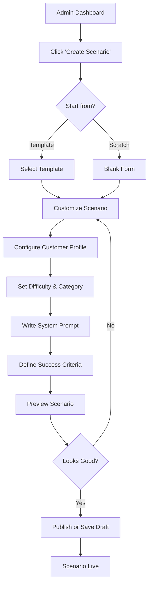
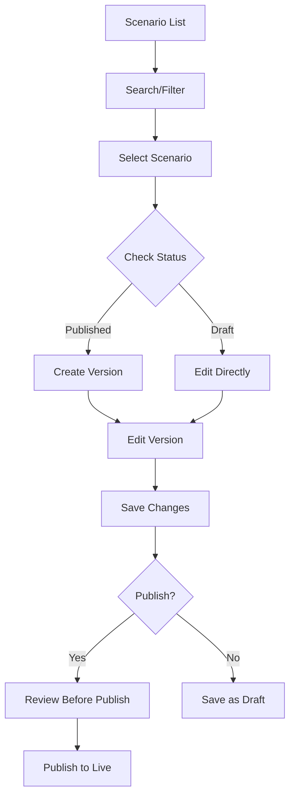

# Scenario Management System - Feature Overview

## Executive Summary

The Scenario Management System enables administrators and content creators to create, edit, and manage AI Mock Call scenarios without requiring developer intervention. This feature empowers non-technical users to scale training content, customize scenarios for specific industries, and continuously improve the training experience based on user feedback.

## Business Objectives

### Primary Goals

1. **Content Scalability**: Enable rapid creation of 500+ scenarios without code deployments
2. **Customization**: Allow company-specific scenario creation for B2B clients
3. **Quality Control**: Implement review workflow before scenarios go live
4. **Data-Driven Improvement**: A/B test scenarios to optimize learning outcomes
5. **Cost Efficiency**: Reduce developer time spent on content updates by 90%

### Secondary Goals

- Enable subject matter experts to contribute directly
- Support multi-language scenarios
- Version control for scenario iterations
- Analytics on scenario effectiveness
- Import/export for bulk operations

## User Personas

### Content Manager (Primary User)
- **Role**: Training content creator
- **Technical Level**: Non-technical
- **Needs**:
  - Intuitive scenario builder
  - Template-based creation
  - Preview functionality
  - Collaboration tools
- **Pain Points**:
  - Currently requires developer for every scenario
  - No visibility into scenario performance
  - Cannot quickly respond to user feedback

### Admin/Super Admin
- **Role**: Platform administrator
- **Technical Level**: Semi-technical
- **Needs**:
  - Full CRUD permissions
  - User access management
  - Bulk operations
  - Analytics dashboard
- **Pain Points**:
  - Manual database updates risky
  - No audit trail
  - Cannot delegate content creation

### Industry Partner
- **Role**: B2B client creating custom content
- **Technical Level**: Non-technical
- **Needs**:
  - Company-specific scenarios
  - Brand customization
  - Industry terminology
  - Private scenario library
- **Pain Points**:
  - Generic scenarios don't match their needs
  - Turnaround time for custom content too long

## Feature Scope

### MVP (Phase 1) - Admin Panel

#### Core CRUD Operations
- ✅ Create new scenario from template
- ✅ Edit existing scenario
- ✅ Duplicate scenario for variations
- ✅ Archive/delete scenarios
- ✅ List all scenarios (with search/filter)
- ✅ Preview scenario before publishing

#### Scenario Components
- Basic info (name, description, category)
- Customer profile (personality, mood, issue)
- Difficulty level
- System prompt configuration
- Voice profile selection
- Target outcomes and acceptable solutions
- Context data (company policies, product info)

#### User Management
- Role-based access (Admin, Content Manager, Viewer)
- Permission matrix
- Audit logging

### Phase 2 - Advanced Features

- ✅ Scenario versioning
- ✅ A/B testing framework
- ✅ Collaboration (comments, suggestions)
- ✅ Workflow (Draft → Review → Published)
- ✅ Import/export (JSON, CSV)
- ✅ Template library
- ✅ AI-assisted scenario generation

### Phase 3 - B2B Features

- ✅ Multi-tenant scenario libraries
- ✅ White-labeling
- ✅ Custom branding per scenario
- ✅ Industry-specific templates
- ✅ Private scenario sharing
- ✅ Analytics per company

## User Flows

### Creating a New Scenario



### Editing an Existing Scenario



## Key Features Breakdown

### 1. Scenario Builder Interface

**Visual Form Builder**:
```typescript
interface ScenarioForm {
  // Basic Info
  basicInfo: {
    name: string
    description: string
    category: ScenarioCategory
    difficulty: DifficultyLevel
    estimatedDuration: number // minutes
    tags: string[]
  }

  // Customer Profile
  customerProfile: {
    name: string
    age: number
    personality: string[]
    initialMood: number // 0-100
    speakingStyle: string
    backgroundStory: string
    voiceProfile: string
  }

  // Scenario Context
  context: {
    companyName: string
    industry: string
    productService: string
    issue: string
    contextDetails: string
    priorInteractions: number
  }

  // AI Configuration
  aiConfig: {
    systemPrompt: string
    temperature: number
    emotionalTriggers: EmotionalTrigger[]
    interruptionRate: number
    escalationThreshold: number
  }

  // Success Criteria
  successCriteria: {
    targetOutcome: string
    acceptableSolutions: string[]
    mustUseKeywords: string[]
    avoidKeywords: string[]
    timeLimit: number
  }

  // Evaluation Rubric
  evaluation: {
    greetingWeight: number
    listeningWeight: number
    solutionWeight: number
    empathyWeight: number
    closingWeight: number
    customMetrics: CustomMetric[]
  }
}
```

### 2. Template System

**Pre-built Templates**:
- Beginner: Simple Product Inquiry
- Beginner: Password Reset
- Intermediate: Billing Dispute
- Intermediate: Technical Support
- Advanced: Irate Customer Retention
- Advanced: VIP Escalation
- Expert: Crisis Management

**Template Structure**:
```typescript
interface ScenarioTemplate {
  id: string
  name: string
  description: string
  category: ScenarioCategory
  difficulty: DifficultyLevel
  thumbnail: string
  usageCount: number
  averageRating: number
  defaultValues: Partial<ScenarioForm>
  variables: TemplateVariable[] // Customizable parts
}

interface TemplateVariable {
  key: string
  label: string
  type: 'text' | 'number' | 'select' | 'textarea'
  defaultValue: any
  description: string
  required: boolean
}
```

### 3. Scenario Preview

**Interactive Preview Mode**:
- Read-only view of scenario details
- AI behavior simulation (mock conversation)
- Voice profile audio sample
- Success criteria checklist
- Estimated difficulty validation
- Test conversation option

### 4. Search & Filter System

**Filter Options**:
```typescript
interface ScenarioFilters {
  // Text Search
  searchQuery: string // Searches name, description, tags

  // Category Filters
  categories: ScenarioCategory[]
  difficulties: DifficultyLevel[]
  industries: string[]

  // Status Filters
  status: ('draft' | 'published' | 'archived')[]

  // Performance Filters
  minRating: number
  minUsageCount: number

  // Metadata Filters
  createdBy: string[]
  createdDateRange: [Date, Date]
  lastModifiedRange: [Date, Date]

  // Advanced
  hasActiveTests: boolean
  isTemplate: boolean
}
```

**Sort Options**:
- Name (A-Z, Z-A)
- Created Date (Newest, Oldest)
- Usage Count (High to Low)
- Average Rating (High to Low)
- Last Modified (Recent First)

### 5. Version Control

**Version Management**:
```typescript
interface ScenarioVersion {
  versionId: string
  scenarioId: string
  versionNumber: number
  createdBy: string
  createdAt: Date
  changelog: string
  snapshot: ScenarioForm
  status: 'draft' | 'published' | 'archived'
  publishedAt?: Date
  publishedBy?: string
  parentVersionId?: string
  isActive: boolean
}
```

**Version Operations**:
- View version history
- Compare versions (diff view)
- Restore previous version
- Branch from version
- Merge changes

### 6. Collaboration Features

**Comments & Feedback**:
```typescript
interface ScenarioComment {
  id: string
  scenarioId: string
  userId: string
  content: string
  attachments: string[]
  createdAt: Date
  updatedAt: Date
  resolvedAt?: Date
  resolvedBy?: string
  parentCommentId?: string // For replies
  mentions: string[] // User IDs
}
```

**Review Workflow**:
```
Draft → Pending Review → Approved → Published
         ↓
      Changes Requested → Draft
```

### 7. Analytics Dashboard

**Scenario Performance Metrics**:
```typescript
interface ScenarioAnalytics {
  scenarioId: string

  // Usage Metrics
  totalAttempts: number
  uniqueUsers: number
  completionRate: number
  averageDuration: number

  // Performance Metrics
  averageScore: number
  passRate: number
  scoreDistribution: {
    grammar: number
    listening: number
    solution: number
    empathy: number
    closing: number
  }

  // User Feedback
  averageRating: number
  feedbackCount: number
  reportedIssues: number

  // AI Metrics
  averageTokensUsed: number
  averageLatency: number
  errorRate: number

  // Trends
  trendData: {
    date: Date
    attempts: number
    avgScore: number
  }[]
}
```

### 8. Bulk Operations

**Import/Export Formats**:

**JSON Export**:
```json
{
  "scenarios": [
    {
      "id": "scn_123",
      "name": "Billing Dispute - Overcharge",
      "category": "billing",
      "difficulty": "intermediate",
      "customerProfile": {
        "name": "Robert Johnson",
        "personality": ["assertive", "detail-oriented"],
        "initialMood": 35
      },
      "aiConfig": {
        "systemPrompt": "...",
        "temperature": 0.8
      }
    }
  ],
  "metadata": {
    "exportedAt": "2025-10-17T10:00:00Z",
    "exportedBy": "admin@hirexp.com",
    "version": "1.0"
  }
}
```

**CSV Import Template**:
```csv
name,category,difficulty,customer_name,customer_age,personality,initial_mood,issue,system_prompt,voice_profile
"Password Reset Request","technical_support","beginner","elderly_1",68,"patient but confused",60,"Forgot account password","You are simulating a customer...","confused_elder"
```

**Bulk Actions**:
- Import scenarios from file
- Export selected scenarios
- Bulk edit (category, difficulty, status)
- Bulk archive/delete
- Bulk tag assignment

## Technical Architecture

### Admin Panel Stack

```typescript
// Admin panel separate from main app
/admin
  /dashboard          # Overview metrics
  /scenarios          # Scenario management
    /list             # Scenario list with filters
    /create           # Create new scenario
    /edit/[id]        # Edit scenario
    /preview/[id]     # Preview scenario
    /versions/[id]    # Version history
    /analytics/[id]   # Scenario analytics
  /templates          # Template library
  /users              # User management
  /settings           # System settings
```

### Component Architecture

```typescript
// Core Components
<ScenarioBuilder>
  <BasicInfoForm />
  <CustomerProfileForm />
  <ContextForm />
  <AIConfigForm />
  <SuccessCriteriaForm />
  <EvaluationRubricForm />
  <PreviewPanel />
</ScenarioBuilder>

<ScenarioList>
  <FilterSidebar />
  <SearchBar />
  <ScenarioGrid />
  <Pagination />
</ScenarioList>

<ScenarioCard>
  <Thumbnail />
  <MetaInfo />
  <PerformanceMetrics />
  <ActionMenu />
</ScenarioCard>
```

## Security & Permissions

### Role-Based Access Control

```typescript
enum Role {
  SUPER_ADMIN = 'super_admin',
  ADMIN = 'admin',
  CONTENT_MANAGER = 'content_manager',
  REVIEWER = 'reviewer',
  VIEWER = 'viewer'
}

interface Permission {
  resource: 'scenario' | 'template' | 'user' | 'analytics'
  action: 'create' | 'read' | 'update' | 'delete' | 'publish'
  granted: boolean
}

const permissions: Record<Role, Permission[]> = {
  [Role.SUPER_ADMIN]: [
    { resource: '*', action: '*', granted: true }
  ],
  [Role.ADMIN]: [
    { resource: 'scenario', action: 'create', granted: true },
    { resource: 'scenario', action: 'read', granted: true },
    { resource: 'scenario', action: 'update', granted: true },
    { resource: 'scenario', action: 'delete', granted: true },
    { resource: 'scenario', action: 'publish', granted: true },
    { resource: 'user', action: 'read', granted: true },
    { resource: 'analytics', action: 'read', granted: true }
  ],
  [Role.CONTENT_MANAGER]: [
    { resource: 'scenario', action: 'create', granted: true },
    { resource: 'scenario', action: 'read', granted: true },
    { resource: 'scenario', action: 'update', granted: true },
    { resource: 'scenario', action: 'delete', granted: false },
    { resource: 'scenario', action: 'publish', granted: false },
    { resource: 'template', action: 'read', granted: true }
  ],
  [Role.REVIEWER]: [
    { resource: 'scenario', action: 'create', granted: false },
    { resource: 'scenario', action: 'read', granted: true },
    { resource: 'scenario', action: 'update', granted: false },
    { resource: 'scenario', action: 'publish', granted: true }
  ],
  [Role.VIEWER]: [
    { resource: 'scenario', action: 'read', granted: true },
    { resource: 'analytics', action: 'read', granted: true }
  ]
}
```

### Audit Logging

```typescript
interface AuditLog {
  id: string
  userId: string
  action: string // 'create', 'update', 'delete', 'publish', etc.
  resourceType: string // 'scenario', 'template', etc.
  resourceId: string
  changes: {
    field: string
    oldValue: any
    newValue: any
  }[]
  ipAddress: string
  userAgent: string
  timestamp: Date
  metadata?: Record<string, any>
}
```

## Integration Points

### Integration with Main Application

1. **Scenario Loading**: Main app reads published scenarios via API
2. **Analytics Feedback**: Training sessions send data back to analytics
3. **User Progress**: Scenario completion updates user progress
4. **A/B Testing**: Variants served based on testing configuration

### API Integration

```typescript
// Public API (used by main app)
GET  /api/scenarios?category=billing&difficulty=beginner
GET  /api/scenarios/:id
GET  /api/scenarios/:id/config  // Returns AI config for session

// Admin API (authentication required)
POST   /api/admin/scenarios
GET    /api/admin/scenarios/:id
PUT    /api/admin/scenarios/:id
PATCH  /api/admin/scenarios/:id
DELETE /api/admin/scenarios/:id
POST   /api/admin/scenarios/:id/publish
POST   /api/admin/scenarios/:id/archive
POST   /api/admin/scenarios/:id/duplicate
GET    /api/admin/scenarios/:id/versions
POST   /api/admin/scenarios/:id/versions/:versionId/restore
GET    /api/admin/scenarios/:id/analytics
POST   /api/admin/scenarios/bulk/import
POST   /api/admin/scenarios/bulk/export
```

## Success Metrics

### Business Metrics
- Scenario creation time reduced by 80%
- 500+ scenarios created in first 6 months
- 50+ content creators onboarded
- 5+ B2B clients using custom scenarios
- $50K+ in custom content revenue

### Technical Metrics
- Admin panel load time < 2 seconds
- Scenario save time < 1 second
- 99.9% uptime
- < 1% error rate on operations
- Import/export handles 1000+ scenarios

### User Satisfaction
- Content creator satisfaction > 4.5/5
- Time to create scenario < 15 minutes
- 90% of scenarios published without revision
- < 5% of scenarios reported for issues

## Implementation Timeline

### Phase 1: MVP (Weeks 1-4)
**Week 1-2**: Core CRUD
- Database schema
- Basic API endpoints
- Simple admin UI
- Authentication & authorization

**Week 3-4**: Essential Features
- Scenario builder form
- List/search/filter
- Preview functionality
- Basic permissions

### Phase 2: Enhanced Features (Weeks 5-8)
**Week 5-6**: Advanced Operations
- Version control
- Template system
- Import/export
- Bulk operations

**Week 7-8**: Analytics & Collaboration
- Analytics dashboard
- Comments system
- Review workflow
- AI-assisted generation

### Phase 3: B2B Features (Weeks 9-12)
**Week 9-10**: Multi-tenancy
- Tenant isolation
- Custom branding
- Private libraries
- White-labeling

**Week 11-12**: Advanced Analytics
- A/B testing framework
- Advanced metrics
- Reporting tools
- API webhooks

## Risk Mitigation

### Technical Risks

| Risk | Impact | Probability | Mitigation |
|------|--------|-------------|------------|
| Data loss during import | High | Low | Validation, backups, rollback |
| Performance issues with large datasets | Medium | Medium | Pagination, indexing, caching |
| Unauthorized access | High | Low | RBAC, audit logs, 2FA |
| Breaking changes to published scenarios | High | Medium | Version control, testing |

### User Experience Risks

| Risk | Impact | Probability | Mitigation |
|------|--------|-------------|------------|
| Complex interface | High | Medium | User testing, tutorials |
| Lost work | High | Low | Auto-save, drafts |
| Confusion about permissions | Medium | High | Clear UI indicators |
| Poor AI scenario results | High | Medium | Validation, preview, testing |

## Future Enhancements

### Year 1 Roadmap
- AI-powered scenario generation from description
- Real-time collaboration (multiple editors)
- Advanced A/B testing with automatic winner selection
- Marketplace for sharing scenarios
- Mobile admin app

### Year 2 Vision
- Voice recording for custom customer voices
- Video scenario integration
- VR/AR scenario builder
- Machine learning for optimal scenario difficulty
- Multi-language AI translation

## Conclusion

The Scenario Management System transforms content creation from a bottleneck into a competitive advantage. By empowering non-technical users to create high-quality training scenarios, we can scale content 10x faster, serve B2B clients with custom content, and continuously improve based on data-driven insights.

**Key Success Factors**:
1. Intuitive UX for non-technical users
2. Robust security and access controls
3. Comprehensive analytics
4. Scalable architecture
5. Strong integration with main application

---

*Document Version: 1.0*
*Created: October 2025*
*Next Review: November 2025*
