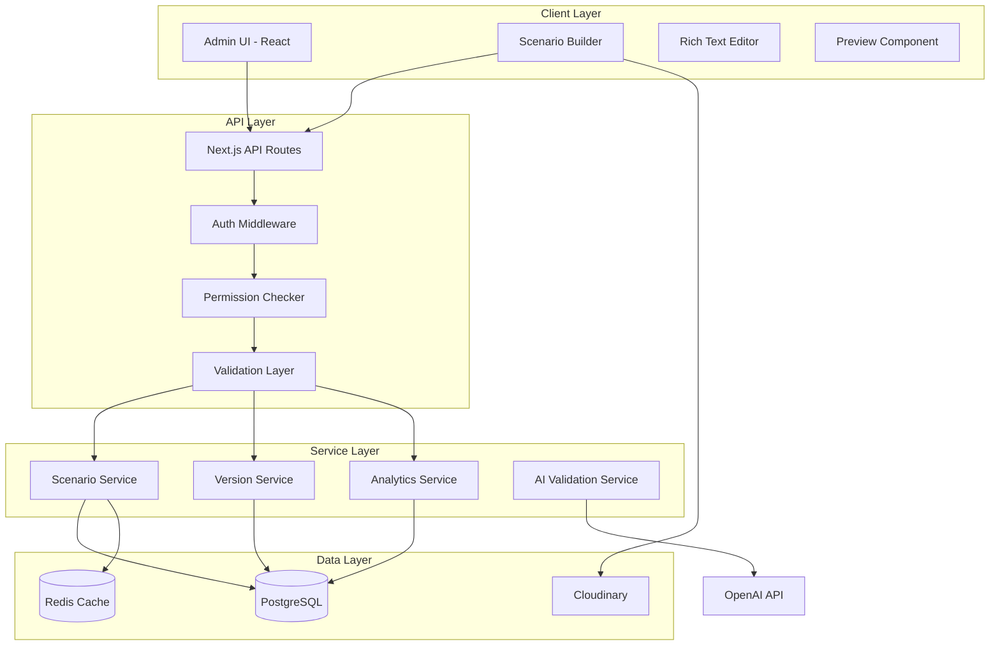

# Scenario Management - Technical Specifications

## Architecture Overview

### System Architecture



## Database Schema

### Core Tables

```prisma
// schema.prisma

// Scenario Management
model Scenario {
  id              String   @id @default(cuid())
  name            String
  description     String?  @db.Text
  slug            String   @unique

  // Classification
  category        ScenarioCategory
  difficulty      Difficulty
  industry        String?
  tags            String[]
  estimatedDuration Int    // minutes

  // Customer Profile
  customerName    String
  customerAge     Int
  personality     String[]
  initialMood     Int      @default(50) // 0-100
  speakingStyle   String
  backgroundStory String?  @db.Text
  voiceProfileId  String

  // Context
  companyName     String?
  companyContext  Json?    // Product info, policies, etc.
  issue           String   @db.Text
  priorInteractions Int    @default(0)
  contextDetails  Json?

  // AI Configuration
  systemPrompt    String   @db.Text
  temperature     Float    @default(0.7)
  interruptionRate Float   @default(0.1)
  escalationThreshold Int  @default(70)
  emotionalTriggers Json?

  // Success Criteria
  targetOutcome   String   @db.Text
  acceptableSolutions Json // Array of solution objects
  mustUseKeywords String[]
  avoidKeywords   String[]
  timeLimit       Int?     // seconds

  // Evaluation Weights
  greetingWeight  Int      @default(10)
  listeningWeight Int      @default(20)
  solutionWeight  Int      @default(25)
  empathyWeight   Int      @default(20)
  closingWeight   Int      @default(10)
  customMetrics   Json?

  // Status & Publishing
  status          ScenarioStatus @default(DRAFT)
  publishedAt     DateTime?
  publishedBy     String?
  archivedAt      DateTime?
  archivedBy      String?

  // Versioning
  versionNumber   Int      @default(1)
  parentScenarioId String?
  parentScenario  Scenario? @relation("ScenarioVersions", fields: [parentScenarioId], references: [id])
  versions        Scenario[] @relation("ScenarioVersions")
  isActiveVersion Boolean  @default(true)

  // Metadata
  createdBy       String
  creator         User     @relation("CreatedScenarios", fields: [createdBy], references: [id])
  createdAt       DateTime @default(now())
  updatedAt       DateTime @updatedAt
  updatedBy       String?

  // Template
  isTemplate      Boolean  @default(false)
  templateCategory String?
  templateVariables Json?
  usageCount      Int      @default(0)

  // Multi-tenant
  tenantId        String?
  isPrivate       Boolean  @default(false)
  sharedWith      String[] // Tenant IDs

  // Relations
  sessions        CallSession[]
  analytics       ScenarioAnalytics?
  comments        ScenarioComment[]
  versions        ScenarioVersion[]
  auditLogs       AuditLog[]

  @@index([status, category, difficulty])
  @@index([createdBy, status])
  @@index([tenantId, isPrivate])
  @@index([slug])
  @@map("scenarios")
}

enum ScenarioStatus {
  DRAFT
  PENDING_REVIEW
  APPROVED
  PUBLISHED
  ARCHIVED
}

enum ScenarioCategory {
  CUSTOMER_COMPLAINTS
  TECHNICAL_SUPPORT
  SALES_INQUIRIES
  BILLING_PAYMENTS
  RETENTION_CANCELLATION
}

enum Difficulty {
  BEGINNER
  INTERMEDIATE
  ADVANCED
  EXPERT
}

// Version Control
model ScenarioVersion {
  id              String   @id @default(cuid())
  scenarioId      String
  scenario        Scenario @relation(fields: [scenarioId], references: [id], onDelete: Cascade)

  versionNumber   Int
  changelog       String?  @db.Text
  snapshot        Json     // Full scenario data snapshot

  createdBy       String
  creator         User     @relation(fields: [createdBy], references: [id])
  createdAt       DateTime @default(now())

  publishedAt     DateTime?
  publishedBy     String?
  isActive        Boolean  @default(false)

  @@unique([scenarioId, versionNumber])
  @@index([scenarioId, isActive])
  @@map("scenario_versions")
}

// Comments & Collaboration
model ScenarioComment {
  id              String   @id @default(cuid())
  scenarioId      String
  scenario        Scenario @relation(fields: [scenarioId], references: [id], onDelete: Cascade)

  userId          String
  user            User     @relation(fields: [userId], references: [id])

  content         String   @db.Text
  attachments     String[] // URLs
  mentions        String[] // User IDs

  parentCommentId String?
  parentComment   ScenarioComment? @relation("CommentReplies", fields: [parentCommentId], references: [id])
  replies         ScenarioComment[] @relation("CommentReplies")

  resolvedAt      DateTime?
  resolvedBy      String?

  createdAt       DateTime @default(now())
  updatedAt       DateTime @updatedAt

  @@index([scenarioId, createdAt])
  @@map("scenario_comments")
}

// Analytics
model ScenarioAnalytics {
  id              String   @id @default(cuid())
  scenarioId      String   @unique
  scenario        Scenario @relation(fields: [scenarioId], references: [id], onDelete: Cascade)

  // Usage Metrics
  totalAttempts   Int      @default(0)
  uniqueUsers     Int      @default(0)
  completionRate  Float    @default(0)
  averageDuration Float    @default(0) // seconds

  // Performance Metrics
  averageScore    Float    @default(0)
  passRate        Float    @default(0)
  scoreDistribution Json?

  // User Feedback
  averageRating   Float    @default(0)
  feedbackCount   Int      @default(0)
  reportedIssues  Int      @default(0)

  // AI Metrics
  avgTokensUsed   Int      @default(0)
  avgLatency      Float    @default(0)
  errorRate       Float    @default(0)

  // Time-series Data
  trendData       Json?    // Daily metrics

  lastCalculatedAt DateTime @default(now())
  updatedAt       DateTime @updatedAt

  @@map("scenario_analytics")
}

// Templates
model ScenarioTemplate {
  id              String   @id @default(cuid())
  name            String
  description     String   @db.Text
  thumbnail       String?

  category        ScenarioCategory
  difficulty      Difficulty
  industry        String?

  defaultValues   Json     // Default scenario form values
  variables       Json     // Template variables config

  usageCount      Int      @default(0)
  averageRating   Float    @default(0)

  createdBy       String
  creator         User     @relation(fields: [createdBy], references: [id])
  createdAt       DateTime @default(now())
  updatedAt       DateTime @updatedAt

  isPublic        Boolean  @default(true)
  isFeatured      Boolean  @default(false)

  @@index([category, difficulty])
  @@map("scenario_templates")
}

// Audit Logs
model AuditLog {
  id              String   @id @default(cuid())

  userId          String
  user            User     @relation(fields: [userId], references: [id])

  action          AuditAction
  resourceType    String   // 'scenario', 'template', etc.
  resourceId      String

  changes         Json?    // Field-level changes
  metadata        Json?    // Additional context

  ipAddress       String?
  userAgent       String?

  createdAt       DateTime @default(now())

  scenarioId      String?
  scenario        Scenario? @relation(fields: [scenarioId], references: [id])

  @@index([userId, createdAt])
  @@index([resourceType, resourceId])
  @@index([action, createdAt])
  @@map("audit_logs")
}

enum AuditAction {
  CREATE
  UPDATE
  DELETE
  PUBLISH
  ARCHIVE
  RESTORE
  DUPLICATE
  IMPORT
  EXPORT
}

// User Roles & Permissions
model User {
  id                String    @id @default(cuid())
  email             String    @unique
  role              UserRole  @default(VIEWER)

  // Relations
  createdScenarios  Scenario[] @relation("CreatedScenarios")
  scenarioVersions  ScenarioVersion[]
  comments          ScenarioComment[]
  templates         ScenarioTemplate[]
  auditLogs         AuditLog[]

  // ... other user fields
}

enum UserRole {
  SUPER_ADMIN
  ADMIN
  CONTENT_MANAGER
  REVIEWER
  VIEWER
}

// A/B Testing
model ScenarioTest {
  id              String   @id @default(cuid())
  name            String
  description     String?

  scenarioIds     String[] // Variants being tested

  status          TestStatus @default(RUNNING)
  startDate       DateTime @default(now())
  endDate         DateTime?

  trafficSplit    Json     // Distribution percentages
  successMetric   String   // Which metric to optimize

  results         Json?    // Test results
  winnerId        String?  // Winning variant

  createdBy       String
  createdAt       DateTime @default(now())
  updatedAt       DateTime @updatedAt

  @@map("scenario_tests")
}

enum TestStatus {
  DRAFT
  RUNNING
  PAUSED
  COMPLETED
  CANCELLED
}
```

## API Design

### Scenario CRUD Endpoints

#### Create Scenario
```typescript
POST /api/admin/scenarios

Request:
{
  "name": "Billing Dispute - Overcharge",
  "description": "Customer received incorrect bill",
  "category": "BILLING_PAYMENTS",
  "difficulty": "INTERMEDIATE",
  "estimatedDuration": 10,
  "customerProfile": {
    "name": "Robert Johnson",
    "age": 45,
    "personality": ["assertive", "detail-oriented"],
    "initialMood": 35,
    "speakingStyle": "firm, wants explanations",
    "backgroundStory": "Long-term customer with good payment history",
    "voiceProfileId": "angry_customer"
  },
  "context": {
    "companyName": "TelcoMax",
    "issue": "Bill is $75 higher than usual",
    "priorInteractions": 0
  },
  "aiConfig": {
    "systemPrompt": "You are Robert Johnson, calling about...",
    "temperature": 0.8,
    "interruptionRate": 0.15
  },
  "successCriteria": {
    "targetOutcome": "Issue resolved with credit applied",
    "acceptableSolutions": [
      "Immediate credit + future discount",
      "Full credit on next bill"
    ]
  },
  "status": "DRAFT"
}

Response: 201 Created
{
  "id": "scn_abc123",
  "name": "Billing Dispute - Overcharge",
  "slug": "billing-dispute-overcharge",
  "status": "DRAFT",
  "versionNumber": 1,
  "createdAt": "2025-10-17T10:00:00Z",
  "createdBy": "usr_xyz789"
}
```

#### Get Scenario
```typescript
GET /api/admin/scenarios/:id

Response: 200 OK
{
  "id": "scn_abc123",
  "name": "Billing Dispute - Overcharge",
  "description": "...",
  "category": "BILLING_PAYMENTS",
  "difficulty": "INTERMEDIATE",
  "status": "PUBLISHED",
  "versionNumber": 2,
  "customerProfile": { /* ... */ },
  "context": { /* ... */ },
  "aiConfig": { /* ... */ },
  "successCriteria": { /* ... */ },
  "evaluationWeights": { /* ... */ },
  "metadata": {
    "createdAt": "2025-10-15T10:00:00Z",
    "createdBy": "usr_xyz789",
    "updatedAt": "2025-10-17T10:00:00Z",
    "publishedAt": "2025-10-16T14:30:00Z"
  },
  "analytics": {
    "totalAttempts": 245,
    "averageScore": 82.5,
    "completionRate": 0.89
  }
}
```

#### Update Scenario
```typescript
PUT /api/admin/scenarios/:id

Request:
{
  "name": "Billing Dispute - Overcharge (Updated)",
  "aiConfig": {
    "systemPrompt": "Updated prompt...",
    "temperature": 0.85
  },
  "changelog": "Increased customer frustration level"
}

Response: 200 OK
{
  "id": "scn_abc123",
  "versionNumber": 3,
  "updatedAt": "2025-10-17T11:00:00Z",
  "message": "Scenario updated successfully"
}
```

#### Partial Update
```typescript
PATCH /api/admin/scenarios/:id

Request:
{
  "status": "PUBLISHED",
  "publishedBy": "usr_xyz789"
}

Response: 200 OK
```

#### Delete Scenario
```typescript
DELETE /api/admin/scenarios/:id?permanent=false

Query Parameters:
- permanent: boolean (default: false)
  - false: Archive scenario
  - true: Permanently delete (requires SUPER_ADMIN)

Response: 204 No Content
```

### List & Search Endpoints

#### List Scenarios
```typescript
GET /api/admin/scenarios?page=1&limit=20&status=PUBLISHED&category=BILLING_PAYMENTS

Query Parameters:
- page: number (default: 1)
- limit: number (default: 20, max: 100)
- search: string (searches name, description, tags)
- status: ScenarioStatus[]
- category: ScenarioCategory[]
- difficulty: Difficulty[]
- createdBy: string
- tenantId: string
- sortBy: string (name|createdAt|updatedAt|usageCount|rating)
- sortOrder: 'asc' | 'desc'

Response: 200 OK
{
  "data": [
    {
      "id": "scn_abc123",
      "name": "Billing Dispute",
      "category": "BILLING_PAYMENTS",
      "difficulty": "INTERMEDIATE",
      "status": "PUBLISHED",
      "usageCount": 245,
      "averageRating": 4.5,
      "createdAt": "2025-10-15T10:00:00Z"
    }
  ],
  "pagination": {
    "page": 1,
    "limit": 20,
    "total": 156,
    "totalPages": 8,
    "hasNext": true,
    "hasPrev": false
  },
  "filters": {
    "appliedFilters": {
      "status": ["PUBLISHED"],
      "category": ["BILLING_PAYMENTS"]
    }
  }
}
```

#### Search Scenarios
```typescript
POST /api/admin/scenarios/search

Request:
{
  "query": "billing dispute customer angry",
  "filters": {
    "categories": ["BILLING_PAYMENTS"],
    "difficulties": ["INTERMEDIATE", "ADVANCED"],
    "minRating": 4.0
  },
  "sort": {
    "by": "relevance",
    "order": "desc"
  },
  "page": 1,
  "limit": 20
}

Response: 200 OK
{
  "results": [
    {
      "id": "scn_abc123",
      "name": "Billing Dispute - Overcharge",
      "relevanceScore": 0.95,
      "matchedFields": ["name", "description", "tags"],
      "highlights": {
        "description": "...customer is <em>angry</em> about <em>billing</em>..."
      }
    }
  ],
  "pagination": { /* ... */ }
}
```

### Scenario Operations

#### Duplicate Scenario
```typescript
POST /api/admin/scenarios/:id/duplicate

Request:
{
  "newName": "Billing Dispute - Overcharge (Copy)",
  "preserveAnalytics": false,
  "status": "DRAFT"
}

Response: 201 Created
{
  "id": "scn_new456",
  "originalId": "scn_abc123",
  "name": "Billing Dispute - Overcharge (Copy)"
}
```

#### Publish Scenario
```typescript
POST /api/admin/scenarios/:id/publish

Request:
{
  "notes": "Ready for production use"
}

Response: 200 OK
{
  "id": "scn_abc123",
  "status": "PUBLISHED",
  "publishedAt": "2025-10-17T12:00:00Z",
  "publishedBy": "usr_xyz789"
}
```

#### Archive Scenario
```typescript
POST /api/admin/scenarios/:id/archive

Request:
{
  "reason": "Outdated scenario, replaced by scn_new456"
}

Response: 200 OK
```

#### Restore Archived Scenario
```typescript
POST /api/admin/scenarios/:id/restore

Response: 200 OK
{
  "id": "scn_abc123",
  "status": "DRAFT",
  "restoredAt": "2025-10-17T13:00:00Z"
}
```

### Version Management

#### Get Version History
```typescript
GET /api/admin/scenarios/:id/versions

Response: 200 OK
{
  "versions": [
    {
      "versionId": "ver_123",
      "versionNumber": 3,
      "changelog": "Increased frustration level",
      "createdBy": "usr_xyz789",
      "createdAt": "2025-10-17T10:00:00Z",
      "isActive": true
    },
    {
      "versionId": "ver_122",
      "versionNumber": 2,
      "changelog": "Updated voice profile",
      "createdBy": "usr_abc456",
      "createdAt": "2025-10-16T14:00:00Z",
      "isActive": false
    }
  ]
}
```

#### Get Specific Version
```typescript
GET /api/admin/scenarios/:id/versions/:versionNumber

Response: 200 OK
{
  "versionId": "ver_122",
  "versionNumber": 2,
  "changelog": "Updated voice profile",
  "snapshot": {
    /* Full scenario data at this version */
  },
  "createdAt": "2025-10-16T14:00:00Z"
}
```

#### Restore Version
```typescript
POST /api/admin/scenarios/:id/versions/:versionNumber/restore

Request:
{
  "createNewVersion": true,
  "changelog": "Reverted to version 2 due to performance issues"
}

Response: 200 OK
{
  "id": "scn_abc123",
  "versionNumber": 4,
  "restoredFromVersion": 2,
  "message": "Version restored successfully"
}
```

#### Compare Versions
```typescript
GET /api/admin/scenarios/:id/versions/compare?from=2&to=3

Response: 200 OK
{
  "from": 2,
  "to": 3,
  "differences": [
    {
      "field": "aiConfig.temperature",
      "oldValue": 0.8,
      "newValue": 0.85,
      "changeType": "modified"
    },
    {
      "field": "customerProfile.initialMood",
      "oldValue": 35,
      "newValue": 25,
      "changeType": "modified"
    }
  ]
}
```

### Template Operations

#### List Templates
```typescript
GET /api/admin/templates?category=BILLING_PAYMENTS

Response: 200 OK
{
  "templates": [
    {
      "id": "tmp_001",
      "name": "Billing Dispute Template",
      "description": "General billing complaint template",
      "category": "BILLING_PAYMENTS",
      "difficulty": "INTERMEDIATE",
      "thumbnail": "https://cloudinary.com/...",
      "usageCount": 145,
      "averageRating": 4.7
    }
  ]
}
```

#### Create Scenario from Template
```typescript
POST /api/admin/templates/:templateId/create-scenario

Request:
{
  "name": "Custom Billing Scenario",
  "variables": {
    "customerName": "John Doe",
    "companyName": "MyCompany",
    "issueAmount": "$75"
  }
}

Response: 201 Created
{
  "id": "scn_new789",
  "name": "Custom Billing Scenario",
  "templateId": "tmp_001"
}
```

### Bulk Operations

#### Bulk Import
```typescript
POST /api/admin/scenarios/bulk/import

Content-Type: multipart/form-data

Request:
- file: scenarios.json (or scenarios.csv)
- options: {
    "validateOnly": false,
    "skipErrors": true,
    "defaultStatus": "DRAFT"
  }

Response: 200 OK
{
  "imported": 45,
  "skipped": 3,
  "errors": [
    {
      "row": 12,
      "error": "Invalid category value"
    }
  ],
  "scenarioIds": ["scn_001", "scn_002", ...]
}
```

#### Bulk Export
```typescript
POST /api/admin/scenarios/bulk/export

Request:
{
  "scenarioIds": ["scn_001", "scn_002"],
  "format": "json", // or "csv"
  "includeAnalytics": true,
  "includeVersions": false
}

Response: 200 OK
{
  "downloadUrl": "https://cloudinary.com/exports/scenarios_20251017.json",
  "expiresAt": "2025-10-18T12:00:00Z",
  "fileSize": 2458320
}
```

#### Bulk Update
```typescript
PATCH /api/admin/scenarios/bulk/update

Request:
{
  "scenarioIds": ["scn_001", "scn_002", "scn_003"],
  "updates": {
    "tags": ["updated", "reviewed"],
    "status": "PUBLISHED"
  }
}

Response: 200 OK
{
  "updated": 3,
  "failed": 0
}
```

### Analytics Endpoints

#### Get Scenario Analytics
```typescript
GET /api/admin/scenarios/:id/analytics?period=30d

Query Parameters:
- period: string (7d|30d|90d|1y|custom)
- startDate: ISO 8601 date
- endDate: ISO 8601 date

Response: 200 OK
{
  "scenarioId": "scn_abc123",
  "period": {
    "start": "2025-09-17T00:00:00Z",
    "end": "2025-10-17T23:59:59Z"
  },
  "metrics": {
    "totalAttempts": 245,
    "uniqueUsers": 189,
    "completionRate": 0.89,
    "averageDuration": 487, // seconds
    "averageScore": 82.5,
    "passRate": 0.91
  },
  "scoreDistribution": {
    "greeting": 85.2,
    "listening": 80.1,
    "solution": 83.7,
    "empathy": 81.9,
    "closing": 84.5
  },
  "userFeedback": {
    "averageRating": 4.5,
    "feedbackCount": 67,
    "reportedIssues": 3
  },
  "trends": [
    {
      "date": "2025-10-15",
      "attempts": 12,
      "avgScore": 81.2
    }
  ]
}
```

#### Get Comparative Analytics
```typescript
POST /api/admin/scenarios/analytics/compare

Request:
{
  "scenarioIds": ["scn_001", "scn_002", "scn_003"],
  "metrics": ["averageScore", "completionRate", "passRate"],
  "period": "30d"
}

Response: 200 OK
{
  "comparison": [
    {
      "scenarioId": "scn_001",
      "name": "Billing Dispute",
      "metrics": {
        "averageScore": 82.5,
        "completionRate": 0.89,
        "passRate": 0.91
      }
    }
  ]
}
```

### A/B Testing

#### Create Test
```typescript
POST /api/admin/scenarios/tests

Request:
{
  "name": "Billing Dispute Variants Test",
  "description": "Testing different frustration levels",
  "scenarioIds": ["scn_001", "scn_002"],
  "trafficSplit": {
    "scn_001": 50,
    "scn_002": 50
  },
  "successMetric": "averageScore",
  "duration": 30 // days
}

Response: 201 Created
{
  "testId": "test_001",
  "status": "RUNNING",
  "startDate": "2025-10-17T12:00:00Z",
  "endDate": "2025-11-16T12:00:00Z"
}
```

#### Get Test Results
```typescript
GET /api/admin/scenarios/tests/:testId

Response: 200 OK
{
  "testId": "test_001",
  "name": "Billing Dispute Variants Test",
  "status": "RUNNING",
  "variants": [
    {
      "scenarioId": "scn_001",
      "impressions": 124,
      "avgScore": 82.5,
      "confidenceLevel": 0.89
    },
    {
      "scenarioId": "scn_002",
      "impressions": 121,
      "avgScore": 85.3,
      "confidenceLevel": 0.92
    }
  ],
  "winner": {
    "scenarioId": "scn_002",
    "improvement": 3.4, // percentage
    "significance": 0.95
  }
}
```

## Service Layer Implementation

### Scenario Service

```typescript
// lib/services/scenario-service.ts
import { prisma } from '@/lib/prisma'
import { redis } from '@/lib/redis'
import { ScenarioForm, ScenarioFilters } from '@/types/scenario'

export class ScenarioService {
  private cachePrefix = 'scenario:'
  private cacheTTL = 3600 // 1 hour

  async create(data: ScenarioForm, userId: string) {
    // Validate data
    await this.validate(data)

    // Generate slug
    const slug = await this.generateUniqueSlug(data.name)

    // Create scenario
    const scenario = await prisma.scenario.create({
      data: {
        ...data,
        slug,
        createdBy: userId,
        versionNumber: 1
      }
    })

    // Create initial version
    await this.createVersion(scenario.id, data, userId, 'Initial version')

    // Log action
    await this.auditLog('CREATE', scenario.id, userId, null, data)

    return scenario
  }

  async findById(id: string, includeAnalytics = false) {
    // Try cache first
    const cached = await redis.get(`${this.cachePrefix}${id}`)
    if (cached) return JSON.parse(cached)

    // Fetch from database
    const scenario = await prisma.scenario.findUnique({
      where: { id },
      include: {
        analytics: includeAnalytics,
        creator: {
          select: { id: true, name: true, email: true }
        }
      }
    })

    if (!scenario) {
      throw new Error('Scenario not found')
    }

    // Cache result
    await redis.setex(
      `${this.cachePrefix}${id}`,
      this.cacheTTL,
      JSON.stringify(scenario)
    )

    return scenario
  }

  async update(id: string, data: Partial<ScenarioForm>, userId: string) {
    const existing = await this.findById(id)

    // Create new version
    await this.createVersion(id, data, userId, data.changelog)

    // Update scenario
    const updated = await prisma.scenario.update({
      where: { id },
      data: {
        ...data,
        versionNumber: existing.versionNumber + 1,
        updatedBy: userId,
        updatedAt: new Date()
      }
    })

    // Invalidate cache
    await this.invalidateCache(id)

    // Log action
    await this.auditLog('UPDATE', id, userId, existing, data)

    return updated
  }

  async delete(id: string, userId: string, permanent = false) {
    if (permanent) {
      // Permanent deletion (requires SUPER_ADMIN)
      await prisma.scenario.delete({ where: { id } })
      await this.auditLog('DELETE', id, userId)
    } else {
      // Soft delete (archive)
      await prisma.scenario.update({
        where: { id },
        data: {
          status: 'ARCHIVED',
          archivedAt: new Date(),
          archivedBy: userId
        }
      })
      await this.auditLog('ARCHIVE', id, userId)
    }

    await this.invalidateCache(id)
  }

  async list(filters: ScenarioFilters, page = 1, limit = 20) {
    const skip = (page - 1) * limit

    const where = this.buildWhereClause(filters)

    const [scenarios, total] = await Promise.all([
      prisma.scenario.findMany({
        where,
        skip,
        take: limit,
        orderBy: this.buildOrderBy(filters.sortBy, filters.sortOrder),
        include: {
          analytics: {
            select: {
              totalAttempts: true,
              averageScore: true,
              averageRating: true
            }
          }
        }
      }),
      prisma.scenario.count({ where })
    ])

    return {
      data: scenarios,
      pagination: {
        page,
        limit,
        total,
        totalPages: Math.ceil(total / limit),
        hasNext: page * limit < total,
        hasPrev: page > 1
      }
    }
  }

  async search(query: string, filters: ScenarioFilters) {
    // Full-text search implementation
    // Could use PostgreSQL full-text search or external service like Algolia

    const scenarios = await prisma.scenario.findMany({
      where: {
        OR: [
          { name: { contains: query, mode: 'insensitive' } },
          { description: { contains: query, mode: 'insensitive' } },
          { tags: { hasSome: query.toLowerCase().split(' ') } }
        ],
        AND: this.buildWhereClause(filters)
      },
      take: 50
    })

    // Calculate relevance scores
    const results = scenarios.map(scenario => ({
      ...scenario,
      relevanceScore: this.calculateRelevance(scenario, query)
    }))

    // Sort by relevance
    results.sort((a, b) => b.relevanceScore - a.relevanceScore)

    return results
  }

  async duplicate(id: string, newName: string, userId: string) {
    const original = await this.findById(id)

    const { id: _, createdAt, updatedAt, ...data } = original

    const duplicate = await this.create(
      {
        ...data,
        name: newName,
        status: 'DRAFT',
        usageCount: 0
      },
      userId
    )

    await this.auditLog('DUPLICATE', duplicate.id, userId, { originalId: id })

    return duplicate
  }

  async publish(id: string, userId: string, notes?: string) {
    const scenario = await this.findById(id)

    if (scenario.status === 'PUBLISHED') {
      throw new Error('Scenario is already published')
    }

    const updated = await prisma.scenario.update({
      where: { id },
      data: {
        status: 'PUBLISHED',
        publishedAt: new Date(),
        publishedBy: userId
      }
    })

    await this.invalidateCache(id)
    await this.auditLog('PUBLISH', id, userId, { notes })

    return updated
  }

  private async validate(data: ScenarioForm) {
    // Validation logic
    if (!data.name || data.name.length < 3) {
      throw new Error('Name must be at least 3 characters')
    }

    if (!data.customerProfile?.name) {
      throw new Error('Customer profile name is required')
    }

    if (data.aiConfig.temperature < 0 || data.aiConfig.temperature > 2) {
      throw new Error('Temperature must be between 0 and 2')
    }

    // Additional validation...
  }

  private async generateUniqueSlug(name: string): Promise<string> {
    const baseSlug = name
      .toLowerCase()
      .replace(/[^a-z0-9]+/g, '-')
      .replace(/^-+|-+$/g, '')

    let slug = baseSlug
    let counter = 1

    while (await prisma.scenario.findUnique({ where: { slug } })) {
      slug = `${baseSlug}-${counter}`
      counter++
    }

    return slug
  }

  private async createVersion(
    scenarioId: string,
    data: any,
    userId: string,
    changelog?: string
  ) {
    const scenario = await prisma.scenario.findUnique({
      where: { id: scenarioId }
    })

    await prisma.scenarioVersion.create({
      data: {
        scenarioId,
        versionNumber: (scenario?.versionNumber || 0) + 1,
        changelog,
        snapshot: data,
        createdBy: userId
      }
    })
  }

  private async invalidateCache(id: string) {
    await redis.del(`${this.cachePrefix}${id}`)
  }

  private buildWhereClause(filters: ScenarioFilters) {
    const where: any = {}

    if (filters.search) {
      where.OR = [
        { name: { contains: filters.search, mode: 'insensitive' } },
        { description: { contains: filters.search, mode: 'insensitive' } }
      ]
    }

    if (filters.status?.length) {
      where.status = { in: filters.status }
    }

    if (filters.categories?.length) {
      where.category = { in: filters.categories }
    }

    if (filters.difficulties?.length) {
      where.difficulty = { in: filters.difficulties }
    }

    if (filters.createdBy) {
      where.createdBy = filters.createdBy
    }

    if (filters.tenantId) {
      where.tenantId = filters.tenantId
    }

    return where
  }

  private buildOrderBy(sortBy?: string, sortOrder: 'asc' | 'desc' = 'desc') {
    const orderBy: any = {}

    switch (sortBy) {
      case 'name':
        orderBy.name = sortOrder
        break
      case 'createdAt':
        orderBy.createdAt = sortOrder
        break
      case 'updatedAt':
        orderBy.updatedAt = sortOrder
        break
      case 'usageCount':
        orderBy.usageCount = sortOrder
        break
      default:
        orderBy.createdAt = 'desc'
    }

    return orderBy
  }

  private calculateRelevance(scenario: any, query: string): number {
    let score = 0

    const queryLower = query.toLowerCase()
    const nameLower = scenario.name.toLowerCase()
    const descLower = (scenario.description || '').toLowerCase()

    // Exact name match
    if (nameLower === queryLower) score += 100

    // Name contains query
    if (nameLower.includes(queryLower)) score += 50

    // Description contains query
    if (descLower.includes(queryLower)) score += 25

    // Tag match
    if (scenario.tags?.some((tag: string) => tag.toLowerCase().includes(queryLower))) {
      score += 10
    }

    return score
  }

  private async auditLog(
    action: string,
    resourceId: string,
    userId: string,
    oldData?: any,
    newData?: any
  ) {
    await prisma.auditLog.create({
      data: {
        userId,
        action,
        resourceType: 'scenario',
        resourceId,
        changes: this.calculateChanges(oldData, newData),
        scenarioId: resourceId
      }
    })
  }

  private calculateChanges(oldData?: any, newData?: any) {
    if (!oldData || !newData) return null

    const changes: any[] = []

    Object.keys(newData).forEach(key => {
      if (JSON.stringify(oldData[key]) !== JSON.stringify(newData[key])) {
        changes.push({
          field: key,
          oldValue: oldData[key],
          newValue: newData[key]
        })
      }
    })

    return changes
  }
}

export const scenarioService = new ScenarioService()
```

## Performance Optimization

### Caching Strategy

```typescript
// lib/cache/scenario-cache.ts
import { redis } from '@/lib/redis'

export class ScenarioCache {
  // L1: In-memory cache
  private memoryCache = new Map<string, { data: any; expiry: number }>()

  // L2: Redis cache
  async get(key: string) {
    // Check memory cache first
    const memoryCached = this.memoryCache.get(key)
    if (memoryCached && memoryCached.expiry > Date.now()) {
      return memoryCached.data
    }

    // Check Redis
    const redisCached = await redis.get(key)
    if (redisCached) {
      const data = JSON.parse(redisCached)

      // Update memory cache
      this.memoryCache.set(key, {
        data,
        expiry: Date.now() + 60000 // 1 minute
      })

      return data
    }

    return null
  }

  async set(key: string, value: any, ttl = 3600) {
    // Set in Redis
    await redis.setex(key, ttl, JSON.stringify(value))

    // Set in memory cache
    this.memoryCache.set(key, {
      data: value,
      expiry: Date.now() + Math.min(ttl * 1000, 60000)
    })
  }

  async invalidate(key: string) {
    this.memoryCache.delete(key)
    await redis.del(key)
  }

  async invalidatePattern(pattern: string) {
    // Clear memory cache
    const keys = Array.from(this.memoryCache.keys())
    keys.forEach(key => {
      if (key.match(pattern)) {
        this.memoryCache.delete(key)
      }
    })

    // Clear Redis
    const redisKeys = await redis.keys(pattern)
    if (redisKeys.length > 0) {
      await redis.del(...redisKeys)
    }
  }
}

export const scenarioCache = new ScenarioCache()
```

### Database Indexing

```sql
-- Critical indexes for performance

-- Scenario listing and filtering
CREATE INDEX idx_scenarios_status_category_difficulty
ON scenarios (status, category, difficulty);

CREATE INDEX idx_scenarios_created_by_status
ON scenarios (created_by, status);

CREATE INDEX idx_scenarios_tenant_private
ON scenarios (tenant_id, is_private);

-- Full-text search
CREATE INDEX idx_scenarios_name_trgm
ON scenarios USING gin (name gin_trgm_ops);

CREATE INDEX idx_scenarios_description_trgm
ON scenarios USING gin (description gin_trgm_ops);

-- Version history
CREATE INDEX idx_scenario_versions_scenario_active
ON scenario_versions (scenario_id, is_active);

-- Analytics queries
CREATE INDEX idx_scenario_analytics_avg_score
ON scenario_analytics (average_score DESC);

-- Audit log queries
CREATE INDEX idx_audit_logs_user_created
ON audit_logs (user_id, created_at DESC);

CREATE INDEX idx_audit_logs_resource
ON audit_logs (resource_type, resource_id, created_at DESC);
```

## Security Implementation

### Permission Middleware

```typescript
// middleware/permissions.ts
import { NextRequest } from 'next/server'
import { getServerSession } from 'next-auth'

export async function checkPermission(
  req: NextRequest,
  resource: string,
  action: string
) {
  const session = await getServerSession()

  if (!session?.user) {
    throw new Error('Unauthorized')
  }

  const hasPermission = await verifyPermission(
    session.user.role,
    resource,
    action
  )

  if (!hasPermission) {
    throw new Error('Forbidden: Insufficient permissions')
  }

  return session.user
}

async function verifyPermission(
  role: string,
  resource: string,
  action: string
): Promise<boolean> {
  // Implementation based on permissions matrix from overview.md
  const permissions = {
    SUPER_ADMIN: ['*:*'],
    ADMIN: [
      'scenario:create',
      'scenario:read',
      'scenario:update',
      'scenario:delete',
      'scenario:publish'
    ],
    CONTENT_MANAGER: [
      'scenario:create',
      'scenario:read',
      'scenario:update'
    ],
    REVIEWER: [
      'scenario:read',
      'scenario:publish'
    ],
    VIEWER: [
      'scenario:read'
    ]
  }

  const userPermissions = permissions[role as keyof typeof permissions] || []

  return userPermissions.includes('*:*') ||
         userPermissions.includes(`${resource}:${action}`)
}
```

### Rate Limiting

```typescript
// middleware/rate-limit.ts
import { redis } from '@/lib/redis'

export async function rateLimit(
  identifier: string,
  limit: number,
  window: number
): Promise<{ allowed: boolean; remaining: number }> {
  const key = `rate_limit:${identifier}`

  const current = await redis.incr(key)

  if (current === 1) {
    await redis.expire(key, window)
  }

  const remaining = Math.max(0, limit - current)

  return {
    allowed: current <= limit,
    remaining
  }
}

// Usage in API route
export async function POST(req: NextRequest) {
  const session = await getServerSession()

  const { allowed, remaining } = await rateLimit(
    `scenario_create:${session.user.id}`,
    10, // 10 requests
    3600 // per hour
  )

  if (!allowed) {
    return NextResponse.json(
      { error: 'Rate limit exceeded' },
      {
        status: 429,
        headers: { 'X-RateLimit-Remaining': '0' }
      }
    )
  }

  // Continue with request...
}
```

## Testing Strategy

### Unit Tests

```typescript
// __tests__/services/scenario-service.test.ts
import { scenarioService } from '@/lib/services/scenario-service'
import { prismaMock } from '@/lib/prisma-mock'

describe('ScenarioService', () => {
  describe('create', () => {
    it('should create a new scenario', async () => {
      const mockData = {
        name: 'Test Scenario',
        category: 'BILLING_PAYMENTS',
        difficulty: 'BEGINNER'
      }

      const mockScenario = {
        id: 'scn_123',
        ...mockData,
        slug: 'test-scenario',
        createdAt: new Date()
      }

      prismaMock.scenario.create.mockResolvedValue(mockScenario)

      const result = await scenarioService.create(mockData, 'usr_123')

      expect(result.id).toBe('scn_123')
      expect(result.name).toBe('Test Scenario')
    })

    it('should validate required fields', async () => {
      const invalidData = { name: 'ab' } // Too short

      await expect(
        scenarioService.create(invalidData as any, 'usr_123')
      ).rejects.toThrow('Name must be at least 3 characters')
    })
  })

  describe('update', () => {
    it('should create new version on update', async () => {
      const mockScenario = {
        id: 'scn_123',
        versionNumber: 1
      }

      prismaMock.scenario.findUnique.mockResolvedValue(mockScenario)
      prismaMock.scenario.update.mockResolvedValue({
        ...mockScenario,
        versionNumber: 2
      })

      const result = await scenarioService.update(
        'scn_123',
        { name: 'Updated Name' },
        'usr_123'
      )

      expect(result.versionNumber).toBe(2)
    })
  })
})
```

### Integration Tests

```typescript
// __tests__/api/scenarios.test.ts
import { testClient } from '@/lib/test-utils'

describe('Scenario API', () => {
  it('POST /api/admin/scenarios - creates scenario', async () => {
    const response = await testClient
      .post('/api/admin/scenarios')
      .set('Authorization', 'Bearer admin-token')
      .send({
        name: 'Test Scenario',
        category: 'BILLING_PAYMENTS',
        difficulty: 'BEGINNER'
      })

    expect(response.status).toBe(201)
    expect(response.body.id).toBeDefined()
  })

  it('GET /api/admin/scenarios - lists scenarios', async () => {
    const response = await testClient
      .get('/api/admin/scenarios?status=PUBLISHED')
      .set('Authorization', 'Bearer admin-token')

    expect(response.status).toBe(200)
    expect(response.body.data).toBeInstanceOf(Array)
    expect(response.body.pagination).toBeDefined()
  })

  it('requires authentication', async () => {
    const response = await testClient
      .get('/api/admin/scenarios')

    expect(response.status).toBe(401)
  })

  it('enforces permissions', async () => {
    const response = await testClient
      .delete('/api/admin/scenarios/scn_123?permanent=true')
      .set('Authorization', 'Bearer viewer-token')

    expect(response.status).toBe(403)
  })
})
```

---

*Document Version: 1.0*
*Created: October 2025*
*Next Review: November 2025*
