# English Training Platform - Course Overview

## Platform Vision
An AI-powered English training platform that combines interactive learning, real-time feedback, and practical simulations to help users improve their English communication skills for professional environments.

---

## User Journey Map

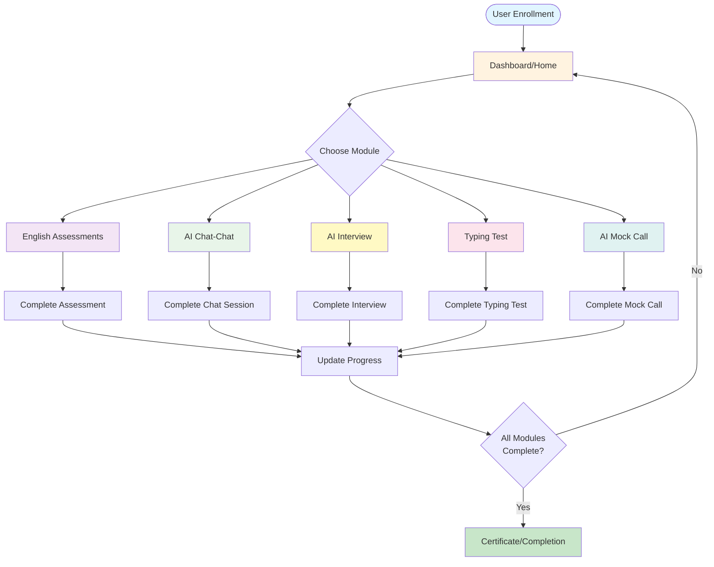

---

## Course Modules Overview

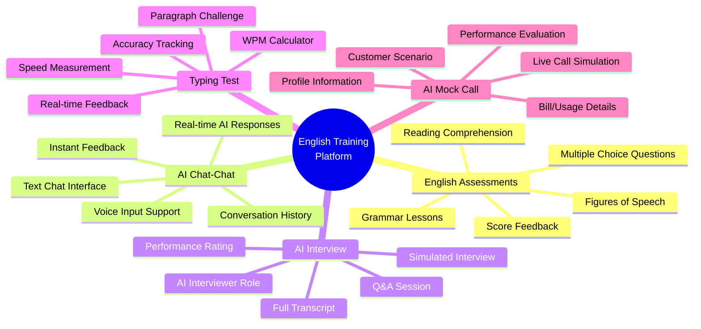

---

## Module Progression Flow

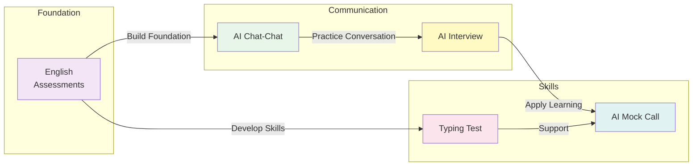

---

## Detailed Module Breakdown

### 1. English Assessments
**Purpose:** Evaluate and improve fundamental English skills

**Components:**
- Reading passages with comprehension questions
- Multiple-choice assessments
- Grammar and syntax lessons
- Figures of speech training
- Immediate score feedback and recommendations

**User Flow:**
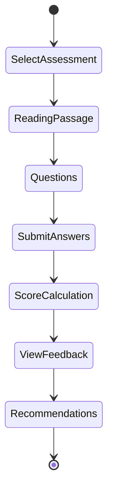

---

### 2. AI Chat-Chat
**Purpose:** Practice conversational English with AI assistance

**Features:**
- Interactive chatbox interface
- Voice input via microphone button
- AI-powered responses using ChatGPT
- Instant feedback on grammar, vocabulary, and fluency
- Conversation history tracking

**User Experience:**
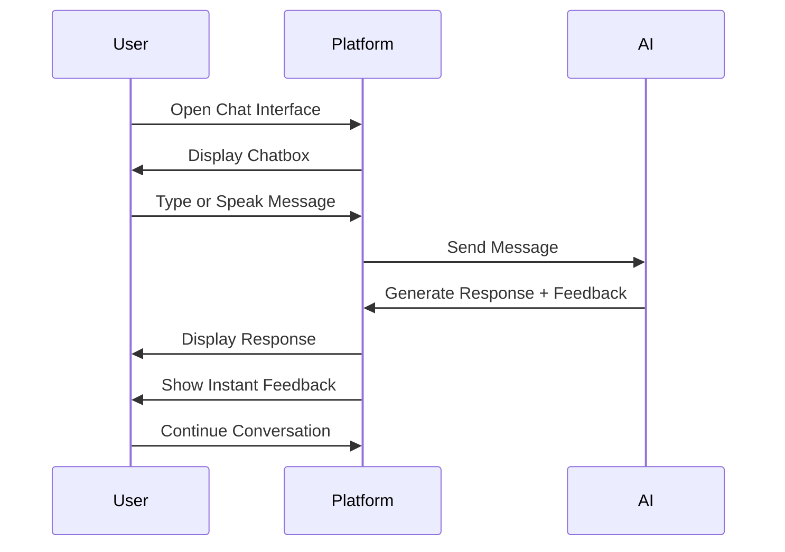

---

### 3. AI Interview
**Purpose:** Simulate job interview scenarios with AI interviewer

**Features:**
- Realistic interview questions
- AI acts as professional interviewer
- Voice-based Q&A interaction
- Full transcript recording
- Performance rating and analysis

**Interview Flow:**
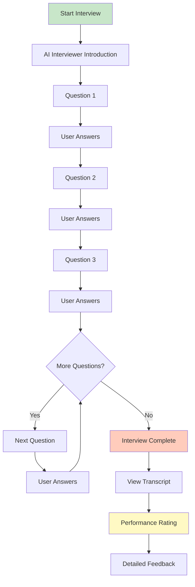

---

### 4. Typing Test
**Purpose:** Assess and improve typing speed and accuracy

**Features:**
- Paragraph typing challenge
- Real-time WPM (Words Per Minute) tracking
- Accuracy percentage calculation
- Error highlighting
- Performance history

**Test Flow:**
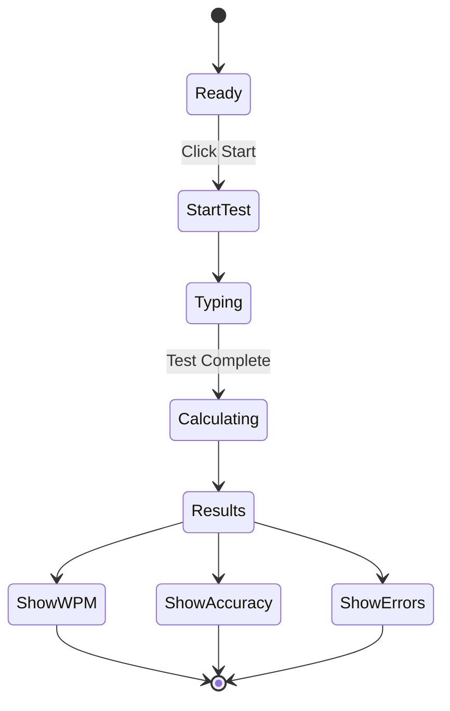

---

### 5. AI Mock Call (Customer Service Simulation)
**Purpose:** Practice real-world customer service scenarios

**Features:**
- Realistic customer profile (Name, Contact, Address)
- Bill/usage scenario details
- Live voice call simulation with AI customer
- Real-time conversation with AI responses
- Performance evaluation and feedback

**Mock Call Workflow:**
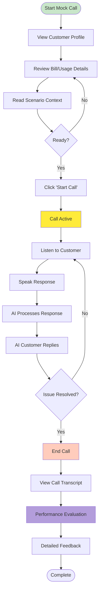

---

## Progress Tracking

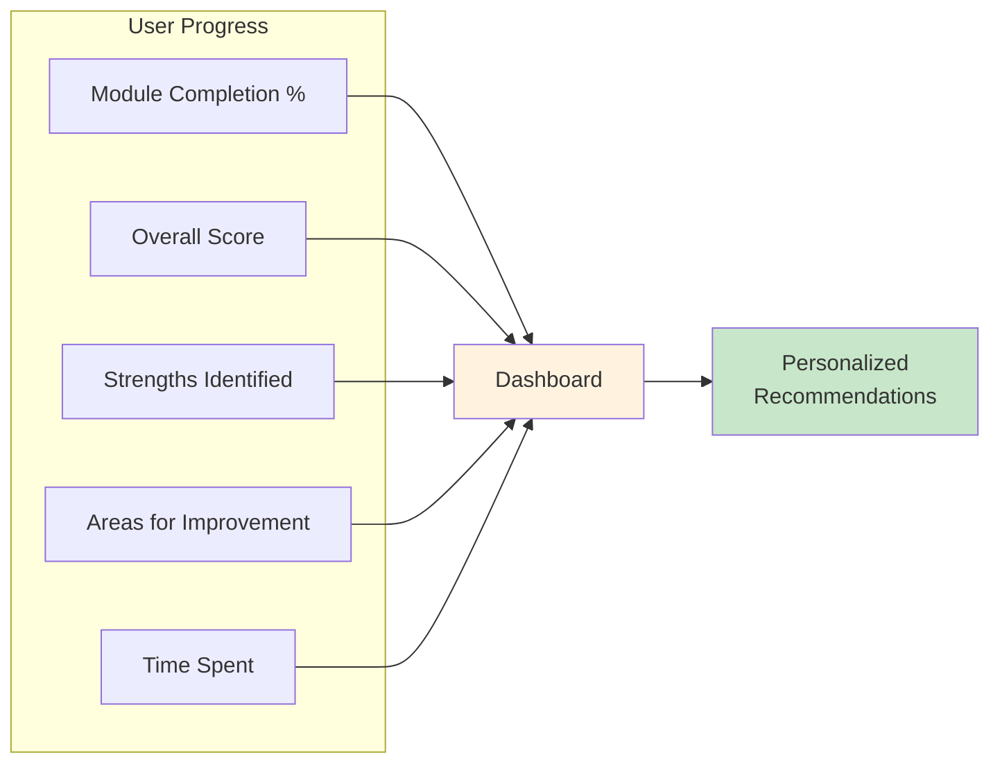

---

## User Interaction Patterns

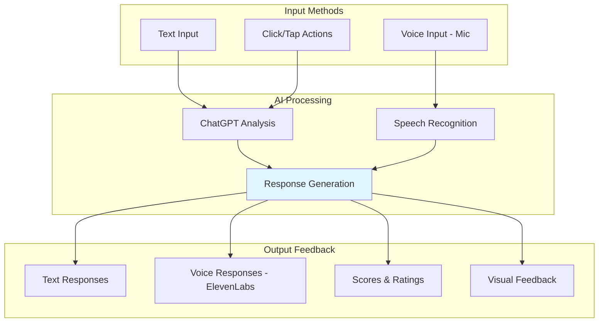

---

## Success Metrics

Each module tracks specific success indicators:

| Module | Success Metrics |
|--------|----------------|
| **English Assessments** | Score percentage, Improvement rate, Topics mastered |
| **AI Chat-Chat** | Conversation quality, Grammar accuracy, Vocabulary usage |
| **AI Interview** | Overall rating, Answer quality, Confidence score |
| **Typing Test** | WPM score, Accuracy percentage, Consistency |
| **AI Mock Call** | Issue resolution, Communication clarity, Professionalism score |

---

## Module Access Strategy

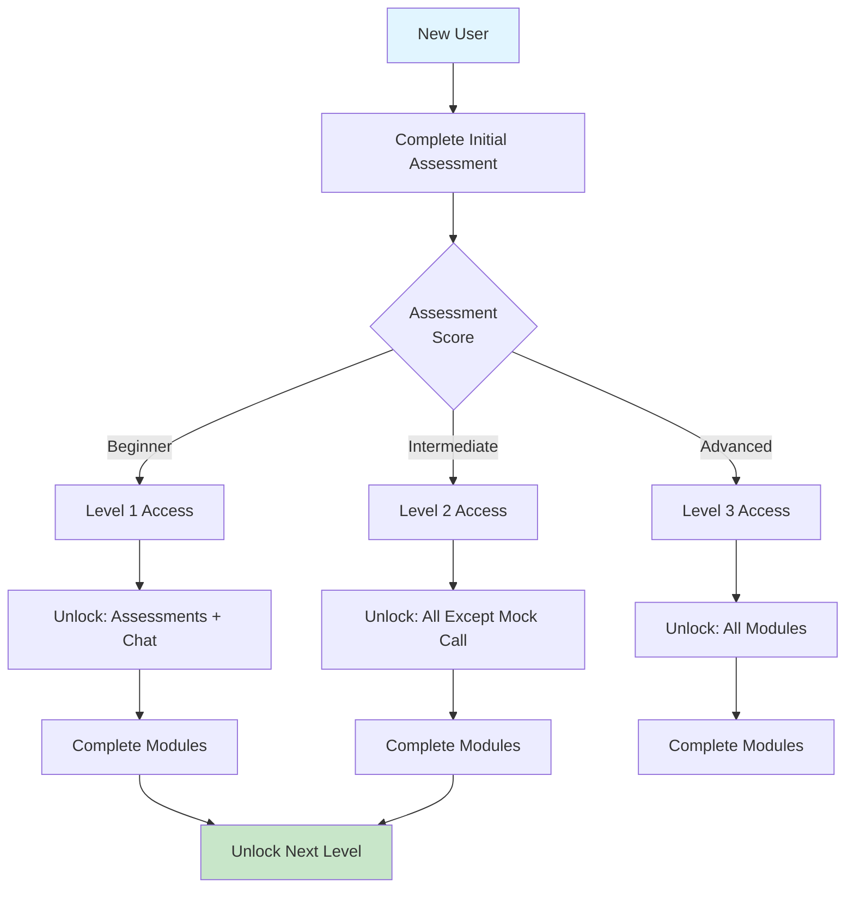

---

## Completion Certificate Flow

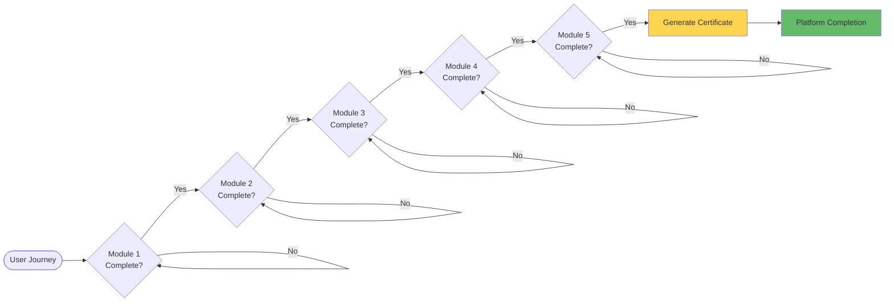

---

## Summary

This English training platform provides a comprehensive, AI-powered learning experience that combines:

- **Assessment & Feedback** - Continuous evaluation and personalized guidance
- **Interactive Learning** - Engaging AI conversations and simulations
- **Practical Application** - Real-world scenarios and skill development
- **Progress Tracking** - Clear metrics and achievement milestones
- **Voice Integration** - Natural speech interaction throughout modules

The modular design allows users to progress at their own pace while ensuring all essential communication skills are developed for professional success.